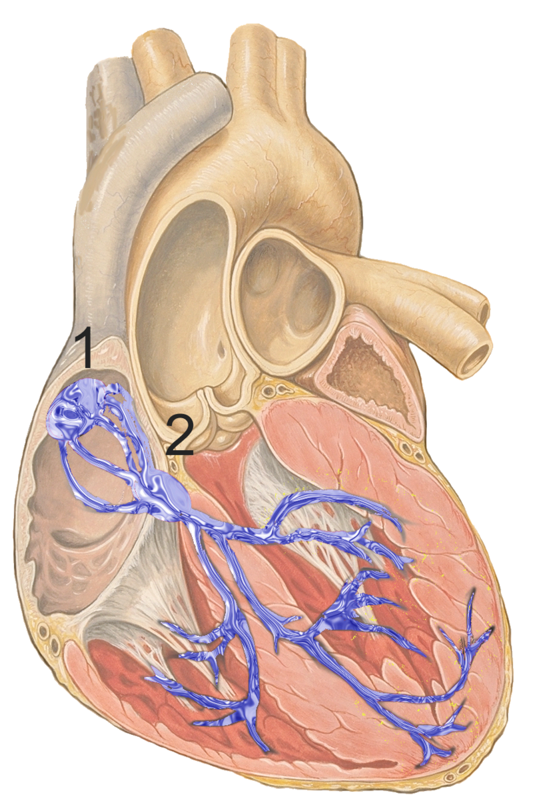

## Overview

:::: {.columns}

::: {.column width=50%}
- Introduction
- HRV Measurements
- The HeartRateLab
    - Preprocessing
    - Feature Exploration
    - Dynamic Systems Modeling
    - Bayesian Inference
    - Statistical Modeling
    - Deep Learning
    - Visualization
- Problem Solving with the HeartRateLab
 - Teaching and Learning
 - Managing Expectations and Priors
 - Comparing, Contrasting, Validating, and Characterizing and Recording Outliers.
 - Modeling and Predicting
:::

::: {.column width=50%}
- What do we do with the HeartRateLab?
    - Arousal and Relaxation
    - Cognitive Mental Workload
    - Attention and Dual-Tasking
    - Attentional Networks
    - *Facial Expression Observation
    - *Ocular Rivalry and Concious Perception
    - *Cognitive Flexibility
    - Heart Rate Variability Biofeedback
    - Mindfulness and Contemplative Practices
    - Neurodiversity, ADHD, and Autism
- Future Work # Contextualized as the Structured and Formal Management of Cognitive Tools and Resources.
:::

::::

## Slides with code
:::: {.columns}

::: {.column width=50%}

Slides in this presentation are written in [Quarto](https://quarto.org/), a literate programming tool that allows you to write documents with embedded code. The code is executed and the results are included in the final document. This allows for reproducible research and easy sharing of results.

:::

::: {.column width=50%}

```{julia}
#| echo: true
#| output: slide
#| label: setup
#| fig-cap: "Installing necessary packages"
using Pkg;
# Pkg.add("GLMakie")
# Pkg.add(url="https://github.com/abcsds/HeartRateLab.jl")
# Pkg.add(url="https://github.com/abcsds/HeartRateVariability.jl")
# Pkg.add("HypothesisTests")
Pkg.activate("/home/beto/.julia/dev/HeartRateLab")
```

```{julia}
using HeartRateLab: HeartRateLab
using GLMakie
using DFA: DFA
```


:::

::::

---

## Introduction

::: incremental

- Cardiac Cycle and Heart Rate
- Regulating mechanisms of the Heart Rate
- Heart Rate Variability (HRV)
- Factors that influence HRV
- Correlations found in HRV studies
- Applications of HRV in research and practice
- Software providers for HRV analysis
    - PyCardio
    - PyNeuroKit2
    - Kubios

:::

---

## Cardiac Cycle and Heart Rate


By Guido4 - Own work http://www.hegasy.de/, CC BY-SA 4.0, https://commons.wikimedia.org/w/index.php?curid=63765394

---


By DrJanaOfficial - Own work: Cardiac Cycle, Wiggers diagram derived from User:Xavax, CC BY-SA 4.0, https://commons.wikimedia.org/w/index.php?curid=54393545
---

## Sinoatrial and Atrioventricular Nodes



By J. Heuser - self made, based upon Image:Heart anterior view coronal section.jpg by Patrick J. Lynch (Patrick J. Lynch; illustrator; C. Carl Jaffe; MD; cardiologist Yale University Center for Advanced Instructional Media ), CC BY 2.5, https://commons.wikimedia.org/w/index.php?curid=1686121

## Sympathetic and Parasympathetic effects on the Heart

|     | Sympathetic | Parasympathetic |
| --- | --- | --- |
| Efferent Pathways | Nerves from sympathetic trunk | Vagus nerve (CN X right) |
| Afferent Pathways | Nerves from cervical and thoracic ganglia | Vagus nerve (CN X left) |

@netter1972ciba

## Heart Rate Variability (HRV)

.svg)

By YitzhakNat - Own work + ECG wave from, CC BY-SA 4.0, https://commons.wikimedia.org/w/index.php?curid=121207798

## HRV Measurements

:::: {.columns}

::: {.column width=50%}

::: incremental
- Time and Statistical Domain
- Frequency Domain
- Geometric Domain
- Nonlinear Domain
:::

:::

::: {.column width=50%}

```{julia}
infile = "test/testdata/example.txt"
data = HeartRateLab.read_txt(infile)
println("Data loaded from: ", infile)
println("Data length: $(length(data)) heartbeats")
println("Type of data: ", typeof(data))
```

:::

::::

---

```{julia}
#| echo: true
#| output: slide
#| label: data-preprocess
f = Figure(size=(1200, 600));
ax = Axis(f[1, 1], 
    title="Raw Data",
    xlabel="Time (s)",
    ylabel="Heart Rate (bpm)")
n = data[1:50]
t = Observable(cumsum(n) ./ 1000) # to seconds
x = Observable(60000 ./ n) # to bpm
stem!(ax, t, x, color=:blue)
# scatter!(ax, t, x, color=:red, markersize=5)
display(f)
```

## Time Domain


:::: .columns
::: {.column width=50%}
- Mean
- Standard Deviation (SDNN)
- Median
- Extrema and Range
- BPM representations
:::

::: {.column width=50%}
- SDSD
- RMSSD
- SDANN
- PNN50, PNN20 and percentages
- CVSD
- rRR
:::
::::

## Frequency Domain

- Power Spectral Density (PSD) over four frequency bands:
    - Very Low Frequency (VLF): 0.003-0.04 Hz
    - Low Frequency (LF): 0.04-0.15 Hz
    - High Frequency (HF): 0.15-0.4 Hz
    - Ultra Low Frequency (ULF): < 0.003 Hz
- Absolute and relative power
- Peak frequencies
- Proportions and ratios (LF/HF, VLF/LF, etc.)

## Geometric Domain

- Poincaré Plot
    - SD1: Short-term variability
    - SD2: Long-term variability
    - SD1/SD2 ratio, area
    - cvi
    - ccsi
- Histogram Based:
    - Triangular Index
    - Tinn

## Nonlinear Domain

- Approximate Entropy (ApEn)
- Sample Entropy (SampEn)
- Hurst Exponent
- Renyi Entropy
- Detrended Fluctuation Analysis (α1, α2)

## The HeartRateLab

```{julia}

ds = HeartRateLab.Features.extract_feature_set(
    data, features=["vlf", "rmssd"]
)
```

## Preprocessing

- Replace Zeros
- Replace biological outliers (200 to 3000 ms) and breaks
- Replace statistical outliers (Z(0.025, 0.975))
- Ectopic beat detection:
    - ACAR
    - Karlsson
    - Malik
    - Kamath
    - Custom absolute threshold (0.2)
- Signal interpolation:
    - Constant
    - Linear
    - Quadratic
    - Cubic
- Windowed analysis:
    - Sliding window
    - Overlapping windows
    - Non-overlapping windows


## Feature Extraction

```{julia}
names = String[keys(HeartRateLab.Features.feature_registry)...]
println("Full Feature set: ", names)
```


```{julia}
#| echo: true
#| output: slide
#| label: data-preprocess
f = Figure(size=(1200, 600));
ax = Axis(f[1, 1], 
    title="Raw Data",
    xlabel="Time (s)",
    ylabel="Inter-Beat Interval (ms)")
n = data[1:50]
x = Observable(n)
t = Observable(cumsum(n) ./ 1000) # to seconds
stem!(ax, t, x, color=:red)
display(f)
```

```{julia}
#| echo: true
#| output: slide
#| label: data-preprocess
f = Figure(size=(1200, 600));
ax = Axis(f[1, 1], 
    title="Raw Data",
    xlabel="Time (s)",
    ylabel="Inter-Beat Interval (ms)")
n = data[1:500]
x = Observable(n)
t = Observable(cumsum(n) ./ 1000) # to seconds
lines!(ax, t, x)
scatter!(ax, t, x, color=:red, markersize=5)
display(f)
```

```{julia}
#| echo: true
#| output: slide
#| label: data-preprocess
f = Figure(size=(1200, 600));
ax = Axis(f[1, 1], 
    title="Difference of Sequential Inter-Beat Intervals",
    xlabel="Time (s)",
    ylabel="Inter-Beat Interval (ms)")
n = data[1:500]
t = Observable(cumsum(n) ./ 1000) # to seconds
x = Observable([0; diff(n)])
x_above_zero = Observable(clamp.(x[], 0, Inf))
x_below_zero = Observable(clamp.(x[], -Inf, 0))
zero_line = Observable(zeros(length(x[])))
lines!(ax, t, x, color=:teal)
# Band above zero
# band(x, ylower, yupper; kwargs...)
band!(ax, t, zero_line, x_above_zero, 
    color=:teal, alpha=0.5)
band!(ax, t, zero_line, x_below_zero, 
    color=:coral, alpha=0.5)
scatter!(ax, t, x, color=:red, markersize=5)
display(f)
```


```{julia}
ds_windowed = HeartRateLab.Features.windowed_feature_set(
    data, features=["vlf", "rmssd"], window_size=60, stride=10
)

f = Figure(size=(1200, 600));
ax = Axis(f[1, 1], 
    title="RMSSD through Time WS=60, S=10",
    xlabel="Time (s)",
    ylabel="RMSSD (ms²)")
x = ds_windowed.rmssd
t = 1:length(x)
lines!(ax, t, x, color=:blue)
display(f)
```

```{julia}
ds_windowed = HeartRateLab.Features.windowed_feature_set(
    data, features=["vlf", "rmssd"], window_size=30, stride=1
)

ax = Axis(f[2, 1], 
    title="RMSSD through Time WS=30, S=1",
    xlabel="Time (s)",
    ylabel="RMSSD (ms²)")
x = ds_windowed.rmssd
t = 1:length(x)
lines!(ax, t, x, color=:blue)
display(f)
```

```{julia}
ds_windowed = HeartRateLab.Features.windowed_feature_set(
    data, features=["vlf", "rmssd"], window_size=120, stride=30
)

ax = Axis(f[3, 1], 
    title="RMSSD through Time WS=120, S=30",
    xlabel="Time (s)",
    ylabel="RMSSD (ms²)")
x = ds_windowed.rmssd
t = 1:length(x)
lines!(ax, t, x, color=:blue)
display(f)
```

```{julia}
using HeartRateLab.Frequency: welch, get_power, find_peak
pgram = welch(data)
f = Figure(size=(1200, 600));
ax = Axis(f[1, 1], 
    title="Power Spectral Density",
    xlabel="Frequency (Hz)",
    ylabel="Power (ms²/Hz)",
    limits=((0, 0.5), (0, nothing)),
    )
lines!(ax, pgram.freq, pgram.power)
# HF
vspan!(ax, 0.15, 0.4, color=:blue, alpha=0.2)
# LF
vspan!(ax, 0.04, 0.15, color=:green, alpha=0.2)
# VLF
vspan!(ax, 0.003, 0.04, color=:orange, alpha=0.2)
# ULF
vspan!(ax, 0, 0.003, color=:purple, alpha=0.2)
# peak_freq = find_peak(pgram.freq, pgram.power)
# lines!(ax, [peak_freq peak_freq], 
#     [0 maximum(pgram.psd)], color=:red, linestyle=:dash)
display(f)
```

```{julia}
feature_registry = HeartRateLab.Features.feature_registry
feature_set = String.(keys(feature_registry))
println("Feature set: ")
for f in feature_set
    println(" - ", f)
end
ds_windowed = HeartRateLab.Features.windowed_feature_set(
    data, features=["rmssd", "ulf"], window_size=60, stride=10
)
```


```{julia}
# Example Data
    spectra = [sin.(1:0.1:10) for _ in 1:7]
    x_values = 1:0.1:10
# Figure
    fig = Figure()

# 3D-Axis
    ax = Axis3(fig[1, 1], title="Waterfallplot", xlabel="X-Axis", ylabel="Y-Axis", zlabel="Z-Axis")

# Plot Data
    for i in 7:-1:1
        y_shift = i-1  # Shift along y-axis
        points = Point3.(x_values, y_shift,  spectra[i])  # Data to Point3
        base   = Point3.(x_values, y_shift, minimum(spectra[i]))
        band!(ax, base, points,alpha=0.5,color=Makie.wong_colors()[i])  # Plot each spectrum
        lines!(ax, points, linewidth=2,color=Makie.wong_colors()[i])  # Plot each spectrum
    end
# Show figure
    fig
```


```{julia}
#DFA
scales, fluc = DFA.dfa(data, boxmax=64, boxmin=4, boxratio=2, overlap=0.0)
log_scales1 = log10.(scales)
log_fluc1 = log10.(fluc)
f = Figure(size=(1200, 600));
ax1 = Axis(f[1, 1], 
    title="Log-scale Fluctuation 4-64",
    xlabel="log10(Scale)",
    ylabel="log10(Fluctuation)",
)
scatter!(ax1, log_scales1, log_fluc1, color=:blue, markersize=5)
intercept1, α1 = DFA.polyfit(log_scales1, log_fluc1)
x = range(minimum(log_scales1), maximum(log_scales1), length=100)
y = intercept1 .+ α1 .* x
lines!(ax1, x, y, color=:red, linewidth=1, linestyle=:dash)
display(f)
```

```{julia}
scales, fluc = DFA.dfa(data, boxmax=16, boxmin=4, boxratio=2, overlap=0.0)
log_scales2 = log10.(scales)
log_fluc2 = log10.(fluc)
ax2 = Axis(f[1, 2], 
    title="Log-scale Fluctuation 4-16",
    xlabel="log10(Scale)",
    ylabel="log10(Fluctuation)",
)
scatter!(ax2, log10.(scales), log10.(fluc), color=:blue, markersize=5)
intercept2, α2 = DFA.polyfit(log_scales2, log_fluc2)
x = range(minimum(log_scales2), maximum(log_scales2), length=100)
y = intercept2 .+ α2 .* x
lines!(ax2, x, y, color=:red, linewidth=1, linestyle=:dash)
linkxaxes!(ax1, ax2)
linkyaxes!(ax1, ax2)
display(f)
```

```{julia}
```


## Dynamic Systems

- LIF
- VanDerPol
- Lorenz
- Dynamic Mode Decomposition
- Delayed Differential Analysis


.jpg)
By Ashraful - Own work using Matlab program., CC BY-SA 3.0, https://commons.wikimedia.org/w/index.php?curid=116710259

---


```{julia}
using DifferentialEquations
using Random
using Plots

# Parameters for the HRV model
params = (
    τ=0.6,        # Integration time constant
    I_base=1.1,   # Baseline input to the integrator
    threshold=0.9, # Firing threshold
    noise_amp=0.15,  # Amplitude of stochastic noise
)

# Define the integrate-and-fire dynamics
function hrv_dynamics(dV, V, p, t)
    dV[1] = (p.I_base - V[1]) / p.τ + p.noise_amp * randn()
end

# Time span for simulation
tspan = (0.0, 1000.0)  # Simulate for 100 seconds
V0 = [0.0]            # Initial integrator value

# Define the callback to reset the integrator and log spike times
function hrv_fire!(integrator)
    # Log the firing time
    global spike_times
    push!(spike_times, integrator.t)
    # Reset the integrator value
    integrator.u[1] = 0.0
end

# Condition for firing
function fire_condition(u, t, integrator)
    u[1] >= params.threshold
end

# Initialize a global spike time array
global spike_times = Float64[]

# Create a DiscreteCallback for firing events
fire_callback = DiscreteCallback(fire_condition, hrv_fire!)

# Solve the integrate-and-fire HRV model
hrv_problem = ODEProblem(hrv_dynamics, V0, tspan, params)
```


```{julia}
hrv_solution = solve(hrv_problem, Tsit5(); callback=fire_callback)

# Interbeat intervals (IBIs) in milliseconds
IBIs = diff(spike_times) * 1000.0

# Plot the results
plot(
    spike_times[1:(end - 1)],
    IBIs;
    marker=:circle,
    xlabel="Time (s)",
    ylabel="IBI (s)",
    title="Interbeat Intervals (IBIs)",
)
```

## Bayesian Inference and Statistical Modeling

- Turing.jl

## Deep Learning

- Flux.jl
- Variational Autoencoders


## Visualization

Makie.jl GLMakie

DEMO


## Problem Solving with the HeartRateLab

## Teaching and Learning

## Managing Expectations and Priors

## Comparing, Contrasting, Validating, and Characterizing and Recording Outliers

## Modeling and Predicting

##  What do we do with the HeartRateLab?

    - Arousal and Relaxation
    - Cognitive Mental Workload
    - Attention and Dual-Tasking
    - Attentional Networks
    - *Facial Expression Observation
    - *Ocular Rivalry and Concious Perception
    - *Cognitive Flexibility
    - Heart Rate Variability Biofeedback
    - Mindfulness and Contemplative Practices
    - Neurodiversity, ADHD, and Autism
- Future Work 

# Structured and Formal Management of Cognitive Tools and Resources.


:::: {.columns}

::: {.column width=50%}
Para distinguir una variable algebraica de una variable aleatoria, se suele utilizar letras mayúsculas para las variables aleatorias y letras minúsculas para las variables algebraicas.

Por ejemplo, si $X$ es una variable aleatoria, $x$ es un valor posible de $X$. Y la probabilidad de que $X$ tome el valor $x$ se denota como $P(X = x)$.

:::

::: {.column width=50%}
**Ejemplo**:
La variable X que representa las probabilidades de los valores de un tiro de dado, puede presentar seis distintos valores: 1, 2, 3, 4, 5, 6. 

La probabilidad de que X tome el valor 1 es P(X = 1) = 1/6.

:::

::::

## Visualización de una variable aleatoria

### Animación
```{julia}
#| echo: true
#| output: slide
#| label: random-var
#| fig-cap: "Variable Aleatoria"
N = 10000
x = Observable(rand(N))
fig = Figure(size=(1800, 600));
ax = Axis(fig[1, 1], subtitle="Variable Aleatoria")
scatter!(ax, x)
ylims!(ax, -1, 2)
ax = Axis(fig[1, 2], subtitle="Distribución")
# density!(ax, x)
hist!(ax, x, bins=100)
xlims!(ax, -1, 2)
button = Button(fig[2, 1:2], label="Generar Nueva Muestra")
l = on(button.clicks) do b
    x[] = rand(N)
end
fig
```


## **Ejemplo**:
- La media de una muestra de una población $\bar{x}$ se puede utilizar para estimar la media de la población $\mu$.
- Lo mismo se puede hacer con la varianza, la moda, el rango, la mediana, la correlación, la covarianza, etc.

__Definiciones__:

::: incremental
- **Población**: Conjunto de todos los elementos de interés. (Universo: U)
- **Muestra**: Subconjunto de la población. (N)
:::

---

## Problemas de reproducibilidad en ciencias cognitivas

- The Open Science Collaboration (2015) https://osf.io/82fth: 36% de los estudios replicados tuvieron resultados significativos, comparado con 97% de los estudios originales. @open2015

The Many Labs Project (2014) https://osf.io/wx7ck/:  10 de 13 estudios replicados tuvieron resultados significativos, comparado con 13 de 13 estudios originales. @klein2013

## Prácticas questionables en investigación

John, L. K., Loewenstein, G., & Prelec, D. (2012). Measuring the prevalence of questionable research practices with incentives for truth telling. Psychological science, 23(5), 524-532. [https://www.cmu.edu/dietrich/sds/docs/loewenstein/MeasPrevalQuestTruthTelling.pdf] @john2012


1. In a paper, failing to report all of a study’s dependent measures.
2. Deciding whether to collect more data after looking to see whether the results were significant.
3. In a paper, failing to report all of a study’s conditions.
4. Stopping collecting data earlier than planned because one found the result that one had been looking for.
5. In a paper, “rounding off” a p value (e.g., reporting that a p value of .054 is less than .05).
6. In a paper, selectively reporting studies that “worked”.
7. Deciding whether to exclude data after looking at the impact of doing so on the results.
8. In a paper, reporting an unexpected finding as having been predicted from the start.
9. In a paper, claiming that results are unaffected by demographic variables (e.g., gender) when one is actually unsure (or knows that they do).
10. Falsifying data.


## Modelado y Variables latentes

Cuando los verdaderos parametros de una población no son observables, se pueden utilizar variables latentes para describir el comportamiento verdadero de la población. Estas son variables que no se pueden observar directamente, pero que se pueden inferir a partir de evidencias. Esta forma de pensar nos permite conceptualizar cada experimento: no como eventos independientes, sino como un muestreo de una variable latente.  Así, cada nuevo experimento produce evidencia en contra o a favor de nuestras creencias sobre los parametros que describen la distribución de la población. A esto le llamamos modelado estadistico.

:::: {.columns}

::: {.column width=50%}
```{mermaid}
%%| fig-width: 6.5
graph TD
    A(Variable Latente) --> B[Observación 1]
    A --> C[Observación 2]
```
:::

::: {.column width=50%}
```{mermaid}
%%| fig-width: 30
graph TD
    A(Alimentación) --> B[Estatura]
    A --> C[Peso]
    B --> D[IMC]
    C --> D
```
:::

::::

Este tipo de modelado requiere el manejo explicito de creencias sobre las distribuciones de parametros en la poblacion a estudiar. También nos permite modelar otras posibles variables ocultas (o de confusión) que puedan influin en los resultados de nuestros experimentos.

---

## **Ejercicio**
Hagamos un ejercicio para desarrollar intuicicón. Infiere la distribución de la que provienen las siguientes muestras:

```{julia}
#| echo: true
#| output: slide
#| label: latent
#| fig-cap: "Modelado y Variables Latentes"
U = 100000
N = 50
distributions = [Normal(0, 1), 
                Exponential(1), 
                Uniform(0, 1), 
                Binomial(10, 0.5),
                Poisson(5),
                Gamma(2, 1),
                Beta(2, 7),
                Cauchy(),
                LogNormal(0, 1),
                Weibull(1, 1),
                Pareto(1, 1),
                ]
dist = sample(distributions, 1)[1]
X = Observable(rand(dist, U))
x = Observable(sample(X[], N))
means = Observable([])
experiments = Observable(0)
fig = Figure(size=(1200, 600));
ax = Axis(fig[1, 1], subtitle="Muestra de Población")
# scatter!(ax, X)
scatter!(ax, x, color=:teal)
ax = Axis(fig[1, 2], subtitle="Distribución")
# density!(ax, X)
hist!(ax, x, color=:teal,  normalization=:pdf)
ax1 = Axis(fig[1, 3], subtitle="Media de Muestras")
push!(means[], mean(x[]))
scatter!(ax1, means[], color=:coral)
ax2 = Axis(fig[1, 4], subtitle="Distribución de la media de Muestras")
density!(ax2, means[], color=:coral)
# hist!(ax2, means[], color=:coral,  normalization=:pdf)
button = Button(fig[2, 1:4], label="Tomar Nueva Muestra")
l = on(button.clicks) do b
    x[] = sample(X[], N)
    push!(means[], mean(x[]))
    scatter!(ax1, means[], color=:coral)
    empty!(ax2)
    density!(ax2, means[], color=:coral)
    experiments[] += 1
end
fig
```

::: {.callout-tip collapse="true"}
## Solución
```{julia}
println(dist)
```
:::

## Modelos Jerarquicos
Así como podemos inferir la distribución de una variable aleatoria a partir de una muestra, también podemos inferir la distribución de los parametros de una distribución a partir de una muestra. A esto se le llama inferencia jerarquica. Aqui los parametros de una distribución son variables aleatorias que siguen una distribución. Este tipo de modelado nos permite inferir la distribución de los parametros de una distribución a partir de una muestra, y nos permite modelar la incertidumbre en nuestras creencias sobre los parametros de una distribución.

```{mermaid}
%%| fig-width: 6.5
graph TD
    A(Variable Latente) --> B[Parametro_1]
    A --> C[Parametro_2]
    B --> D[Observación_1]
    C --> E[Observación_2]
    C --> D
```
A su vez, estos parametros pueden representar variabilidad entre grupos de muestras. Por ejemplo, si tomamos muestras de dos poblaciones distintas, podemos inferir la distribución de los parametros de cada población, y la variabilidad entre las poblaciones. A esto se le conoce también como modelos mixtos. Estos son el estandard de oro en la inferencia estadistica. Prof. Nan Laird obtuvo el premio internacional de stadisticas por su descripción de estos modelos [@laird2004].

## Probabilidad Condicional

Como hemos visto, no todos los eventos son independientes. La probabilidad de que ocurra un evento puede depender de que ocurra otro evento. A esto se le llama probabilidad condicional. La probabilidad de que ocurra un evento A dado que ocurra un evento B se denota como $P(A|B)$. La probabilidad condicional se puede calcular como el cociente de la probabilidad conjunta de $A$ y $B$ entre la probabilidad de $B$. $P(A|B) = P(A ∩ B) / P(B)$.

__Definiciones__:

- **Independencia**: Dos eventos son independientes si la probabilidad de que ocurra uno no depende de que ocurra el otro. $P(A|B) = P(A)$.
- **Dependencia**: Dos eventos son dependientes si la probabilidad de que ocurra uno depende de que ocurra el otro. $P(A|B) ≠ P(A)$.
- **Probabilidad Conjunta**: La probabilidad de que ocurran dos eventos simultáneamente. $P(A ∩ B)$.
- **Probabilidad Marginal**: La probabilidad de que ocurra un evento sin importar si ocurre otro evento. $P(A)$.

## **Ejemplo**:

La probabilidad de que un estudiante apruebe un examen de matemáticas es de 0.7. La probabilidad de que un estudiante apruebe un examen de matemáticas y física es de 0.5. La probabilidad de que un estudiante apruebe un examen de física es de 0.6. ¿Cuál es la probabilidad de que un estudiante apruebe un examen de matemáticas dado que aprobó un examen de física?

::: {.callout-tip collapse="true"}
## __Solución__
- P(A) = 0.7
- P(A ∩ B) = 0.5
- P(B) = 0.6
- P(A|B) = P(A ∩ B) / P(B) = 0.5 / 0.6 = 0.8333
:::

## Teorema de Bayes
El teorema de Bayes es una regla para actualizar creencias con base en evidencias. Nos permite calcular la probabilidad de una hipótesis dada una evidencia. La probabilidad de una hipótesis $H$ dado un conjunto de evidencias $E$ se puede calcular como el producto de la probabilidad de la evidencia dado la hipótesis $P(E|H)$ por la probabilidad de la hipótesis $P(H)$ dividido por la probabilidad de la evidencia $P(E). P(H|E) = P(E|H) * P(H) / P(E)$.


$$
P(H|E) = \frac{P(E|H) * P(H)}{P(E)} = \frac{P(E|H) * P(H)}{P(E|H) * P(H) + P(E|¬H) * P(¬H)}
$$

## **Ejemplo 1**
Sabemos que la probabilidad de que un estudiante de cierta escuela tenga TDA es del 0.1. También sabemos que la proporcion de hombres y mujeres es del 50%. También sabemos que entre los estudiantes diagnosticados con TDA, el 60% son hombres. ¿Cuál es la probabilidad de que un estudiante tenga TDA dado que es hombre?

## __Solución__
$P(A) = 0.1$ es la probabilidad de que un estudiante tenga TDA.
$P(B) = 0.5$ es la probabilidad de que un estudiante sea hombre.
$P(B|A) = 0.6$ es la probabilidad de hombres entre los estudiantes con TDA.

Para encontrar $P(A∣B)$, primero necesitamos calcular $P(B∣A)$ y $P(B)$ como se ha dado, y luego encontrar $P(A∩B)$ usando la fórmula de probabilidad condicional. Esta es la probabilidad de que un estudiante en esa escuela tenga TDA Y sea Hombre.
$$
P(A ∩ B) = P(B|A) * P(A) = 0.6 * 0.1 = 0.06
$$

Por lo tanto, la probabilidad de que un estudiante tenga TDA dado que es hombre es:

::: {.callout-tip collapse="true"}
$$
P(A|B) = P(A ∩ B) / P(B) = 0.06 / 0.5 = 0.12
$$
:::


## **Ejemplo 2**
Hicimos un experimento, en el que el 30% de nuestros participantes reportaron reportaron dormir mal. Sabemos que el 50% de las personas que reportaron dormir mal, también reportaron tener ansiedad. También sabemos que el 20% de las personas que no reportaron dormir mal, reportaron tener ansiedad. ¿Cuál es la probabilidad de que una persona tenga ansiedad dado que reportó dormir mal?

::: {.callout-tip collapse="true"}
__Solución__:

- $P(D) = 0.3$
- $P(¬D) = 0.7$
- $P(A|D) = 0.5$
- $P(A|¬D) = 0.2$
- $P(A ∩ D) = P(A|D) * P(D) = 0.5 * 0.3 = 0.15$
- $P(A ∩ ¬D) = P(A|¬D) * P(¬D) = 0.2 * 0.7 = 0.14$
- $P(A) = P(A ∩ D) + P(A ∩ ¬D) = 0.15 + 0.14 = 0.29$
- $P(D|A) = P(A|D) * P(D) / P(A) = 0.5 * 0.3 / 0.29 = 0.5172$
:::

## **Ejemplo 3**
Un laboratorio produce pruebas de detección de un trastorno. La prueba tiene una sensibilidad del 99% y una especificidad del 95%. La enfermedad afecta al 1% de la población. ¿Cuál es la probabilidad de que una persona tenga la enfermedad dado que la prueba dio positivo?

__Solución__:
La sensibilidad se refiere a la probabilidad de que la prueba sea positiva dado que la persona tiene la enfermedad. La especificidad se refiere a la probabilidad de que la prueba sea negativa dado que la persona no tiene la enfermedad.
Ambas se pueden obtener de una matriz de confusión, y describen completamente el desempeño de una prueba de detección.

|          | Enfermo | Sano |
| -------- | ------- | ---- |
| Positivo | TP      | FP   |
| Negativo | FN      | TN   |

---

En este caso:

|  %  | Enfermo | Sano |
| --- | ------- | ---- |
| +   | 0.99    | 0.05 |
| -   | 0.01    | 0.95 |

::: {.callout-tip collapse="true"}

- $P(D) = 0.01$
- $P(¬D) = 0.99$
- $P(+) = P(+|D) * P(D) + P(+|¬D) * P(¬D) = 0.99 * 0.01 + 0.05 * 0.99 = 0.0585$
- $P(D|+) = P(+|D) * P(D) / P(+) = 0.99 * 0.01 / 0.0585 = 0.1684$

:::

## Herramientas


La herramienta que utilizamos para hacer estos tests es JASP. JASP es un software de código abierto, desarrollado por la Universidad de Amsterdam, que permite hacer análisis bayesianos de forma sencilla. Pueden descargarlo de [aquí](https://jasp-stats.org/).

## Meta-Ciencia

El método cientifico se puede aplicar a la ciencia misma. Lo que llamamos meta-ciencia es el proceso de analizar los métodos y prácticas del laboratorio a travez de **análisis estructurado y crítico**. Aunado a la inferencia bayesiana, existen otras herramientas que nos permitirán mantener un manejo **explicito** de nuestros conocimientos cientificos.

Lectura sugerida: @hofstadter1999.

**Pregunta:** ¿Cuál es el rol del cientifico en la sociedad?

## Manejo y gestion del Conocimiento

El manejo del conocimiento es el proceso de adquirir, almacenar, compartir y utilizar el conocimiento. El conocimiento es un **activo intangible** que puede ser difícil de cuantificar y medir.

__Definiciones__:

 - Conocimiento Tácito (Implicito): Conocimiento que no se puede expresar en palabras, pero se puede demostrar a través de acciones.
 - Conocimiento Explicito: Conocimiento que se puede expresar en palabras y se puede compartir con otros.
 - Institución: Conjunto de creencias que se expresan en el comportamiento de un grupo de personas.
 - Conocimiento institucionalizado: Conocimiento que se ha convertido en parte de la estructura de una organización.
 - Conocimiento tácito institucional: Conocimiento institucional que no se puede expresar en palabras.

**Pregunta:** ¿De que formas explicitas se maneja el conocimiento cientifico? ¿Qué formas implicitas de conocimiento cientifico conocen?

## Pirámide del conocimiento

La pirámide del conocimiento es una representación visual de la jerarquía del conocimiento. 


Img: @flood2016

## Sesgos Cognitivos

El pensamiento humano falla comunmente de formas predecibles y sistemáticas. A estos fallos sistemáticos del pensamiento se les conoce como sesgos cognitivos. Los sesgos cognitivos pueden afectar la toma de decisiones y la interpretación de la información. Algunos de los sesgos cognitivos más comunes son:

- Sesgo de **confirmación**: Tendencia a buscar, interpretar y recordar información que confirma nuestras creencias preexistentes.
- Sesgo de **anclaje**: Tendencia a depender demasiado de la primera información que se recibe.
- Sesgo de **disponibilidad**: Tendencia a sobreestimar la importancia de la información que se recuerda con mayor facilidad.
- Sesgo de **representatividad**: Tendencia a juzgar la probabilidad de un evento en función de lo bien que se ajusta a un prototipo.
- Sesgo de **atribución**: Tendencia a atribuir los éxitos a factores internos y los fracasos a factores externos.
- Sesgo de **sobrevivencia**: Tendencia a centrarse en los éxitos y a ignorar los fracasos.

[](https://upload.wikimedia.org/wikipedia/commons/6/65/Cognitive_bias_codex_en.svg)

## Técnica de Lectura de Artículos Científicos

- Proposito: ¿Para qué estoy leyendo este artículo? ¿Qué información necesito obtener de él?
- Busqueda: ¿Cómo puedo evitar el sesgo de confirmación?
- Título: ¿Existe una relación con lo que busco? ¿Es relevante?
- Autores: ¿Quiénes son los autores? ¿Son expertos en el tema?
- Resumen: ¿Qué se investigó? ¿Cuál es el objetivo del estudio? ¿Cuál es el resultado que presumen?
- Resultados: ¿El resultado del resumen está respaldado por los datos presentados?
- Si los resultados parecen congruentes con el objetivo, entonces pasamos a:
- Métodos: ¿Cómo se realizó el estudio? ¿Qué técnicas se utilizaron? ¿Qué datos se recopilaron?
- Discusión: ¿Los resultados son consistentes con la literatura previa? ¿Tiene sentido el estudio? ¿Qué implicaciones tiene el estudio?
- Mis conclusiones: ¿Qué aprendí de este artículo? ¿Respaldó mi hipótesis? ¿Qué preguntas me quedan?

## Bibliometría

La bibliometría es el estudio **cuantitativo** de la producción, difusión, interconectividad, y uso de la información científica. La bibliometría se puede utilizar para evaluar la calidad de la investigación, identificar tendencias en la investigación y evaluar la eficacia de las políticas de investigación. Generalmente depende de las publicaciones en revistas científicas.

__Definiciones__:

::: {.columns}
::: {.column width=50%}

 - [Factor de Impacto](https://en.wikipedia.org/wiki/Impact_factor): Medida de la frecuencia con la que los artículos de una revista científica son citados en un año determinado.
$$
  IF = \frac{\text{Citas}}{\text{Publicaciones}_{2 años}}
$$

:::
::: {.column width=50%}

 - [Índice H](https://en.wikipedia.org/wiki/H-index): Medida de la productividad y el impacto de un científico basada en el número de citas que recibe un científico. Un autor con un dado indice H ha publicado H artículos que han sido citados al menos H veces.
:::
:::
## Redes Sociales

Una de las formas de medir la interconectividad de la información científica es a través de las estructuras sociales e individuos que la producen. El análisis de redes sociales es una técnica que se utiliza para analizar la estructura de las relaciones entre individuos y organizaciones. Se puede utilizar para identificar patrones de colaboración, identificar líderes de opinión y evaluar la eficacia de las políticas de investigación.


## Manejo de Proyectos

El manejo de proyectos es el proceso de planificar, organizar, dirigir y controlar los recursos para lograr un objetivo específico. El manejo de proyectos es esencial para la investigación científica, ya que permite a los investigadores planificar y ejecutar sus proyectos de manera eficiente.

En la ciencia, comunmente debemos identificar el entorno y los recursos necesarios para llevar a cabo un proyecto. Para esto les presentamos una herramienta conceptual que servir como referencia:


img: @snowden2007

## Herramientas

### Buscadores

- [**Google Scholar**](https://scholar.google.com/): Motor de búsqueda de literatura académica. (Google scholar button)
- [**PubMed**](https://pubmed.ncbi.nlm.nih.gov/): Base de datos de literatura médica: National Library of Medicine USA.
- [**Semantic Scholar**](https://www.semanticscholar.org/): Motor de búsqueda de literatura científica y académica.
- [Web of Science](https://www.webofscience.com/): Base de datos de literatura científica para la que se requiere una suscripción.
- [Scopus](https://www.scopus.com/): Base de datos de literatura científica de Elsevier.
- [Crossref](https://www.crossref.org/): Base de datos de referencias y citas (Libreria de metadatos).
- [Clarivate](https://jcr.clarivate.com/jcr/home): Base de datos de literatura científica para la que se requiere una suscripción.
- [Paperpanda](https://paperpanda.com/): Motor de búsqueda de literatura científica.
- [ConnectedPapers](https://www.connectedpapers.com/): Herramienta de visualización de referencias y citas.
- [IOP Publishing](https://iopscience.iop.org/): Base de datos de literatura científica.
- Otros: Tenemos accesso a algunos otros buscadores cientificos.

---

### Datos y pre-processamiento 

::: {.columns}

::: {.column width=50%}
- [OpenNeuro](https://openneuro.org/): Base de datos de datos de neuroimagen.
- [Wikidata](https://www.wikidata.org/): Base de datos de conocimiento libre y abierta.
- [Academic Torrents](https://academictorrents.com/browse.php): Tecnología de datos distribuidos para la comunidad científica.
- [Kaggle](https://www.kaggle.com/): Base de datos de todo tipo, para competencias de ciencia de datos.
- [Zenodo](https://zenodo.org/): Repositorio de datos y software científicos.
- [Open Science Framework](https://osf.io/): Repositorio de proyectos científicos.
:::

::: {.column width=50%}
- [**MNE y tutoriales**](https://mne.tools/stable/auto_tutorials/index.html): Herramienta open source para procesamiento de señales EEG y MEG. Incluye muy completos tutoriales.
- [**LabStreamingLayer (LSL)**](https://labstreaminglayer.readthedocs.io/index.html): Herramienta para connectividad de dispositivos usando TCP/IP.

Toolboxes de Matlab:

- [Brainstorm](https://neuroimage.usc.edu/brainstorm/): Procesamiento de señales EEG y MEG.
- [FieldTrip](https://www.fieldtriptoolbox.org/): Procesamiento de señales EEG y MEG.
- [EEGLAB](https://sccn.ucsd.edu/eeglab/index.php): Procesamiento de señales EEG.
- [SPM](https://www.fil.ion.ucl.ac.uk/spm/): Procesamiento de señales de neuroimagen.

:::

:::

---

## Manejo de citas

::: {.columns}

::: {.column width=50%}
- [Zotero](https://www.zotero.org/): La herramienta que yo uso.
- [Mendeley](https://www.mendeley.com/): La herramienta que la Dra. Sanchez Gamma usa.
- [EndNote](https://endnote.com/): La herramienta de microsoft: tal vez ustedes tengan acceso o experiencia con ella.
- [Paperpile](https://paperpile.com/): Herramienta alternativa de gestión de referencias y citas.
:::

::: {.column width=50%}
- [LaTex](https://www.latex-project.org/): Herramienta de escritura de documentos científicos.
- [Overleaf](https://www.overleaf.com/): Herramienta de escritura colaborativa de documentos científicos.
- [GoogleScholarButton](https://addons.mozilla.org/en-US/firefox/addon/google-scholar-button/): Complemento de exploradores para buscar literatura científica.
- [ScienceResearchAssistant](https://chromewebstore.google.com/detail/science-research-assistan/ceacgaccjcomdbnoodjpllihjmeflfmg?hl=en&pli=1): Complemento de Chrome para buscar literatura científica.
- [OpenAccessButton](https://openaccessbutton.org/): Herramienta para encontrar artículos de acceso abierto.
:::

:::


## Análisis

::: {.columns}

::: {.column width=50%}
- [**JASP**](https://jasp-stats.org/): Herramienta de análisis estadístico frequentista y bayesiano.
- [JAMOVI](https://www.jamovi.org/): Herramienta de análisis estadístico basada en R.
- [R](https://www.r-project.org/): Lenguaje de programación estadística.
- [R Studio](https://rstudio.com/): Entorno de desarrollo integrado para R.
- [Julia](https://julialang.org/): Lenguaje de programación de alto rendimiento para la ciencia.
- [Python](https://www.python.org/): Lenguaje de programación de propósito general.
- [SPSS](https://www.ibm.com/analytics/spss-statistics-software): Herramienta de análisis estadístico: Aquí no promovemos la pratería, así que no la usaremos con ustedes. Existen suficientes herramientas adecuadas como para obligarlos a usar esta.
:::

::: {.column width=50%}
- [ResearchRabbit](https://www.researchrabbit.ai/): Herramienta de exploración de redes de referencias.
- [Elicit](https://elicit.org/): Herramienta AI de análisis de literatura científica.
- [Consensus](https://consensus.app/): Herramienta AI útil para preguntas "Si o no".
- [Python Scholarly](https://pypi.org/project/scholarly/): Herramienta de búsqueda de literatura científica en Python, usando google scholar.
- [PyBibliometrics](https://pypi.org/project/pybibliometrics/): Herramienta de análisis de literatura científica en Python, principalmente scopus.
- [Python SemanticScholar](https://pypi.org/project/semanticscholar/): Herramienta de búsqueda de literatura científica y autores en Python.
- [Padron del SNII](https://conahcyt.mx/sistema-nacional-de-investigadores/padron-de-beneficiarios/): Lista de investigadoras/es en México.
:::

:::

## Gestión de Proyectos

- [ClickUp](https://clickup.com/): Herramienta de gestión de proyectos. Mi única herramienta que aún no es abierta. Estamos buscando alternativas.
- [Asana](https://asana.com/): TODO list con colaboración.
- [Trello](https://trello.com/): Común entre desarrolladores de software, diseñadores y equipos de marketing, usa metodo Kanban (Basado en pizarroncitos).
- [Notion](https://www.notion.so/): Herramienta de gestión de proyectos muy poderosa, para quien no sabe programar.
- [Obsidian](https://obsidian.md/): Originalmente para tomar notas, pero programada en javascript, así que tiene extenciones para todo.
- [Logseq](https://logseq.com/): Llegó despues de Obsidian, pero es gratis y open source.
- [Vikunja](https://vikunja.io/): Herramienta de colaboración sencilla que se puede mantener en tu propio servidor.

### Comunicación

La universidad de LaSalle tiene una licencia de Microsoft Teams. Hemos estado usando WhatsApp.
Teams está hecho para solucionar nuestro tipo de problemas.

## Habilidades Cognitivas

La **flexibilidad cognitiva** es la capacidad de cambiar de pensamiento o de acción en respuesta a un cambio en el entorno. Es esencial para la resolución de problemas, la toma de decisiones y la adaptación al cambio. Se puede entrenar a través de la práctica y la exposición a nuevas ideas y experiencias.

La atención plena, o **mindfulness**, es la capacidad de prestar atención propositivamente a las experiencias del momento presente sin asignar juicios de valor. Es una herramienta de meta-cognición que procuramos desarrollar en nuestro laboratorio.

Si les interesa este tema, con gusto podemos discutir sobre las habilidades cognitivas (o **herramientas de pensar**) que utilizamos en el laboratorio, pero consideramos estas dos ser las más generales y relevantes. Lectura sugerida: @dennett2014.

## Ejercicio Ético

El ejercicio ético de la ciencia requiere de análisis crítico y reflexión sobre las implicaciones de nuestras acciones. Es un **proceso continuo** y **activo** de **auto-evaluación** como **individuos** y como **institución**, aunado al **dialogo** y la ejecución de acciones que promuevan los valores éticos en la ciencia.

Con esta slide buscamos establecer el continuo dialogo sobre la ética en la ciencia en un ambiente de **confianza y respeto**.

## Referencias
::: {#refs}
:::