## Overview

<!-- ========================================================================
     SLIDE-STRUCTURE CHEAT-SHEET   (this deck uses navigation-mode: vertical)
     NOTE: this comment lives INSIDE the Overview slide on purpose - any content
     (even a comment) placed BEFORE the first heading becomes a stray empty slide.

     MOVE A SLIDE
       * to the SIDE (→): give it a `# Title` (starts its own section), or move
         it above the section's first `##`.
       * to the BOTTOM (↓) of another: give it `## Title` and place it directly
         under the `# Section` you want it beneath.
       (!) A `# Section` CAPTURES every following `##` until the next `#`. So
         re-leveling one heading can pull the slides under/over it - re-level in
         pairs and glance at the ↓ tree after.

     HIDE / COMMENT-OUT A SLIDE  (its code still executes)
       * add `{data-visibility="hidden"}` to the heading, e.g.
             ## Some slide {data-visibility="hidden"}
         delete the attribute to turn it back on.
       * to remove it entirely (and skip its code) wrap it in an HTML comment.
     ======================================================================== -->

:::: {.columns}

::: {.column width=50%}
- Existing efforts
- Introduction to HRV
- Inter-Beat-Intervals
- HRV Domains and Metrics
:::

::: {.column width=50%}
- The HeartRateLab
    - Preprocessing
    - Feature Domains
    - Modeling
- Applications
- Metascience and Agentic tools
:::

::::

## Slides with code {data-visibility="hidden"}
:::: {.columns}

::: {.column width=50%}

Slides in this presentation are written in [Quarto](https://quarto.org/), a literate programming tool that allows you to write documents with embedded code. The code is executed and the results are included in the final document. This allows for reproducible research and easy sharing of results.

:::

::: {.column width=50%}

```{julia}
#| echo: true
#| output: slide
#| label: setup
#| fig-cap: "Installing necessary packages"
using Pkg;
# Pkg.add("HypothesisTests")
Pkg.activate(@__DIR__)
# Pkg.add(url="https://github.com/abcsds/LSL.jl")
# Pkg.add(url="https://github.com/abcsds/DFA.jl")
# Pkg.add(path=joinpath(@__DIR__, "..", ".."))
# Pkg.add(["StatsBase", "GLMakie", "SequentialSamplingModels"])
# Pkg.instantiate();
# Pkg.precompile();

using StatsBase
using GLMakie
using DFA: DFA
using HeartRateLab: HeartRateLab
```

:::

::::

---

## HRV Analysis

:::: {.columns}

::: {.column width=50%}
- ~~Electro Cardiography (ECG)~~
- photoplethysmography (PPG)
- Series of inter-beat-intervals (IBIs)
:::

::: {.column width=50%}
::: incremental
- Existing HRV analysis tools
    - [PyCardio](https://javierfm27.github.io/)
    - [PyHRV](https://github.com/PGomes92/pyhrv)
    - [PyNeuroKit2](https://github.com/neuropsychology/NeuroKit/tree/master/neurokit2/hrv)
    - [HeartRateVariability.jl](https://github.com/LiScI-Lab/HeartRateVariability.jl)
    - [Kubios](https://www.kubios.com/)
:::
:::
::::

## Cardiac Cycle and Heart Rate {data-visibility="hidden"}


## Cardiac Cycle and Heart Rate


---


## Sinoatrial and Atrioventricular Nodes 


## Sympathetic and Parasympathetic effects on the Heart {data-visibility="hidden"}

:::: {.columns}

::: {.column width=50%}


:::

::: {.column width=50%}
|     | Sympathetic | Parasympathetic |
| --- | --- | --- |
| Efferent Pathways | Nerves from sympathetic trunk | Vagus nerve (CN X right) |
| Afferent Pathways | Nerves from cervical and thoracic ganglia | Vagus nerve (CN X left) |

@netter1972ciba
:::

::::

## Heart Rate Variability (HRV)

.png)


# Interbeat Intervals
:::: {.columns}
::: {.column width=50%}
```{julia}
#| echo: true
#| output: slide
#| label: read-txt
# infile = joinpath(@__DIR__, "..", "..", "test", "testdata", "example.txt")
# infile = joinpath(@__DIR__, "..", "..", "test", "testdata", "e1304.txt")
infile = joinpath(@__DIR__, "example.xdf")
data = Float64.(HeartRateLab.read_xdf(infile))

println("Data loaded from: ", infile)
println("Data length: $(length(data)) heartbeats")
println("Type of data: ", typeof(data))

```


:::
::: {.column width=50%}


:::
::::

## Optical (PPG) sensors

:::: {.columns}
::: {.column width=50%}
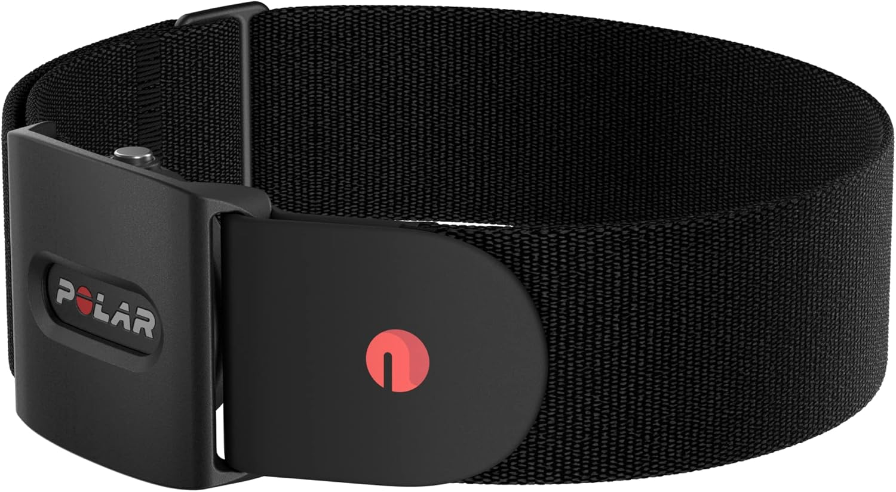{.sensor-photo}
:::
::: {.column width=50%}
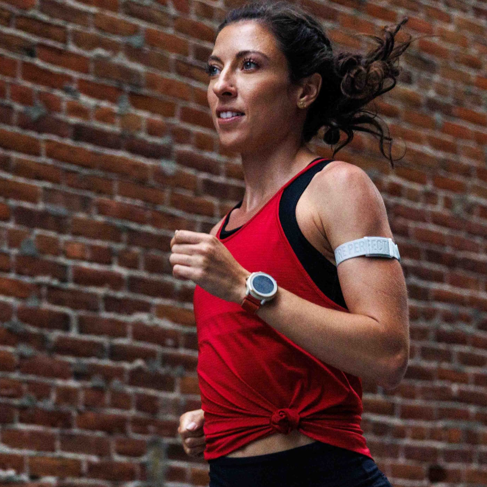{.sensor-photo}
:::
::::

## Data Output

:::: {.columns}

::: {.column width=40%}

Although some heart rate bands have the capability of recording ECG, communicating the **IBIs** is more effective for low energy devices.

:::

::: {.column width=60%}

```{julia}
#| echo: true
#| output: slide
#| label: inter-beat-intervals
f = Figure(size=(1200, 600));
ax = Axis(f[1, 1], 
    title="Raw Data",
    xlabel="Time (s)",
    ylabel="IBI (ms)")
n = data[1:50]
t = Observable(cumsum(n) ./ 1000) # to seconds
# x = Observable(60000 ./ n) # to bpm
x = Observable(n)
stem!(ax, t, x, color=:blue)
ylims!(ax, (minimum(n) - 20, maximum(n) + 20))
f
```

:::

::::

---


## IBIS are inversely proportional to Heart Rate

::: {.center-xy}
```{julia}
#| echo: true
#| output: slide
#| label: ibis-vs-hr
f = Figure(size=(1400, 600));
ax1 = Axis(f[1, 1], 
    title="Heart Rate",
    xlabel="Time (s)",
    ylabel="Heart Rate (bpm)")
n = data[1:50]
t = Observable(cumsum(n) ./ 1000) # to seconds
x = Observable(60000 ./ n) # to bpm
lines!(ax1, t, x, color=:blue, label="Heart Rate")
ax2 = Axis(f[1, 2], 
    title="Inter-Beat Intervals",
    xlabel="Time (s)",
    ylabel="IBI (ms)")
lines!(ax2, t, n, color=:red, label="IBI")
f
```
:::

---

```{julia}
#| echo: true
#| output: slide
#| label: heart-rate
f = Figure(size=(1600, 600));
ax = Axis(f[1, 1], 
    title="Heart Rate from Inter-Beat Intervals",
    xlabel="Heart Rate (bpm)",
    ylabel="Time (s)")
n = data[1:50]
t = Observable(cumsum(n) ./ 1000) # to seconds
x = Observable(60000 ./ n) # to bpm
lines!(ax, t, x, color=:teal, label="Continuous Heart Rate")
hlines!(ax, mean(x[]), label="Mean Heart Rate", linestyle=:dash, color=:coral, linewidth=2)

f
```

---

```{julia}
#| echo: true
#| output: slide
#| label: heart-rate2
f = Figure(size=(1600, 600));
ax = Axis(f[1, 1], 
    title="Heart Rate from Inter-Beat Intervals",
    xlabel="Heart Rate (bpm)",
    ylabel="Time (s)")
n = data
t = Observable(cumsum(n) ./ 1000) # to seconds
x = Observable(60000 ./ n) # to bpm
lines!(ax, t, x, color=:teal, label="Continuous Heart Rate")
hlines!(ax, mean(x[]), label="Mean Heart Rate", linestyle=:dash, color=:coral, linewidth=2)

f
```

# HRV Domains and Features

- **Time & statistics**
- **Frequency**
- **Geometric**
- **Nonlinear**

## Time Domain

:::: {.columns}
::: {.column width=50%}

- Mean
- Standard Deviation (SDNN)
- Median
- Extrema and Range
- BPM representations

:::

::: {.column width=50%}

 - SDSD
 - RMSSD
 - SDANN
 - PNN50, PNN20 and percentages
 - CVSD
 - rRR

:::

::::

## An empirical random variable

::: {.centered-xy}
```{julia}
#| echo: true
#| output: slide
#| label: histogram
# A histogram of the first 50 heartbeats
f = Figure(size=(1400, 600));
ax1 = Axis(f[1, 1], 
    title="Histogram of measured Heart Rate",
    xlabel="Heart Rate (bpm)",
    ylabel="Frequency")
n = data[1:50]
t = Observable(cumsum(n) ./ 1000) # to seconds
x = Observable(60000 ./ n) # to bpm
hist!(ax1, x, color=:teal, bins=40)
vlines!(ax1, mean(x[]), color=:red, linewidth=2, label="Mean")

ax2 = Axis(f[1, 2], 
    title="Estimated distribution of measured Heart Rate",
    xlabel="Heart Rate (bpm)",
    ylabel="Frequency")
# Makie.boxplot!(ax2, x, color=:teal, label="Heart Rate Boxplot"; orientation=:horizontal)
density!(ax2, x, color=:coral, label="Distribution Density")
vlines!(ax2, mean(x[]), color=:red, linewidth=2, label="Mean")

f
```

:::

## Numeric Derivative

```{julia}
#| echo: true
#| output: slide
#| label: sequential-differences
f = Figure(size=(1200, 600));
ax = Axis(f[1, 1], 
    title="Difference of Sequential Inter-Beat Intervals",
    xlabel="Time (s)",
    ylabel="Inter-Beat Interval (ms)")
n = data[1:end]
t = Observable(cumsum(n) ./ 1000) # to seconds
x = Observable([0; diff(n)])
x_above_zero = Observable(clamp.(x[], 0, Inf))
x_below_zero = Observable(clamp.(x[], -Inf, 0))
zero_line = Observable(zeros(length(x[])))
lines!(ax, t, x, color=:teal)
# Band above zero
# band(x, ylower, yupper; kwargs...)
band!(ax, t, zero_line, x_above_zero,
    color=:teal, alpha=0.5)
band!(ax, t, zero_line, x_below_zero,
    color=:coral, alpha=0.5)
# The +/-50 ms threshold: successive differences beyond it are the ones counted
# by pNN50. Paint those beats blue, the rest red.
hlines!(ax, [50.0, -50.0], color=:gray, linestyle=:dash, linewidth=1)
pnn50_color = [abs(v) > 50 ? :blue : :red for v in x[]]
scatter!(ax, t, x, color=pnn50_color, markersize=8)
f
```


## RMSSD

:::: {.columns}
::: {.column width=80%}
```{julia}
#| echo: true
#| output: slide
#| label: diff
n = data[1:50]
t = Observable(cumsum(n) ./ 1000) # to seconds
x = Observable([0; diff(n)])
x_above_zero = Observable(clamp.(x[], 0, Inf))
x_below_zero = Observable(clamp.(x[], -Inf, 0))
zero_line = Observable(zeros(length(x[])))
f = Figure(size=(1600, 600));
ax1 = Axis(f[1, 1], 
    title="Difference of Sequential IBIs",
    xlabel="Time (s)",
    ylabel="ΔTime (ms)")
lines!(ax1, t, x, color=:teal, label="ΔRR[n, n+1]")
# Band above zero
# band(x, ylower, yupper; kwargs...)
band!(ax1, t, zero_line, x_above_zero, 
    color=:teal, alpha=0.5)
band!(ax1, t, zero_line, x_below_zero, 
    color=:coral, alpha=0.5)
scatter!(ax1, t, x, color=:red, markersize=5)

ax2 = Axis(f[1, 2], 
    title="IBIs and its Numeric Derivative",
    xlabel="Time (s)",
    ylabel="ΔTime (ms)")
lines!(ax2, t, x, color=:teal, alpha=0.5)
band!(ax2, t, zero_line, x_above_zero, color=:teal, alpha=0.25)
band!(ax2, t, zero_line, x_below_zero, color=:coral, alpha=0.25)
scatter!(ax2, t, x, color=:red, markersize=5, alpha=0.5)

ax3 = Axis(f[1, 2], 
    xlabel="Time (s)",
    ylabel="RR-interval (ms)",
    yticklabelcolor=:blue,
    yaxisposition=:right
    )
lines!(ax3, t, n, color=:blue, linewidth=3, label="Detrended RR-interval signal")

f
```
:::

::: {.column width=20%}
```{julia}
#| echo: true
#| output: slide
#| label: rmssd
println("SDNN: ", round(StatsBase.std(n), digits=2))
println("RMSSD: ", round(StatsBase.std(x[]), digits=2))
```

:::
::::

## Frequency Domain

:::: {.columns}

::: {.column width=50%}

::: {}
- Power Spectral Density (PSD) over four frequency bands:
    - High Frequency (HF): 9-24 BPM (0.15-0.4 Hz)
    - Low Frequency (LF): 2.4-9 BPM (0.04-0.15 Hz)
    - Very Low Frequency (VLF): .18-2.4 BPM (0.003-0.04 Hz)
    - Ultra Low Frequency (ULF): < .18 BPM (< 0.003 Hz) 
- Absolute and relative power
- Peak frequencies
- Proportions and ratios (LF/HF, VLF/LF, etc.)
:::

:::

::: {.column width=50%}

```{julia}
using HeartRateLab.Frequency: welch, get_power, find_peak
pgram = welch(data)
f = Figure(size=(1200, 600));
ax = Axis(f[1, 1], 
    title="Power Spectral Density",
    xlabel="Frequency (Hz)",
    ylabel="Power (ms²/Hz)",
    limits=((0, 0.4), (0, nothing)),
    )
lines!(ax, pgram.freq, pgram.power)
# HF
vspan!(ax, 0.15, 0.4, color=:blue, alpha=0.2)
# LF
vspan!(ax, 0.04, 0.15, color=:green, alpha=0.2)
# VLF
vspan!(ax, 0.003, 0.04, color=:orange, alpha=0.2)
# ULF
vspan!(ax, 0, 0.003, color=:purple, alpha=0.2)
# peak_freq = find_peak(pgram, 0.003, 0.4)
# vlines!(ax, peak_freq, color=:red, linewidth=2, label="P: $(round(peak_freq, digits=3)) Hz")
f
```

:::

::::

## Geometric Domain

:::: {.columns}
::: {.column width=40%}
- Poincaré Plot
    - SD1: Short-term variability
    - SD2: Long-term variability
    - SD1/SD2 ratio, area
    - cvi
    - ccsi
- Histogram Based:
    - Triangular Index
    - Triangular Interpolation of NN intervals (TINN)
:::

::: {.column width=60%}
```{julia code-line-numbers="10,11"}
#| echo: true
#| output: slide
#| label: poincare
function getellipsepoints(cx, cy, rx, ry, θ)
	t = range(0, 2*pi, length=100)
	ellipse_x_r = @. rx * cos(t)
	ellipse_y_r = @. ry * sin(t)
	R = [cos(θ) sin(θ); -sin(θ) cos(θ)]
	r_ellipse = [ellipse_x_r ellipse_y_r] * R
	x = @. cx + r_ellipse[:,1]
	y = @. cy + r_ellipse[:,2]
	(x,y)
end
x = [data[i] for i in 1:length(data)-1]
y = [data[i+1] for i in 1:length(data)-1]
sd1 = sqrt(StatsBase.var((x - y) / sqrt(2)))
sd2 = sqrt(StatsBase.var((x + y) / sqrt(2)))
f = Figure(size=(1200, 600));
ax = Axis(f[1, 1], 
    title="Poincaré Plot",
    xlabel="ΔRR(n) (ms)",
    ylabel="ΔRR(n+1) (ms)")
scatter!(ax, x, y, markersize=5, label="ΔRR[i, i+1]")
cx = mean(x)
cy = mean(y)
ellipse_x, ellipse_y = getellipsepoints(cx, cy, sd2, sd1, π/4)
lines!(ax, ellipse_x, ellipse_y, linewidth=2, label="Variance Ellipse", color=:coral)
f[1,2] = Legend(f, ax, "Poincaré Plot",
    position=:bottomright, 
    title="Poincaré Plot Legend",
    fontsize=10,
    bgcolor=:white,
    framecolor=:black)

f
```
:::

::::

## Nonlinear Domain

:::: {.columns}

::: {.column width=50%}
- Approximate Entropy (ApEn)
- Sample Entropy (SampEn)
- Hurst Exponent
- Renyi Entropy
- Detrended Fluctuation Analysis (α1, α2)
:::

::: {.column width=50%}
```{julia}
#| echo: true
#| output: slide
#| label: dfa

# Congruent with HeartRateLab's DFA defaults (Features.config): an INTEGER box
# grid, order-1 detrending, non-overlapping windows - α1 over boxes 4-16 and
# α2 over 16-64.
ns   = collect(4:64)
fluc = [DFA.dfa(data, k; order=1, overlap=0.0) for k in ns]
logn = log10.(Float64.(ns))
logf = log10.(fluc)

i1 = findall(n -> 4 <= n <= 16, ns)     # α1 (short-term) boxes
i2 = findall(n -> 16 <= n <= 64, ns)    # α2 (long-term) boxes
b1, α1 = DFA.polyfit(logn[i1], logf[i1])
b2, α2 = DFA.polyfit(logn[i2], logf[i2])

f = Figure(size=(1400, 650));
ax = Axis(f[1, 1],
    title="DFA on this recording:  α1 = $(round(α1, digits=3))   |   α2 = $(round(α2, digits=3))",
    xlabel="log10(box size n)",
    ylabel="log10 F(n)",
)
scatter!(ax, logn, logf, color=:black, markersize=8)
x1 = range(minimum(logn[i1]), maximum(logn[i1]), length=50)
lines!(ax, x1, b1 .+ α1 .* x1, color=:crimson, linewidth=3,
    label="α1 (4-16) = $(round(α1, digits=3))")
x2 = range(minimum(logn[i2]), maximum(logn[i2]), length=50)
lines!(ax, x2, b2 .+ α2 .* x2, color=:royalblue, linewidth=3,
    label="α2 (16-64) = $(round(α2, digits=3))")
axislegend(ax; position=:lt)
f
```
:::
::::


# The HeartRateLab {.hrl-logo-slide}

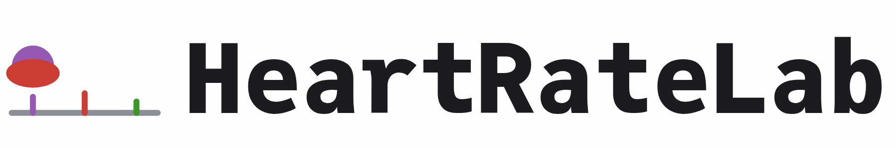{.hrl-wordmark}

```{julia}
#| include: false
ds = HeartRateLab.Features.extract_feature_set(
    data, features=["vlf", "rmssd"]
)
```

## Preprocessing

:::: {.columns}

::: {.column width=30%}
- Input from TXT: EliteHRV, Kubios
- Input as WFDB: PhysioNet
- Input as XDF: sub ms precision, markers
- Live input from LSL:
  - Synchronized signals and data
  - Combine with myriad of other devices
:::

::: {.column width=30%}
- Replace Zeros
- Replace biological outliers (200 to 3000 ms) and breaks
- Replace statistical outliers (Z(0.025, 0.975))
- Ectopic beat detection:
    - ACAR @acar2000
    - Karlsson @karlsson2012
    - Malik @malik1996
    - Kamath @kamath1995
    - Custom absolute threshold (0.2)
:::

::: {.column width=30%}
- Signal interpolation:
    - Constant
    - Linear
    - Quadratic
    - Cubic
- Windowed analysis:
    - Sliding window
    - Overlapping windows
    - Non-overlapping windows
:::
::::

## Raw data

```{julia}
#| echo: true
#| output: slide
#| label: data-preprocess
f = Figure(size=(800, 600));
ax = Axis(f[1, 1], 
    title="Raw Data",
    xlabel="Time (s)",
    ylabel="Inter-Beat Interval (ms)",
    )
n = data[1:50]
x = Observable(n)
t = Observable(cumsum(n) ./ 1000) # to seconds
stem!(ax, t, x, color=:red)
ylims!(ax, (minimum(n) - 20, maximum(n) + 20))
f
```

## Ectopic-beat removal

```{julia}
#| echo: true
#| output: slide
#| label: outlier-detection
f = Figure(size=(800, 600));
ax = Axis(f[1, 1], 
    title="Raw Data",
    xlabel="Time (s)",
    ylabel="Inter-Beat Interval (ms)")
n = data[1:end]
x = Observable(n)
t = Observable(cumsum(n) ./ 1000) # to seconds
lines!(ax, t, x)
scatter!(ax, t, x, color=:red, markersize=5)

# Detect outliers
# xn = HeartRateLab.replace_ectopic_beats(n, method=:karlsson)
xn = HeartRateLab.replace_ectopic_beats(n, method=:acar, threshold=0.20)
x = Observable(xn)
scatter!(ax, t, x, color=:blue, markersize=5, label="Ectopic Beats Removed")

f
```

## Feature Extraction

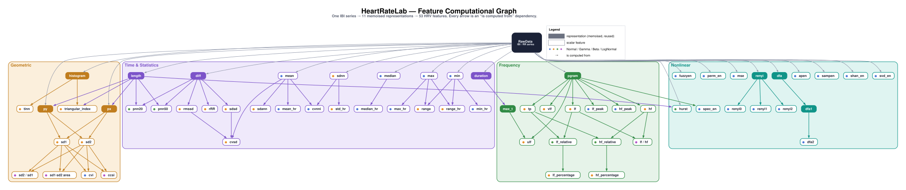{.compgraph}[^compgraph]

[[Open the full vertical graph]{.compgraph-zoomlink}](computational-graph-tall.svg){target="_blank" title="Opens the tall, full-resolution computational graph in a new tab"}

[^compgraph]: Graph laid out with Graphviz from the live `Features.jl` registry (`gen_compgraph_dot.py`): every parent-to-child dependency, the domain of each node, the representation/feature split and the distribution families are taken directly from the registered docstrings.


## Rolling Window Features

```{julia}
#| echo: true
#| output: slide
#| label: windowed-rmssd
ds_windowed = HeartRateLab.Features.windowed_feature_set(
    data, features=["vlf", "rmssd"], window_size=60, stride=10
)

f = Figure(size=(1200, 600));
ax = Axis(f[1, 1], 
    title="RMSSD through Time WS=60, S=10",
    xlabel="Time (s)",
    ylabel="RMSSD (ms²)")
x = ds_windowed.rmssd
t = 1:length(x)
lines!(ax, t, x, color=:blue)
f
```

## With different resolutions

```{julia}
#| echo: true
#| output: slide
#| label: windowed-short
ds_windowed = HeartRateLab.Features.windowed_feature_set(
    data, features=["vlf", "rmssd"], window_size=30, stride=1
)

ax = Axis(f[2, 1], 
    title="RMSSD through Time WS=30, S=1",
    xlabel="Time (s)",
    ylabel="RMSSD (ms²)")
x = ds_windowed.rmssd
t = 1:length(x)
lines!(ax, t, x, color=:blue)
f
```

---

```{julia}
#| echo: true
#| output: slide
#| label: windowed-long
ds_windowed = HeartRateLab.Features.windowed_feature_set(
    data, features=["vlf", "rmssd"], window_size=120, stride=5
)

ax = Axis(f[3, 1], 
    title="RMSSD through Time WS=120, S=5",
    xlabel="Time (s)",
    ylabel="RMSSD (ms²)")
x = ds_windowed.rmssd
t = 1:length(x)
lines!(ax, t, x, color=:blue)
f
```

## Windowed Frequency Analysis

```{julia}
#| echo: true
#| output: slide
#| label: windowed-freq
using HeartRateLab.Frequency: lomb_scargle
ds_windowed = HeartRateLab.windowed(data, window_size=60, stride=5)
freq = lomb_scargle(ds_windowed[1]).freq
y_values = 1:length(ds_windowed)
X = []
min_size = Inf
for i in 1:length(ds_windowed)
    w = ds_windowed[i]
    y = y_values[i]
    pgram = lomb_scargle(w)
    x = pgram.freq
    z = pgram.power
    push!(X, z)
    min_size = min(min_size, length(x))
end
# Crop every element to the minimum size
println("Minimum size: ", min_size)
println("Minimum in X: ", minimum([length(x) for x in X]))
for i in 1:length(X)
    X[i] = X[i][1:Int(min_size)]  # Ensure all have the same length
end
X = hcat(X...) # Windows by Frequency
y_values = 1:size(X, 2) # Window Index
freq = freq[1:Int(min_size)] # Crop frequency to the minimum size
f = Figure(size=(1600, 800));
ax = Axis3(f[1, 1], 
    title="Windowed Power Spectral Density",
    xlabel="Window Index",
    ylabel="Frequency (Hz)",
    zlabel="Power (ms²/Hz)",
    # limits=((0, length(ds_windowed)), (0, 0.5), (0, nothing)),
)
for i in 1:size(X, 2)
    x = freq # Frequency
    y = y_values[i] # Window Index
    z = X[:, i]
    points = Point3.(x, y, z)  # Data to Point3
    base   = Point3.(x, y, minimum(z))
    band!(ax, base, points, alpha=0.5, color=Makie.wong_colors()[i % length(Makie.wong_colors()) + 1])
    lines!(ax, points, linewidth=2, color=Makie.wong_colors()[i % length(Makie.wong_colors()) + 1])
end
f
```

## Statistical Analysis of single recordings

:::: {.columns}
::: {.column width=50%}
```{julia}
#| echo: true
#| output: slide
#| label: feature-registry
feature_registry = HeartRateLab.Features.feature_registry
feature_set = String.(keys(feature_registry))
println("Feature set: ")
for f in feature_set
    println(" - ", f)
end
```
:::

::: {.column width=50%}
```{julia}
#| echo: true
#| output: slide
#| label: feature-confidence
ds_windowed = HeartRateLab.Features.windowed_feature_set(
    data, features=["rmssd", "vlf"], window_size=60, stride=10
)
f = Figure(size=(600, 600));
ax = Axis(f[1, 1],
    title="Windowed RMSSD histogram",
    xlabel="Time (s)",
    ylabel="Feature Value",
)
x = ds_windowed.rmssd
# Confidence intervals
mean_x = mean(x)
std_x = std(x)
ci_lower = StatsBase.quantile(x, 0.025)
ci_upper = StatsBase.quantile(x, 0.975)
density!(ax, x, label="Density", color=(:coral, 0.5))
vlines!(ax, mean_x, color=:blue, linewidth=2, label="Mean")
vlines!(ax, ci_lower, color=:green, linewidth=2, linestyle=:dash, label="95% CI Lower")
vlines!(ax, ci_upper, color=:green, linewidth=2, linestyle=:dash, label="95% CI Upper")
# hist!(ax, x, bins=30, label="RMSSD")
f[1, 2] = Legend(f, ax, "Windowed RMSSD Histogram",
    position=:bottomright, 
    title="Windowed RMSSD Histogram Legend",
    fontsize=10,
    bgcolor=:white,
    framecolor=:black)  
f
```
:::
::::


# Dynamic Systems

Generative models of the IBI series.

- **Dynamic Mode Decomposition** - data-driven modal reconstruction
- **VanDerPol** - nonlinear relaxation oscillator
- **Lorenz** - deterministic chaos
- **LIF** - leaky integrate-and-fire pacemaker

## Dynamic Mode Decomposition

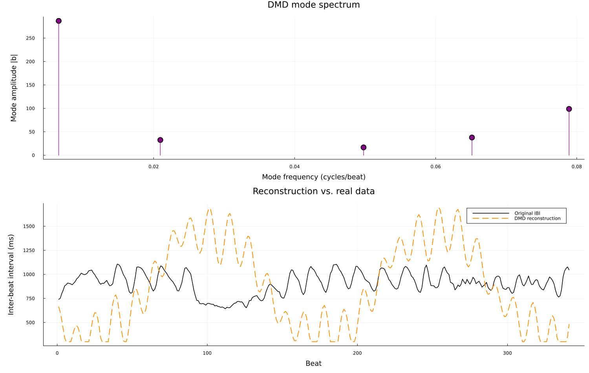{.model-fig}

## Van der Pol

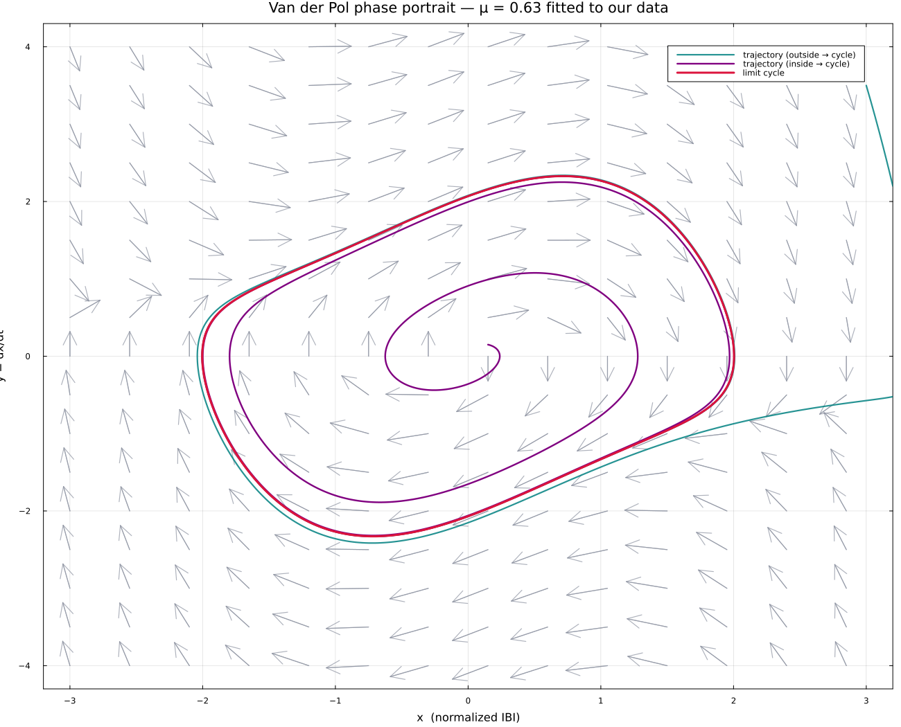{.model-fig}

## Van der Pol - animated

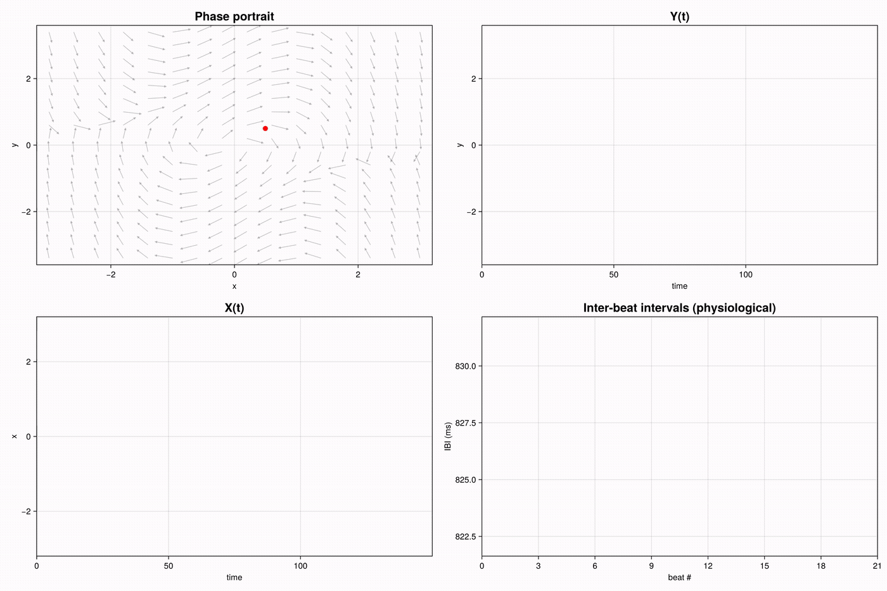{.model-fig}

## Lorenz

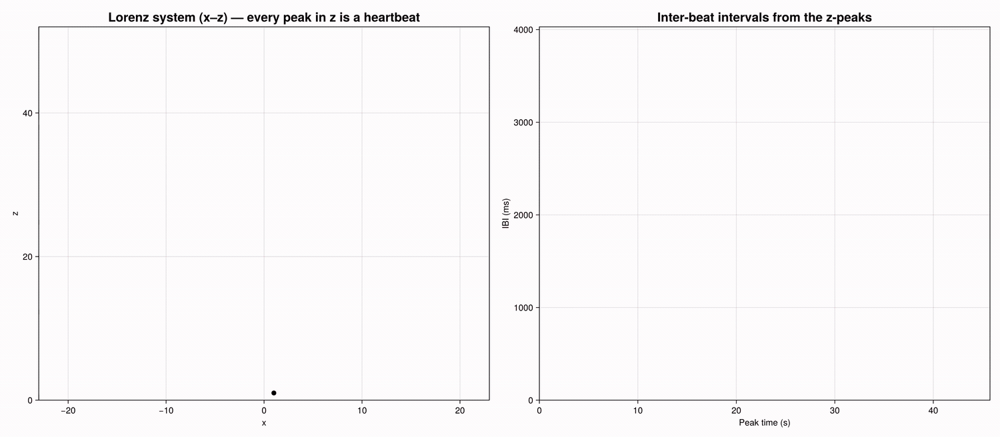{.model-fig}

## Leaky Integrate-and-Fire Model (LIF)

{.lif-artificial}

```{julia}
#| echo: true
#| label: lif
#| code-fold: true
using DifferentialEquations
using Random

# Parameters for the HRV model
params = (
    τ=0.6,        # Integration time constant
    I_base=1.1,   # Baseline input to the integrator
    threshold=0.9, # Firing threshold
    noise_amp=0.15,  # Amplitude of stochastic noise
)

# Define the integrate-and-fire dynamics
function hrv_dynamics(dV, V, p, t)
    dV[1] = (p.I_base - V[1]) / p.τ + p.noise_amp * randn()
end

# Time span for simulation
tspan = (0.0, 1000.0)  # Simulate for 100 seconds
V0 = [0.0]            # Initial integrator value

# Define the callback to reset the integrator and log spike times
function hrv_fire!(integrator)
    # Log the firing time
    global spike_times
    push!(spike_times, integrator.t)
    # Reset the integrator value
    integrator.u[1] = 0.0
end

# Condition for firing
function fire_condition(u, t, integrator)
    u[1] >= params.threshold
end

# Initialize a global spike time array
global spike_times = Float64[]

# Create a DiscreteCallback for firing events
fire_callback = DiscreteCallback(fire_condition, hrv_fire!)

# Solve the integrate-and-fire HRV model
hrv_problem = ODEProblem(hrv_dynamics, V0, tspan, params)
```

## LIF Input Current

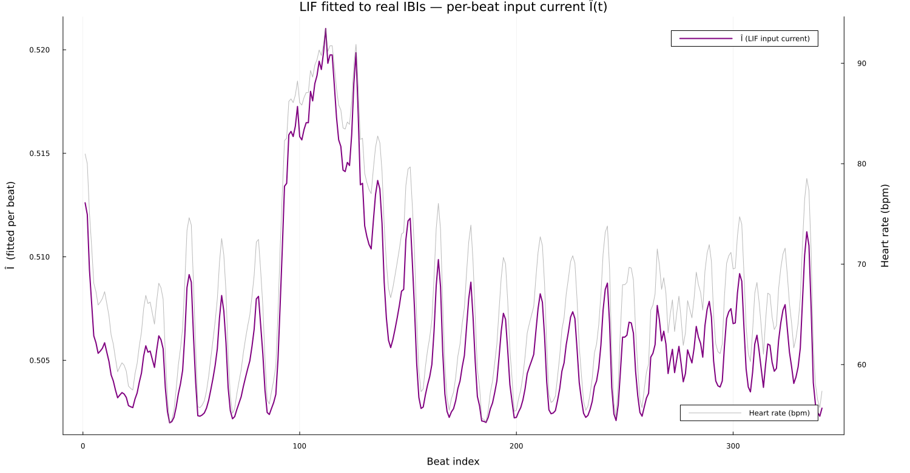{.model-fig}

## Solving ODEs

```{julia}
#| echo: true
#| output: slide
#| label: lif-solution
#| code-fold: true
hrv_solution = solve(hrv_problem, Tsit5(); callback=fire_callback)

# Interbeat intervals (IBIs) in milliseconds
IBIs = diff(spike_times) * 1000.0
IBIs = HeartRateLab.replace_bio_outliers(IBIs)

# Plot the results
f = Figure(size=(1600, 430));
ax = Axis(f[1, 1],
    title="Simulated Heart Rate",
    xlabel="Time (s)",
    ylabel="Heart Rate (bpm)",
)
# stem!(ax, spike_times[1:(end - 1)], IBIs,
#     marker=:circle, color=:blue, markersize=5)
t = cumsum(IBIs) ./ 1000 # Convert to seconds
x = 60000 ./ IBIs # Convert to bpm
lines!(ax, t, x, label="Simulated Heart Rate")
f
```

## Bayesian Inference and Statistical Modeling

:::: {.columns}
::: {.column width=50%}


Where we actually use it: fitting a **Bayesian AR model** to the RR-interval
series for forecasting. Unlike the LIF (which has a closed-form inter-spike
interval), the AR coefficients have no analytical solution, so we estimate a
posterior over the mean level, the innovation scale, and the AR weights.
:::

::: {.column width=50%}
```{julia}
#| eval: false
#| echo: true
#| output: slide
#| label: bayesian-inference
#| code-fold: false
using Turing

# Bayesian AR(p) model of the RR-interval series, used for RR forecasting.
@model function bayes_ar(y, p)
    n = length(y)
    mu    ~ Normal(mean(y), 200)         # mean RR level (ms)
    sigma ~ Exponential(50)              # innovation scale (ms)
    phi   ~ filldist(Normal(0, 0.5), p)  # AR coefficients
    for t in (p + 1):n
        m = mu
        for j in 1:p
            m += phi[j] * (y[t - j] - mu)
        end
        y[t] ~ Normal(m, sigma)
    end
end

# Fit to a recording's RR series, then draw the posterior predictive band
chain = sample(bayes_ar(rr, 8), NUTS(0.65), 250)
```
:::
::::

## AR forecast of the RR series

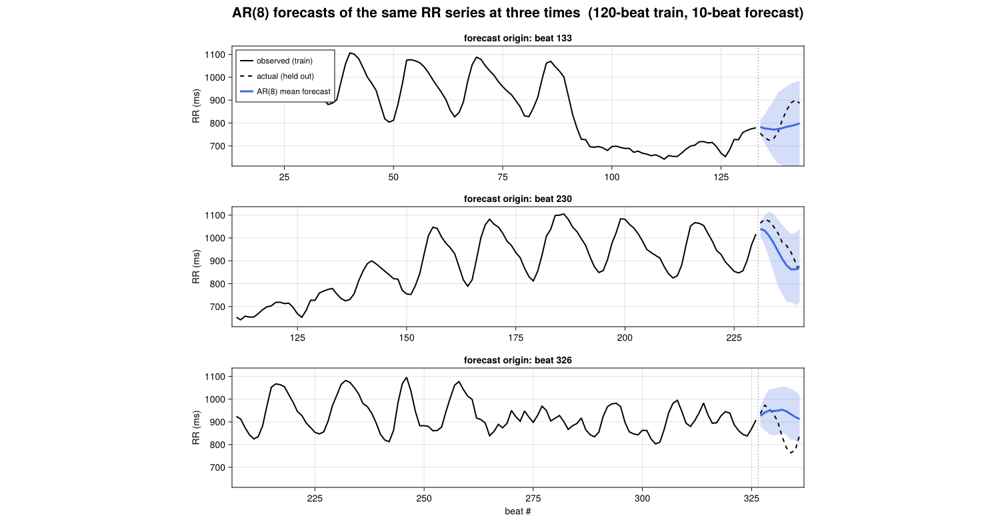{.model-fig}

## Deep Learning {data-visibility="hidden"}

<!-- Hidden: the VAE below is an illustrative Flux sketch (`eval: false`),
     never actually trained, so the slide stays out of the deck. -->

:::: {.columns}
::: {.column width=50%}
- Flux.jl
- Variational Autoencoders


:::

::: {.column width=50%}
```{julia}
#| echo: true
#| eval: false
#| output: slide
#| label: vae
#| code-fold: true
using Flux
using Statistics
using Random

# Set random seed for reproducibility
Random.seed!(42)

# Define the VAE model
struct VAE
    encoder
    decoder
    μ
    logσ
end

Flux.@functor VAE

function VAE(input_dim, latent_dim, hidden_dims)
    # Encoder (1D convolutional layers)
    encoder = Chain(
        Conv((3,), 1 => hidden_dims[1], relu; pad=(1,)),
        Conv((3,), hidden_dims[1] => hidden_dims[2], relu; pad=(1,)),
        Flux.flatten,
        Dense(hidden_dims[2] * input_dim, 64, relu),
    )

    # Latent space mean and log-variance
    μ = Dense(64, latent_dim)
    logσ = Dense(64, latent_dim)

    # Decoder (transposed 1D convolutional layers)
    decoder = Chain(
        Dense(latent_dim, 64, relu),
        Dense(64, hidden_dims[2] * input_dim, relu),
        x -> reshape(x, (input_dim, hidden_dims[2])),
        ConvTranspose((3,), hidden_dims[2] => hidden_dims[1], relu; pad=(1,)),
        ConvTranspose((3,), hidden_dims[1] => 1, sigmoid; pad=(1,)),
    )

    return VAE(encoder, decoder, μ, logσ)
end

# Reparameterization trick
function reparameterize(μ, logσ)
    σ = exp.(logσ)
    ϵ = randn(Float32, size(μ))
    return μ + σ .* ϵ
end

# VAE forward pass
function (vae::VAE)(x)
    h = vae.encoder(x)
    μ, logσ = vae.μ(h), vae.logσ(h)
    z = reparameterize(μ, logσ)
    # return vae.decoder(z), μ, logσ
    x_reconstructed = vae.decoder(z)
    # Reshape decoder output to match input shape for loss calculation
    return reshape(x_reconstructed, size(x)), μ, logσ
end

# Loss function (reconstruction + KL divergence)
function vae_loss(vae, x)
    x̂, μ, logσ = vae(x)
    reconstruction_loss = Flux.mse(x̂, x)
    kl_divergence = -0.5f0 * sum(1.0f0 .+ logσ .- μ .^ 2 .- exp.(logσ))
    return reconstruction_loss + kl_divergence
end

# Training loop
function train_vae(vae, data, epochs, batch_size, opt)
    train_loader = Flux.DataLoader(data; batchsize=batch_size, shuffle=true)
    for epoch in 1:epochs
        for x in train_loader 
            loss, grads = Flux.withgradient(vae) do m
                vae_loss(m, reshape(x, (size(x, 1), 1, size(x, 2))))
            end
            Flux.update!(opt, vae, grads[1])
        end
        println("Epoch $epoch, Last batch loss: $(loss)")
    end
end

# Parameters
input_dim = 64  # Window size
latent_dim = 16  # Latent space dimension
hidden_dims = [32, 64]  # Encoder/decoder hidden dimensions
n_samples = 1000  # Number of samples
seq_length = input_dim  # Sequence length
batch_size = 32
epochs = 10

# Initialize VAE model
vae = VAE(input_dim, latent_dim, hidden_dims)

# Optimizer
opt = ADAM(0.001)

# Train the VAE
train_vae(vae, data, epochs, batch_size, opt)
```
:::
::::

## Visualization

All visualizations in this notebook can be generated live.

```{julia}
#| eval: false
#| echo: true
#| output: slide
#| label: random-var
N = 10000
x = Observable(rand(N))
fig = Figure(size=(1800, 600));
ax = Axis(fig[1, 1], subtitle="Random Variable")
scatter!(ax, x)
ylims!(ax, -1, 2)
ax = Axis(fig[1, 2], subtitle="Distribution")
# density!(ax, x)
hist!(ax, x, bins=100)
xlims!(ax, -1, 2)
button = Button(fig[2, 1:2], label="New")
l = on(button.clicks) do b
    x[] = rand(N)
end
fig
```

**DEMO**


# Problem Solving with the HeartRateLab

What have we used the HeartRateLab for?

<!-- The 3-column body lives on a ## down-slide (below) rather than on this #
     divider: a level-1 slide centres its big title over tall multi-column
     content and they collide. Divider stays light; content flows from the top. -->

## Teaching, priors, and modeling

:::: {.columns}
::: {.column width=33%}
### Teaching and Learning

- Communication and Visualization
- Test-driven feature definition
- Ranges and normal values of features are part of our tests
- Open source encourages student engagement
- Online tools help us debug live during our experiments
- Online demos aid visual understanding
- Personal Biofeedback practice
:::

::: {.column width=33%}
### Managing Expectations and Priors

- Open Data Sets become the basis for our Normative Datasets
- For every study, a graph of related studies can be selected from a superset to compare and contrast the results.
- Given similar studies, we can design experiments with quantified expectations (Bayesian priors).
- We can identify outliers in different populations, and under different conditions.
:::

::: {.column width=33%}
### Modeling and Predicting

- Models can be tested against normative datasets.
- Their accuracy and precision can be quantified.
- Artificial models encourage model-thinking: no true model, but useful models.

:::
::::

##  What do we do with the HeartRateLab?

:::: {.columns}
::: {.column width=33%}
- Arousal and Relaxation
- Cognitive Mental Workload
- Attention and Dual-Tasking
- Attentional Networks
:::
::: {.column width=33%}
- Facial Expression Observation
- Ocular Rivalry and Conscious Perception
- Cognitive Flexibility
:::
::: {.column width=33%}
- Heart Rate Variability Biofeedback
- Mindfulness and Contemplative Practices
- Neurodiversity, ADHD, and Autism
:::
:::: 


# Scientific Infrastructure behind HeartRateLab

## Heterogenous Distributed Computing

The HeartRateLab was developed and is currently used under a self-designed research infrastructure that enables metascientific evaluation of the research field:

- The **Wanderers Science-OS**: A custom made NixOS system for a fleet of heterogenous devices that includes diferent forms of computing in diverse environments.
- The **Science Agents** agentic science framework: A sistem that includes research field mapping, bibliography and bibilometry, researcher and topic tracikng, conference and CfP monitor, project management, and general scientific supervision. 
- Explicit **Knowledge Management** systems over three shared memory layers on [**memvault**](https://git.plan.ai/plan-ai/memvault), running on the Wanderers fleet.

## Science Agents on the Wanderers

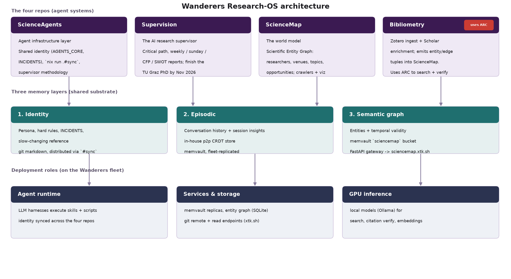{.sci-fig}

## The four systems

- **ScienceAgents** - agent infrastructure: shared identity and methodology.
- **Supervision** - the AI research supervisor: critical-path tracking and weekly / Sunday / CFP / SWOT reports, currently driving the TU Graz PhD.
- **ScienceMap** - the world model: a Scientific Entity Graph (researchers, venues, topics, opportunities) on semantic memory, with crawlers, tracking and visualization.
- **Bibliometry** - Zotero ingest + Scholar enrichment; emits entity/edge tuples into ScienceMap. Uses **AutoResearchClaw** for literature search and 4-layer citation verification.

Three memory layers on memvault - **Identity** (git), **Episodic**, and the **Semantic** graph - replicated across the fleet.

On the Wanderers fleet: the agents run on **Saturn**; **Moon** and **Phobos** host the services (git, memvault, entity graph); **Neptune** and **Jupiter** provide GPU inference and fast builds.

## AutoResearchClaw (ARC)

{.sci-fig}

## The HRV field over time

{.sci-fig}

## Research field networks

```{=html}
<iframe class="coauth-frame" src="./img/sci/hrv_coauthors.html" title="Interactive HRV citation network" loading="eager"></iframe>
```

554 papers and 3,841 citations - **89% sit in one connected component**, so the field is a single citation web, not scattered groups. Colour = research field; node size = how often a paper is cited within the set (the largest nodes are the shared foundations - Task Force 1996, Akselrod 1981, Peng/DFA 1995).

# Tools and Resources


---

::: {.columns}

::: {.column width=50%}
- [OpenNeuro](https://openneuro.org/)
- [PhysioNet](https://physionet.org/)
- [Wikidata](https://www.wikidata.org/)
- [Academic Torrents](https://academictorrents.com/browse.php)
- [Kaggle](https://www.kaggle.com/)
- [Zenodo](https://zenodo.org/)
- [Open Science Framework](https://osf.io/)
:::

::: {.column width=50%}
- [**HeartRateLab**](https://github.com/abcsds/HeartRateLab.jl)
- [**SequentialSamplingModels**](https://github.com/dfisher/SequentialSamplingModels.jl)
- [**MNE**](https://mne.tools/stable/auto_tutorials/index.html)
- [**LabStreamingLayer (LSL)**](https://labstreaminglayer.readthedocs.io/index.html)
:::
::::

## Analysis {data-visibility="hidden"}

::: {.columns}

::: {.column width=50%}
- [**JASP**](https://jasp-stats.org/)
- [JAMOVI](https://www.jamovi.org/)
- [R](https://www.r-project.org/)
- [R Studio](https://rstudio.com/)
- [Julia](https://julialang.org/)
- [Python](https://www.python.org/)
- [SPSS](https://www.ibm.com/analytics/spss-statistics-software)
- [NotebookLM](https://notebooklm.com/)
:::

::: {.column width=50%}
- [Ollama](https://ollama.com/)
- [LangChain](https://python.langchain.com/)
- [OpenWebUI](https://openwebui.org/)
- [Hugging Face](https://huggingface.co/)
- [Obsidian](https://obsidian.md/)
- [ResearchRabbit](https://www.researchrabbit.ai/)
- [Elicit](https://elicit.org/)
- [Consensus](https://consensus.app/)
- [Python Scholarly](https://pypi.org/project/scholarly/)
- [PyBibliometrics](https://pypi.org/project/pybibliometrics/)
- [Python SemanticScholar](https://pypi.org/project/semanticscholar/)
- [Padron del SNII](https://conahcyt.mx/sistema-nacional-de-investigadores/padron-de-beneficiarios/)
:::

::::

## References
::: {#refs}
:::

# Thank you {.hrl-thanks .jc-center}

::: {.thanks-wrap}
{.hrl-ring fig-alt="HeartRateLab ring logo"}

[github.com/abcsds/HeartRateLab.jl](https://github.com/abcsds/HeartRateLab.jl)

Alberto Barradas, JuliaCon 2026, Mainz, Germany
:::