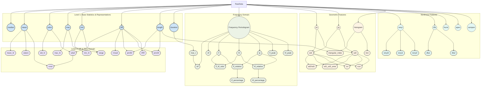

```mermaid

%% {init: {"flowchart": {"curve":"stepBefore"}} }%%
flowchart TB
  RawData
  %% Level 1: Base Statistics & Representations
  subgraph subGraph0["Level 1: Base Statistics & Representations"]
    mean((mean))
    sdnn((sdnn))
    median((median))
    max((max))
    min((min))
    diff((diff))
    length((length))
    duration((duration))
  end

  %% Level 2: HR & Time Domain
  subgraph subGraph1["Level 2: HR & Time Domain"]
    mean_hr([mean_hr])
    std_hr([std_hr])
    max_hr([max_hr])
    min_hr([min_hr])
    sdsd([sdsd])
    range([range])
    rmssd([rmssd])
    sdann([sdann])
    pnn50([pnn50])
    pnn20([pnn20])
    cvsd([cvsd])
    rRR([rRR])
  end

  %% Frequency
  subgraph subGraph2["Frequency Domain"]
    pgram((Frequency Periodogram))
    max_t([max_t])
    ulf([ulf])
    vlf([vlf])
    lf([lf])
    hf([hf])
    tp([tp])
    lf_peak([lf_peak])
    hf_peak([hf_peak])
    lf_hf_ratio([lf_hf_ratio])
    lf_relative([lf_relative])
    hf_relative([hf_relative])
    lf_percentage([lf_percentage])
    hf_percentage([hf_percentage])
  end

    %% Geometric
    subgraph subGraph3["Geometric Features"]
        px((px))
        py((py))
        histogram((histogram))
        sd1([sd1])
        sd2([sd2])
        sd2_sd1([sd2/sd1])
        sd1_sd2_area([sd1_sd2_area])
        cvi([cvi])
        ccsi([ccsi])
        triangular_index([triangular_index])
        tinn([tinn])
    end

    %% Nonlinear
    subgraph subGraph4["Nonlinear Features"]
        apen((apen))
        sampen((sampen))
        hurst((hurst))
        renyi((renyi))
        renyi0([renyi0])
        renyi1([renyi1])
        renyi2([renyi2])
        dfa((dfa))
        dfa1([dfa1])
        dfa2([dfa2])
    end

    %% Node linkages 
    RawData --> median & mean & sdnn & max & min & diff & length & duration & pgram & px & py & renyi & dfa & hurst & apen & sampen & histogram
    mean --> mean_hr & sdann & cvsd
    sdnn --> std_hr & sdsd
    max --> max_hr & range
    min --> min_hr & range
    diff --> sdsd & rmssd & pnn50 & pnn20 & rRR
    length --> pnn50 & pnn20 & triangular_index
    sdsd --> cvsd
    duration --> max_t
    max_t --> ulf
    pgram --> ulf & vlf & lf & hf & tp & lf_peak & hf_peak
    lf --> lf_hf_ratio & lf_relative
    hf --> lf_hf_ratio & hf_relative
    tp --> lf_relative & hf_relative
    lf_relative --> lf_percentage
    hf_relative --> hf_percentage
    px --> sd1 & sd2
    py --> sd1 & sd2
    sd1 --> sd2_sd1 & sd1_sd2_area & cvi & ccsi
    sd2 --> sd2_sd1 & sd1_sd2_area & cvi & ccsi
    histogram --> triangular_index & tinn
    renyi --> renyi0 & renyi1 & renyi2
    dfa --> dfa1 & dfa2

  %% Color themes by class
  classDef basic fill:#cde4f7,stroke:#333,stroke-width:2px;
  classDef time fill:#efe7fa,stroke:#888,stroke-width:2px;
  classDef freq fill:#ecf3e6,stroke:#888,stroke-width:2px;
  classDef geom fill:#fdf4e3,stroke:#888,stroke-width:2px;
  classDef nl fill:#e3f7f3,stroke:#888,stroke-width:2px;
  classDef leaf fill:#f2f2f2,stroke:#bbb,stroke-width:1px,stroke-dasharray: 3 2;

  class mean,sdnn,median,max,min,diff,length,duration basic;
  class mean_hr,std_hr,max_hr,min_hr,sdsd,range,rmssd,sdann,pnn50,pnn20,cvsd,rRR time;
  class pgram,max_t,ulf,vlf,lf,hf,tp,lf_peak,hf_peak,lf_hf_ratio,lf_relative,hf_relative,lf_percentage,hf_percentage freq;
  class px,py,histogram,sd1,sd2,sd2_sd1,sd1_sd2_area,cvi,ccsi,triangular_index,tinn geom;
  class apen,sampen,hurst,renyi,renyi0,renyi1,renyi2,dfa,dfa1,dfa2 nl;
  class n1,n2 leaf;

  %% Bolder title
  linkStyle default stroke-width:1.3px,opacity:0.85;
```