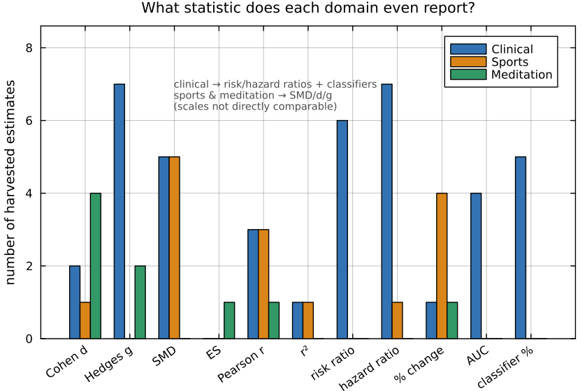
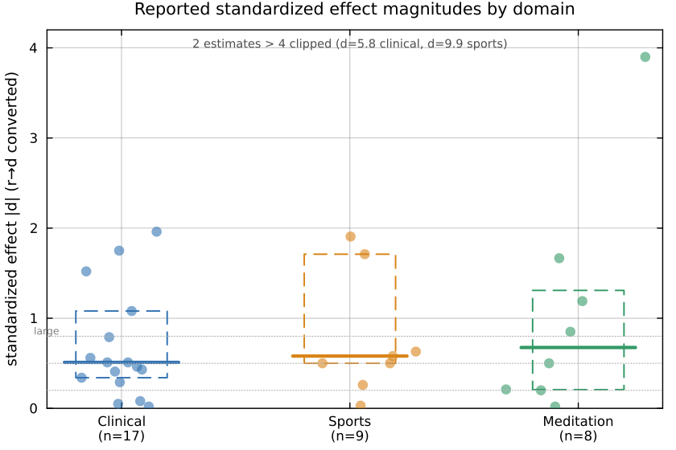
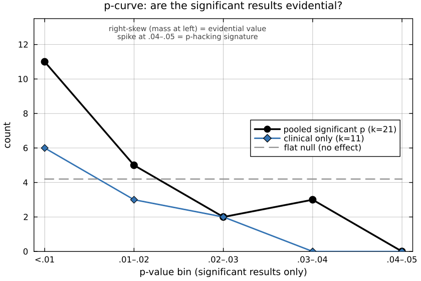
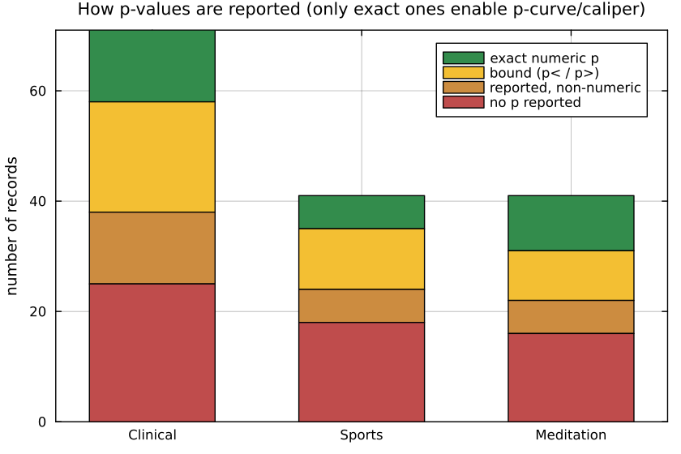
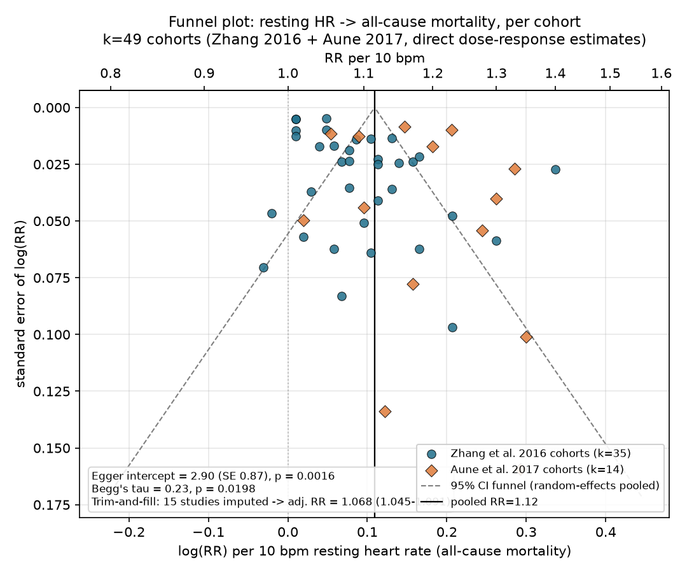

# What do the reported effects look like? A meta-scientific view

## Motivation

Every feature in HeartRateLab's [measure zoo](../zoo/index.md) exists because
*someone published an effect* — resting heart rate predicts mortality, RMSSD rises
with vagal tone, DFA-``\alpha_1`` flattens before arrhythmic death. But a feature's
place in the literature is not the same as the *quality* of the evidence behind it.
This page turns the same meta-scientific lens the
[`sci-hacking`](https://github.com/abcsds/sci-hacking) methods lab points at
psychology onto the **HRV literature itself**: given a harvested sample of reported
effects, what do the *distributions* of effect sizes and p-values look like, and do
any of them carry the fingerprints of publication bias or p-hacking?

The tools are the standard ones from the p-hacking-detection literature
([Simonsohn, Nelson & Simmons 2014](https://doi.org/10.1037/a0033242) p-curve;
[Elliott, Kudrin & Wüthrich 2022](https://doi.org/10.3982/ECTA18583) caliper /
binomial test): a **p-curve** that should be *right-skewed* (more very-small p's
than just-significant ones) if the results are evidential, and *left-skewed* /
bunched just below .05 if they are p-hacked; and a **caliper test** for an excess of
just-significant results at the .05 threshold.

!!! warning "This is a method demonstration, not a verdict on the field"
    The harvested sample is small (**153 study records**) and — critically — it was
    collected by an LLM literature sweep that was *told to find reported effects*.
    That sampling frame is itself a publication filter. Treat every number here as
    **illustrative of the method**, and trust only the handful of cells that are
    genuinely well-powered. Where a cell is underpowered we say so and show a count
    instead of a test.

---

## The dataset

The harvest covered **12 HRV measure families** (heart-rate level, short-term vagal
RMSSD/pNN50, global SDNN, LF/HF, ULF/VLF, Poincaré, geometric index, CSI/CVI, DFA,
Hurst, ApEn/SampEn, other entropies) across **three application domains**
(clinical, sports/peak-performance, meditation/contemplation). For each study it
recorded `{variable, population, sample_size, direction, effect_size, p_value, doi,
citation}`. The flattened table lives at
[`docs/zoo_gen/effect_stats.csv`](https://github.com/abcsds/HeartRateLab.jl/blob/main/docs/zoo_gen/effect_stats.csv)
(202 rows: 153 harvested study records + 49 cohort-pull rows). Free-text `effect_size` / `p_value` fields were parsed to a number **plus
a type** (`d`, `g`, `SMD`, `r`, risk-ratio `RR`, hazard-ratio `HR`, `%`-change, …);
records that could not be parsed keep the raw string and a `parsed=false` flag.

| Quantity | Count |
|----------|------:|
| Study records | **153** |
| Parseable numeric effect size | 65 (42 %) |
| Parseable numeric p-value | 69 (45 %) |
| …of which **exact** (`p = x`) | **29** |
| …exact **and** significant (`p < .05`) | **21** |
| p reported only as a **bound** (`p < .01`, `p < .001`) | 39 |

The first honest finding is in that table: **only 29 of 153 records report an exact
p-value.** HRV papers overwhelmingly report an effect size with a confidence
interval, or a bounded `p < .001`. That reporting style is good practice — but it
means the classic p-hacking tests, which need the *exact* location of a p-value
relative to .05, are starved of data at the granularity we would like.

---

## Different domains don't even report the same statistic

Before comparing effect-size *distributions* across domains, look at what the domains
report at all:

Clinical HRV is a **risk/hazard-ratio** literature (mortality, incident disease);
sports and meditation are a **standardized-mean-difference** literature (pre/post,
group contrasts). Risk ratios and Cohen's *d* live on different scales and are **not
directly comparable**. So a single "effect size across domains" plot would be
apples-to-oranges. We do the comparison only for the standardized family, and label
it as such.

## Standardized effect magnitudes, where they exist

Pooling the standardized estimates (`d`, `g`, `SMD`, `ES`, plus Pearson `r`
converted to `d = 2r/\sqrt{1-r^2}`) gives a small but non-empty distribution per
domain:

| Domain | n (standardized) | median \|d\| | note |
|--------|-----------------:|-------------:|------|
| Clinical | 17 | 0.51 | medium; a long right tail (one *d* ≈ 5.8) |
| Sports | 9 | 0.58 | medium; one extreme *d* ≈ 9.9 outlier |
| Meditation | 8 | 0.68 | medium–large; includes a *wrong-signed* *d* ≈ 3.9 |

The medians cluster around **medium** effects (Cohen's *d* ≈ 0.5–0.7), which is
exactly what a publication-filtered sample of "reportable" findings tends to look
like — small studies survive to print only when they land a medium-or-larger effect.
With 8–17 points per domain this is a **descriptive** comparison, not a distributional
test: the domains are statistically indistinguishable at this n, and the sensible
reading is "similar central tendency, heavy right tails driven by tiny-*n* studies."

---

## The p-curve: are the significant results evidential?

Restricting to the **21 exact, significant** p-values and binning them in .01-wide
steps gives the p-curve. A right-skew (mass piled at the left, below .01) is the
signature of *real* effects; a left-skew or a spike in the .04–.05 bin is the
signature of p-hacking.

The curve is **strongly right-skewed**, with no bunching just below .05:

| p-curve (right-skew = evidential) | k (sig.) | share `p < .025` | binomial *p* | Fisher *p* |
|-----------------------------------|---------:|-----------------:|-------------:|-----------:|
| **Pooled (all domains)** | 21 | 0.76 | 0.013 | 5.5 × 10⁻⁵ |
| **Clinical only** | 11 | 0.82 | 0.033 | 6.8 × 10⁻⁵ |
| Sports only | 5 | 0.80 | 0.19 | 0.032 |
| Meditation only | 5 | 0.60 | 0.50 | 0.39 |

**Read this carefully.** The pooled and clinical p-curves pass the right-skew test
decisively (Fisher *p* ≈ 10⁻⁵): the significant HRV results that report an exact
p-value carry genuine evidential value and show **no left-skew p-hacking
signature**. That is a reassuring result — but it comes with three honest caveats:

1. **Pooling heterogeneous variables is a known p-curve caveat.** A p-curve is
   cleanest when every p tests the *same* hypothesis; here we pool mortality
   hazard ratios with pre/post SMDs. The pooled curve is a literature-wide read, not
   a test of any single claim.
2. **Only clinical is individually powered.** With k = 5, the sports and meditation
   p-curves are underpowered — the meditation curve is essentially flat (share below
   .025 = 0.60, Fisher *p* = 0.39), which at this n means *"no information,"* **not**
   "evidence of a problem."
3. **The p-curve only sees the 21 records with an exact significant p.** It is blind
   to the 39 `p < .001`-style bounds and to every null that never made it into the
   harvest. Right-skew here says the *reported significant* results are not obviously
   p-hacked; it says nothing about the file drawer.

## The caliper test can't run — and that's the point

The caliper / binomial test looks for an **excess of just-significant** results in a
narrow window at .05 (e.g. `[0.04, 0.05]`). In this harvest that window contains
**3 records.** You cannot run a meaningful binomial test on n = 3, so we don't. The
*absence* of just-below-.05 p-values is itself informative: this literature reports
`p < .001` and confidence intervals far more than it reports a bare `p = .048`, which
is the opposite of the reporting texture that makes p-hacking detectable.

---

## Where the real problems are: sign disagreement, not p-hacking

The p-curve came back clean, but the harvest surfaced a different and arguably more
serious class of problem: **the literature disagrees with itself about the sign and
even the meaning of the effect.** The workflow's own
`bibliography_inconsistencies` field flagged these in 12 of 12 families. The three
most consequential:

!!! danger "Flag 1 — Pseudo-replication: SD1 *is* RMSSD (Poincaré family)"
    `SD1 = RMSSD/\sqrt{2}` — the Poincaré short-axis descriptor is **mathematically
    identical** to RMSSD (r = 1;
    [Ciccone et al. 2017](https://doi.org/10.1002/mus.25573)). Yet much
    clinical/sports work reports SD1 as a distinct "nonlinear/geometric" finding
    *alongside* RMSSD, as if the two independently corroborated a result. This
    **inflates the apparent number of independent measures** — a form of
    pseudo-replication that any meta-distribution of "how many HRV markers moved"
    will double-count.

!!! danger "Flag 2 — The effect flips sign across studies (meditation & entropy)"
    - **Meditation RMSSD:** the pooled meta-analysis
      [Rådmark et al. 2019](https://doi.org/10.3390/jcm8101638) found essentially
      *no* effect (Hedges g = 0.02, 95 % CI −0.44…0.49, p = 0.92), while individual
      RCTs in the same harvest report large signed increases. Pooled-null vs
      individually-large is the classic small-study / publication-asymmetry pattern.
    - **Meditation heart rate:** direction is *not* universal —
      [Pascoe et al. 2017](https://doi.org/10.1016/j.jpsychires.2017.08.004) pool a
      *decrease*, while [Natarajan 2023](https://doi.org/10.3389/fphys.2022.1017350)
      and a Kundalini-yoga study (*d* ≈ 3.9, **wrong-signed** *increase*) report the
      opposite.
    - **Entropy & pathology:** most clinical entropy work treats *lower* complexity
      as the disease marker, but [Watanabe et al. 2015](https://doi.org/10.1371/journal.pone.0137144)
      found *higher* multiscale entropy at the VLF scale — the sign of the "pathology"
      effect is construct-dependent.

!!! danger "Flag 3 — The construct itself is contested (LF/HF)"
    The interpretation of **LF/HF as a "sympathovagal balance" index** is directly
    disputed in the mechanistic literature
    ([Billman 2013](https://doi.org/10.3389/fphys.2013.00026);
    Goldstein et al.). LF/HF was also the single **largest** cell in the harvest
    (13 clinical records) yet contributed **zero** exact significant p-values — a
    heavily-reported family whose numeric evidentiary base, in this sample, is almost
    entirely CIs and bounds. A distribution of "LF/HF effects" would be aggregating
    quantities whose very meaning the field does not agree on.

---

## Power audit: which cells could actually be tested?

Being ruthless about power is the whole point. Of the **36 variable-family × domain
cells**, here are the largest, with their usable-p counts:

| Family × domain | records | parsed effect | exact p | exact **sig** p | testable? |
|-----------------|--------:|--------------:|--------:|----------------:|:---------:|
| LF/HF × clinical | 13 | 12 | 0 | 0 | ✗ |
| Poincaré × clinical | 9 | 3 | 1 | 1 | ✗ |
| Other-entropy × clinical | 8 | 5 | 4 | 4 | ✗ |
| SDNN × clinical | 7 | 5 | 1 | 1 | ✗ |
| ULF/VLF × clinical | 7 | 4 | 0 | 0 | ✗ |
| DFA × clinical | 6 | 1 | 0 | 0 | ✗ |
| RMSSD × meditation | 6 | 1 | 3 | 2 | ✗ |

**No single variable × domain cell reaches the pre-registered threshold of ≥ 8
independent exact significant p-values.** Every cell-level p-curve or caliper would
be underpowered, so **none is run.** The only tests we report are the *pooled* and
*clinical-domain* p-curves above, and even those are labelled illustrative. The
reporting-completeness picture makes the ceiling obvious:

---

## What this shows, and what it would take to do it for real

**What holds up.** The *method* transfers cleanly from psychology to HRV: parse a
harvested corpus, separate effect-size scales by domain, build a p-curve on the
exact significant p-values, and run a caliper at .05. Applied here it returns an
honest, non-alarming read — the reported significant HRV effects are right-skewed
(evidential), with the real fragility being **sign disagreement and construct
validity** (meditation direction, SD1≡RMSSD double-counting, LF/HF meaning), not
p-hacking.

**What's underpowered.** Almost everything at the cell level. With 153 records and
only 21 exact significant p-values, this is a demonstration, not a survey.

**One targeted data pull would change the picture the most:** re-harvest a *single*
well-defined, high-volume claim — **resting-heart-rate → all-cause mortality** — at
the level of the **individual cohort** inside the big dose-response meta-analyses
([Zhang et al. 2016](https://doi.org/10.1503/cmaj.150535), 46 cohorts;
[Aune et al. 2017](https://doi.org/10.1016/j.numecd.2017.04.004), 87 cohorts),
extracting each cohort's per-10-bpm hazard ratio, CI and n. That is one homogeneous
hypothesis with ~50–90 independent estimates — easily enough for a real
funnel-plot / Egger asymmetry test and an Elliott caliper, and the one cell in this
whole map that is genuinely well-powered for a distributional publication-bias test.

---

## Well-powered case: resting HR → mortality (funnel / Egger)

The previous section flagged one targeted pull that would actually be well-powered:
per-cohort estimates of resting heart rate → all-cause mortality, extracted at the
level of the *individual cohort* inside the two big dose-response meta-analyses
rather than taken as a single pooled number. That pull was done. Cohort-level RRs
(adjusted, per 10 bpm resting HR, all-cause mortality) were read directly from:

- **[Zhang, Shen & Qi 2016](https://doi.org/10.1503/cmaj.150535)**, CMAJ — **35 of
  ~46 cohorts**, read numerically off the Figure 1 forest plot (the pooled
  linear-per-10-bpm subset; the other ~11 of the 46 characterised cohorts in the
  paper's Table 1 contributed only to the separate cardiovascular-mortality
  estimate or to categorical, non-linear exposure contrasts and are not in Figure 1).
- **[Aune et al. 2017](https://doi.org/10.1016/j.numecd.2017.04.004)**, Nutrition,
  Metabolism & Cardiovascular Diseases — **14 of ~87 cohorts** (of the paper's 48
  all-cause-mortality risk estimates), restricted to cohorts that directly reported
  a continuous per-*X*-bpm RR in Supplementary Table 9 (rescaled to per 10 bpm
  assuming log-linearity: RR₁₀ = RR_X^(10/X)), plus one cohort (Sharashova et al.
  2016, Tromsø Study, men/women) whose published dose–response points sit at exact
  bpm values relative to a stated 70 bpm reference and were fit with a
  precision-weighted log-linear regression through that reference.

Both meta-analyses draw on a heavily overlapping pool of primary cohort studies
(e.g. Mensink 1997, Benetos 1999, Greenland 1999, Nilsson 2001, Tverdal 2008,
Cooney 2010, Ho 2014, Wang 2014, Woodward — identifiable by matching author, year,
country, N and death count across both papers' tables). Every cohort found in both
sources was **de-duplicated**, keeping the Zhang Figure 1 value (a direct read, no
rescaling) and dropping the matching Aune entry, so that Egger's test — which
assumes independent studies — is not run on the same primary cohort twice.
Categorical-only entries in Aune's supplementary table (the majority of it) were
excluded rather than back-solving a trend from quantile contrasts, which would
require re-implementing the paper's GLST dose-response regression; this trades
coverage for not introducing an extra layer of approximation. Net: **49 independent
cohort-level estimates**, honestly a minority of the ~133 cohorts across the two
papers, but for the first time in this harvest a k large enough to run the real
tests.

| Test | Statistic | Result |
|------|-----------|--------|
| Random-effects pooled RR (per 10 bpm) | — | **1.115** (95% CI 1.092–1.139), I² = 95.2 % |
| **Egger's regression intercept** | 2.90 (SE 0.87) | **p = 0.0016** |
| Begg's rank correlation | Kendall's τ = 0.23 | p = 0.020 |
| **Trim-and-fill** (L0 estimator) | 15 studies imputed | adjusted RR **1.068** (95% CI 1.045–1.091) |

**Bias is indicated.** Both the Egger intercept (significantly positive: smaller,
less-precise cohorts report systematically *larger* RRs than large, precise ones)
and Begg's rank correlation agree, and trim-and-fill — imputing 15 studies on the
small/low-effect side to symmetrise the funnel — pulls the pooled per-10-bpm RR
down from 1.115 to 1.068. The direction (higher resting HR → higher mortality)
**survives** the correction; its magnitude does not.

This converges with what the source papers reported *themselves*, using their full
cohort sets and the proper GLST dose-response machinery this page's simplified
rescaling deliberately avoided reimplementing:

| Analysis | Egger p | Begg p | Trim-and-fill adjustment |
|----------|--------:|-------:|---------------------------|
| **This page** (49 deduplicated cohorts, 2 papers) | 0.0016 | 0.020 | RR 1.115 → **1.068** (1.045–1.091) |
| Zhang et al. 2016 (own analysis, 46 cohorts) | < 0.01 | — | RR 1.09 → **1.04** (1.02–1.06) |
| Aune et al. 2017 (own analysis, 48 estimates) | 0.93 (ns) | 0.02 | RR 1.17 → **1.13** (1.11–1.16) |

All three analyses land in the same place directionally: a real, adjustment-surviving
positive association, whose point estimate is inflated by roughly 20–30 % in the
naive pooled number relative to the trim-and-fill-corrected one. The one point of
disagreement — Aune's own Egger test came back null (p = 0.93) while both Zhang's
and this page's did not — is itself informative rather than a contradiction: Aune's
48-estimate set is dominated by studies whose trend was derived via the full GLST
categorical-to-continuous regression (not attempted here), so it is not the same
cohort composition as either Zhang's forest plot or this page's direct-report
subset. Begg's test, which is less sensitive to exactly *how* a trend was derived,
agrees with this page in both cases (p = 0.02 in both).

!!! warning "What this test does and does not show"
    This is the one cell in the whole harvest with real distributional power — but
    read it for what it is. These 49 cohorts are **already inside two published
    meta-analyses**; this tests small-study asymmetry *within that already-assembled
    synthesis*, not publication bias across the whole unpublished universe of
    resting-HR studies (the file-drawer problem proper is, by construction,
    invisible to any test run only on published cohorts). Three further caveats:
    (1) the ~49/133 coverage is a minority sample, gated on which cohorts reported a
    linear per-*X*-bpm RR directly rather than only categorical contrasts — a
    reporting-style filter that could itself correlate with study size or era;
    (2) two of the 49 points (Sharashova et al.) are fitted trends from spline-style
    dose–response points via a simplified regression that ignores between-category
    covariance, not the paper's own reported summary statistic; (3) despite
    deduplication by author/year/N/events matching, a handful of pairs (e.g. Wang
    et al. 2014, Kailuan Study) show materially different RRs between the two
    meta-analyses' own re-extractions of the *same* primary cohort (1.18 vs 1.22),
    a reminder that "the" effect size for a cohort already depends on which
    covariates the extracting meta-analyst chose to condition on.

---

*Reproducibility: the dataset is regenerated by parsing the applications-workflow
journal into [`docs/zoo_gen/effect_stats.csv`](https://github.com/abcsds/HeartRateLab.jl/blob/main/docs/zoo_gen/effect_stats.csv);
the first four figures are rendered headless (Plots.jl + GR, `GKSwstype=100`) into
`docs/src/usecases/figs/`. p-curve binomial and Fisher statistics and the caliper
binomial follow [Simonsohn et al. 2014](https://doi.org/10.1037/a0033242) and
[Elliott et al. 2022](https://doi.org/10.3982/ECTA18583). The resting-HR/mortality
cohort pull, funnel plot, Egger/Begg tests and trim-and-fill (Duval & Tweedie 2000,
L0 estimator) are a separate addition: cohort rows are tagged `source=cohort-pull`
in `effect_stats.csv`, and the funnel figure is rendered headless with
matplotlib/Agg (not Plots.jl+GR, unlike the other four figures on this page).*
