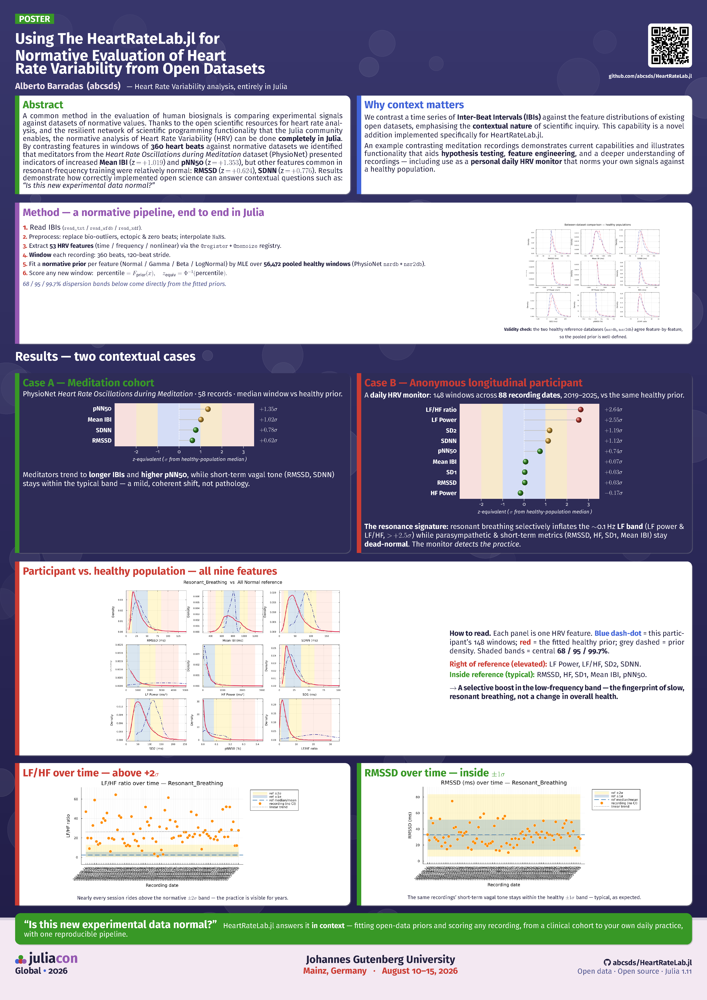

# Use Cases

HeartRateLab.jl is not just a feature library — it has been used to answer real
questions on real recordings. This section collects **finished applied studies**,
each built end-to-end with the package: from IBI parsing and windowed feature
extraction through to a concrete, reproducible result.

Every number on these pages is grounded in a shipped report or the committed data
in this repository; where a headline figure was superseded by a later
reconciliation, we say so explicitly and quote the corrected value.

## The applications

| Use case | Question answered | Headline result |
|----------|-------------------|-----------------|
| [Is my data normal?](normative.md) | Where does one HRV window sit relative to a healthy population? | A quantile *z*-equivalent against **56 472** pooled healthy windows, live-overlaid in `default_normative()`. |
| [Meditation & resonant breathing](meditation.md) | What does a vagally-dominant / resonance state look like in HRV space? | Meditation cohort: elevated Mean IBI (+1.02σ) & pNN50 (+1.32σ). A longitudinal participant: a **selective LF-band boost** (LF/HF +2.64σ). |
| [Forecasting the next heartbeats](forecasting.md) | How well can we predict upcoming RR intervals, with honest uncertainty? | A parsimonious **AR(8)** ties the best of 42 models and transfers to personal data with a near-nominal 90% band. |

*The normative-evaluation and meditation use cases were assembled into a JuliaCon
Global 2026 poster, "Using HeartRateLab.jl for Normative Evaluation of Heart Rate
Variability from Open Datasets."*

## How these relate to the rest of the docs

- The features scored on these pages each have a dedicated entry in the
  [HRV Variable Zoo](../zoo/index.md) — definition, normative distribution, and
  seminal citation.
- The normative and personal-baseline machinery is documented under
  [Visualization](../visualization.md).
- The forecasting study used a module that lives on a **separate branch**
  (`forecasting-integration`); it is presented here as a results narrative
  excerpted from its shipped reports, not as runnable code in this checkout.
