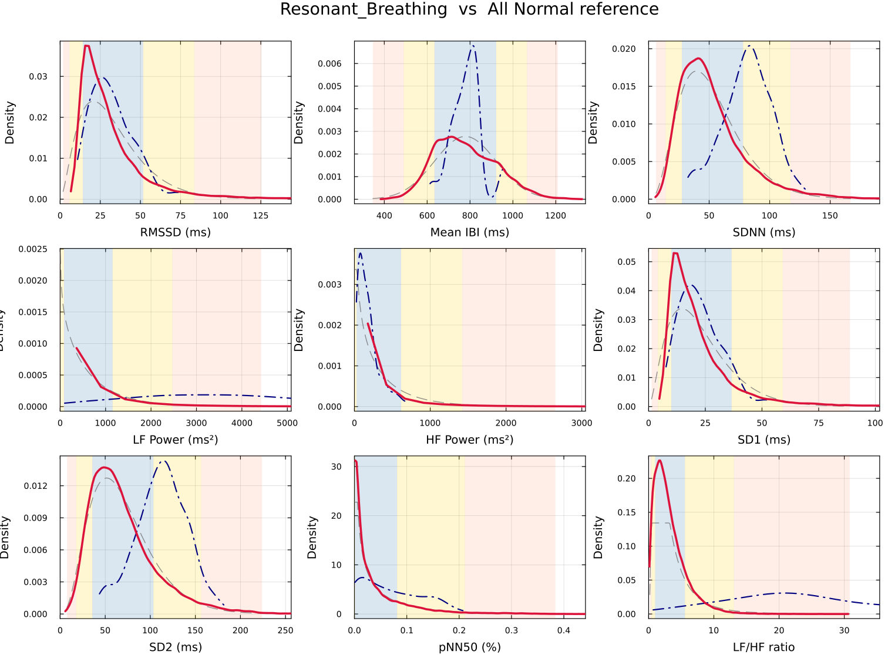
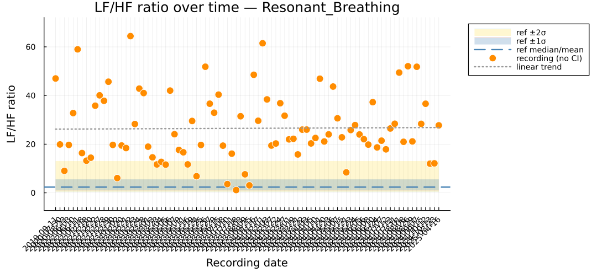
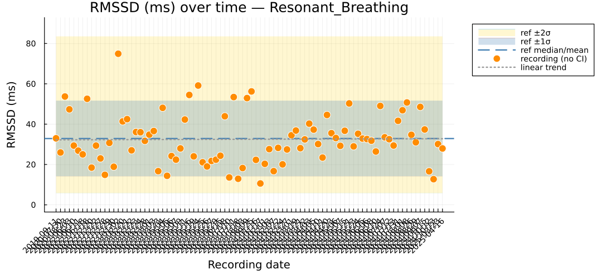

# Meditation & Resonant Breathing

## Motivation

Slow, paced breathing — meditation and resonant-frequency breathing near
~0.1 Hz — is known to reshape heart-rate variability. But *which* features move,
and by how much relative to a healthy baseline? Using the
[normative reference](normative.md), this use case scores two very different real
datasets and reads off their HRV signatures as quantile *z*-equivalents.

Both cases score features against the pooled healthy prior
(`nsrdb` + `nsr2db`, 56 472 windows, 360-beat windows / 120-beat stride) using the
quantile z-equivalent ``z = \Phi^{-1}(F_{\text{prior}}(x))``.

---

## Case A — Meditation cohort

**Dataset.** PhysioNet *Heart Rate Oscillations during Meditation*
[mietus2002](@cite) — **58 records** (meditators and comparison groups; record
labels `C*`, `Y*`, `M*`, `N*`, `I*`), cut into **2 686** windows
(`test/testdata/meditation/windowed_w360_s120_features.csv`).

**Method.** For each headline feature, take the **median across all 2 686 windows**,
then map it through the healthy prior with the quantile z-equivalent. Every value
below is reproducible from the two shipped CSVs — no display or WFDB tools needed.

**Result.** The cohort sits **above** the healthy population on the classic
vagal-tone panel:

| Feature | z-equivalent | Reading |
|---------|-------------|---------|
| [`mean`](../zoo/mean.md) (Mean IBI) | **+1.02** | longer inter-beat intervals (slower HR) |
| [`pnn50`](../zoo/pnn50.md) | **+1.32** | more large beat-to-beat changes |
| [`rmssd`](../zoo/rmssd.md) | **+0.94** | short-term vagal tone modestly elevated |
| [`sdnn`](../zoo/sdnn.md) | **+0.90** | overall variability modestly elevated |

The longer Mean IBI together with elevated pNN50 is the expected fingerprint of a
**vagally-dominant** state — consistent with the slowed, deepened breathing of
meditation and its respiratory-sinus-arrhythmia coupling [akselrod1981](@cite),
[taskforce1996](@cite).

!!! warning "Reconciled numbers (2026-07-29)"
    These are the **reproducible recompute** from the shipped cohort, not the
    original accepted-abstract values. A forensic audit found the abstract's
    **RMSSD +0.62 / SDNN +0.78 do not reproduce** under any aggregation × method:
    they imply observed medians (~42–45 / ~70–73 ms) *below* what the committed CSV
    yields (49.98 / 74.68 ms), i.e. they came from an earlier feature extraction not
    committed to this repo. Mean IBI +1.02 reproduces exactly; pNN50 is +1.32 under
    the quantile method used here (+1.35 under moment z). The abstract's phrase
    "reduced pNN50" is also an error — ``z = +1.32`` is an **increase**. Full audit:
    [z-score reconciliation report](reports/zscore-reconciliation.html).

---

## Case B — A longitudinal participant ("Resonant_Breathing")

**Dataset.** One anonymous participant recorded over **88 dates across 2019–2025**,
yielding **148** 360-beat windows — a personal "daily monitor" time series. Scored
against the same healthy prior (report:
[participant, w360 / s120](reports/participant_Resonant_Breathing_w360s120_report.html)).

**Result: a *selective* LF-band boost.** Unlike the broad shift of Case A, this
participant's departure from normal is concentrated in the low-frequency band and
its ratio, while short-term vagal indices stay squarely typical:

| Feature | z | Feature | z | Feature | z |
|---|---|---|---|---|---|
| [`lf_hf_ratio`](../zoo/lf_hf_ratio.md) | **+2.64** | [`sdnn`](../zoo/sdnn.md) | +1.12 | [`rmssd`](../zoo/rmssd.md) | +0.03 |
| [`lf`](../zoo/lf.md) (LF power) | **+2.55** | [`pnn50`](../zoo/pnn50.md) | +0.74 | [`sd1`](../zoo/sd1.md) | +0.03 |
| [`sd2`](../zoo/sd2.md) | +1.19 | [`mean`](../zoo/mean.md) (Mean IBI) | +0.07 | [`hf`](../zoo/hf.md) (HF power) | −0.17 |

LF power and LF/HF sit beyond +2.5σ while RMSSD, SD1, and HF are within ±0.2σ. That
**dissociation** — a large low-frequency oscillation without a matching rise in
high-frequency (respiratory) power or short-term scatter — is the classic
signature of **resonant-frequency breathing** near 0.1 Hz driving the baroreflex
[akselrod1981](@cite): the maneuver pumps energy specifically into the LF band.

*Each panel: the participant's feature distribution (solid) against the healthy
normative reference with 68/95/99.7 % bands. LF and LF/HF push well into the outer
bands; RMSSD/HF stay central.*

Tracked over time, the two behave differently: LF/HF is repeatedly elevated across
sessions, while RMSSD stays inside the typical range.

## Takeaway

The same normative machinery cleanly separates two kinds of "not average": Case A's
**broad vagal shift** (everything up together) versus Case B's **narrow spectral
signature** (LF only). Context — *which* features move — is the diagnosis.

## Reproduce / where the data lives

- **Case A data:** `test/testdata/meditation/windowed_w360_s120_features.csv`
  (2 686 windows) scored against `docs/normative_priors.csv`; aggregation =
  all-windows median, quantile z-equivalent. Audit + method matrix:
  [`reports/zscore-reconciliation.html`](reports/zscore-reconciliation.html).
- **Case B data:** the participant reports under `docs/reports/`
  (`participant_Resonant_Breathing_w360s120_report.html`, also `w60s30` /
  `w10s5`); figures reused here from the JuliaCon 2026 poster
  (`docs/poster/figs/`).
- **Scoring:** identical to the [normative use case](normative.md) —
  `normative_prior(name)` + ``\Phi^{-1}(\mathrm{cdf}(\cdot))``.
