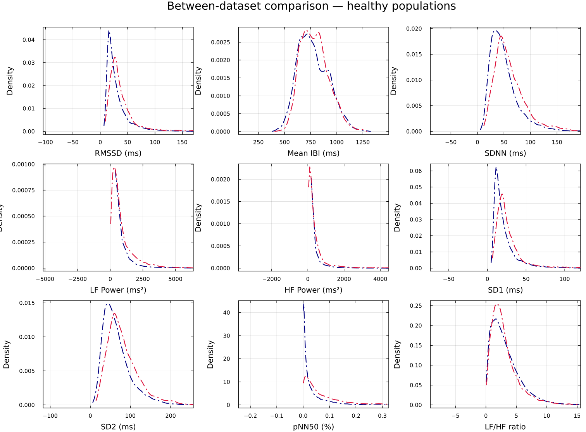

# Is My Data Normal?

## Motivation

An HRV number in isolation means little. Is an SDNN of 74 ms high, low, or
unremarkable? The honest answer is *"compared to what?"* This use case builds the
missing reference frame: a **normative prior** fitted from large open
normal-sinus-rhythm datasets, against which any new window can be scored as a
quantile *z*-equivalent: a single, interpretable "how unusual is this?" number
per feature.

## Method

The normative reference is fitted once, from two PhysioNet normal-sinus-rhythm
collections pooled together (`nsrdb` + `nsr2db`). Each recording is cut into
**360-beat windows with a 120-beat stride**, every window is scored through the
[53-feature registry](../features.md), and each feature's pooled distribution is
fitted to an analytical family (`Normal`, `Gamma`, `Beta`, or `LogNormal`, chosen
per feature). The result is **61 715 pooled healthy windows** summarised as one
fitted prior distribution per feature. The fitted priors ship in
`docs/normative_priors.csv`; a few examples:

| Feature | Family | Fitted prior | n windows |
|---------|--------|--------------|-----------|
| [`mean`](../zoo/mean.md) | `Normal` | `Normal(779.63, 146.81)` | 61 715 |
| [`sdnn`](../zoo/sdnn.md) | `Gamma` | `Gamma(3.795, 14.03)` | 61 715 |
| [`rmssd`](../zoo/rmssd.md) | `Gamma` | `Gamma(2.400, 14.22)` | 61 715 |
| [`pnn50`](../zoo/pnn50.md) | `Beta` | `Beta(0.3211, 3.563)` | 61 715 |
| [`lf_hf_ratio`](../zoo/lf_hf_ratio.md) | `LogNormal` | `LogNormal(0.852, 0.869)` | 61 715 |

Given a fitted prior with CDF ``F`` for a feature, a new value ``x`` is scored as
a **quantile z-equivalent**:

```math
z = \Phi^{-1}\!\big(F(x)\big)
```

where ``\Phi^{-1}`` is the standard-normal quantile function. This maps any
distribution family onto a common ``\sigma``-scale without assuming symmetry: a
value at the prior's median scores ``z = 0``, one at its 84th percentile scores
``z \approx +1``. The same idea, applied to a user's **own** history instead of the
population, gives the personal z-equivalent `baseline_z` used in the live tool.

Because the prior families are asymmetric where the biology is asymmetric, the
dispersion bands drawn around each feature are **distribution-aware central
quantile intervals**: the 68.27 % / 95.45 % / 99.73 % intervals standing in for
±1σ / ±2σ / ±3σ, rather than naive mean ± σ bands. The frequency-domain features
default to a **Welch periodogram** on the resampled RR series
(`config["freq_method"] == :welch`), with the raw unevenly-sampled **Lomb–Scargle**
periodogram [lomb1976](@cite), [scargle1982](@cite) available as an alternative
(`config["freq_method"] = :lomb_scargle`); the whole panel follows the standard HRV
measurement conventions [taskforce1996](@cite).

### Validity check: do the two healthy datasets agree?

Before trusting a pooled prior, the two source datasets are compared directly. The
between-dataset KDE overlay shows `nsrdb` and `nsr2db` tracing nearly the same
feature distributions: evidence that "healthy" is a stable reference here and the
pooling is legitimate.



## Result: a live "how normal is this?" overlay

The scoring is wired into a real-time visualization. `default_normative()` draws
the standard live HRV panels and overlays, on every panel, the personal-baseline
percentile band (shaded low–high with a median line) plus, in each panel title,
the current value's **percentile and z-equivalent**. So as beats stream in, each
feature is continuously placed against the reference: the operational answer to
"is my data normal, right now?"

The offline counterpart, `plot_normative_kde_comparison`, renders the same idea as
a small-multiples grid: one KDE per feature, the fitted prior density overlaid as a
dashed curve, and the σ-equivalent bands shaded behind it. The
[meditation use case](meditation.md) shows this grid applied to a real cohort.

These priors are descriptive references from healthy cohorts, not clinical
thresholds. A large ``|z|`` means unusual relative to this reference
population, not abnormal in any medical sense.

## Build your own personal baseline

The personal-baseline band in `default_normative()` comes from a per-feature
quantile grid (101 points, q0 to q100) computed over your own recording
history. The artifact is not shipped with the package because it is personal
data; you generate it once, locally, and the repository ignores the output
path so it cannot be committed by accident.

You need a folder of your own IBI recordings as plain-text files, one
inter-beat interval per line in milliseconds (the `read_txt` format), laid out
as `<EXPORT_DIR>/<PARTICIPANT>/*.txt`. Then run:

```bash
PARTICIPANT=YourName EXPORT_DIR=path/to/your/exports \
  julia --project=. test/tools/generate_personal_baseline.jl
```

The tool preprocesses each recording (`replace_zeros`,
`replace_bio_outliers`, `interpolate_nans`), cuts it into 100-beat windows
with a 25-beat stride to match the live visualization, computes the windowed
quantities, and writes the quantile grids to
`docs/personal_baseline_w100.csv`, the default path `default_normative()`
reads. `WINDOW_SIZE`, `STRIDE`, and `OUTPUT` can be overridden with
environment variables; if you write to a custom location, pass it explicitly:

```julia
using HeartRateLab, GLMakie, LSL
HeartRateLab.Visualization.default_normative(; baseline="path/to/my_baseline.csv")
```

More recordings make a better baseline: the band is only as representative as
the history behind it. Without a baseline file, `default_normative()` stops
with a message pointing here, and the plain `default()` visualization works
with no setup.

## Reproduce / where the data lives

- **Fitted priors:** `docs/normative_priors.csv` (family, parameters, KS p-value,
  and `n` per feature; `datasets = nsrdb+nsr2db`, `window_size = 360`,
  `stride = 120`).
- **Scoring API:** `HeartRateLab.Features.normative_prior(name)` returns the fitted
  `Distribution`; the quantile z-equivalent is `Φ⁻¹(cdf(prior, x))`.
- **Live overlay:** `HeartRateLab.Visualization.default_normative(; low=10, high=90)`
  (needs GLMakie + an LSL RR stream; personal-baseline artifact built as
  described above).
- **Offline plot:** `HeartRateLab.Visualization.plot_normative_kde_comparison`.
- **Dataset collection:** `test/tools/collect_normative_datasets.jl`.

See the [Visualization](../visualization.md) page for the full plotting API and the
[HRV Variable Zoo](../zoo/index.md) for each feature's normative distribution in
detail.
