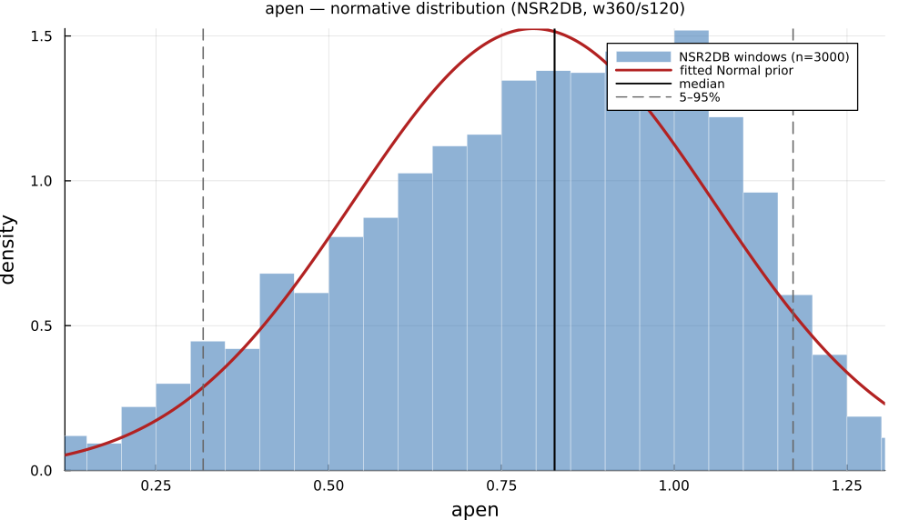

# `apen`

> **Approximate Entropy**

| | |
|---|---|
| **Aliases** | `approximate_entropy`, `apen` |
| **Domain** | `nonlinear` |
| **Distribution family** | `Normal` |
| **Equation** | `log(C_m(r) / C_{m+1}(r))` |
| **Resource intensity** | ◍◍◍◍◌  high — _Nonlinear subgraph (template matching / embedding — O(N²) worst case)._ (measured, see §Resources) |

## Definition

Approximate entropy. Formally: `log(C_m(r) / C_{m+1}(r))`.

## What does *normal* look like?

Fitted normative prior: **Normal(μ = 0.7961, σ = 0.2615)**  —  KS p = 6.7e-08, n = 3000.

Empirical distribution over the **NSR2DB** normative windows (360-beat windows, 120-beat stride), overlaid with the fitted `Normal` prior density. Vertical lines mark the median and the 5–95% range.

### Normal-range summary (NSR2DB)

| statistic | value |
|---|---|
| median | 0.8268 |
| IQR (25–75%) | 0.6129 – 1.001 |
| 5–95% range | 0.3184 – 1.172 |
| mean ± sd | 0.7961 ± 0.2616 |
| n windows | 3000 |

_n varies by feature: pooled time/frequency/geometric features use the full nsrdb+nsr2db table (up to n = 56 472); the 13 nonlinear/entropy features are O(N²)/template-matching and are fit on a fixed-seed ≈3000-window subsample instead (`test/tools/collect_extended_features.jl`, seed 20260729); `ulf` uses a long-window NSRDB-only extraction (see its own page)._

## Use cases

- Regularity / predictability of the RR series (Pincus 1991).
- Discriminating pathological from healthy dynamics (use adequate N).
- Note the self-match bias — prefer SampEn when possible.

## Applications by area

*Evidence is reported at the measure-family level; a specific variant may not be the exact index measured in every cited study.*

### Clinical

**Coverage: statistics** — a large/pooled literature (reviews or meta-analyses exist).

Commonly used for autonomic-complexity/regularity assessment (diabetic neuropathy, CHF, depression, aging mortality); the dominant "loss of complexity with disease" narrative is *not* universal — several well-cited studies report the opposite (higher/more erratic entropy in CHF, higher blood-pressure SampEn predicting higher mortality in a large aging cohort), and a 2026 scoping review of 55 studies explicitly withholds a pooled effect size due to methodological heterogeneity.

*Dominant reported direction:* mixed — mostly down (loss of complexity) in disease, reversed in some CHF/BP-signal studies.

**Key references:** [yang2026](@cite); [richman2000](@cite).

### Sports & peak performance

**Coverage: individual papers** — a small, scattered literature (no pooled meta-analysis).

Used only sporadically — a 19-study systematic review of HRV and overtraining in soccer found *zero* studies used any nonlinear/entropy index. Where used, reduced entropy/increased regularity tracks fatigue and intense training load, and higher resting entropy loosely tracks fitness, but samples are small (n = 11–34) and often only descriptive.

*Dominant reported direction:* down with fatigue/training load (sparse literature).

**Key references:** [yang2026](@cite).

### Meditation & contemplation

**Coverage: individual papers** — a small, scattered literature (no pooled meta-analysis).

Most studies report increased entropy/complexity with meditation practice (a "healthy variability" framing), but effect sizes are frequently small and non-significant in small pilots, and at least one apparent SampEn increase disappeared after covariate adjustment; no dedicated meta-analysis of entropy in meditation exists.

*Dominant reported direction:* up (fragile — often non-significant or vanishes on adjustment).

**Key references:** [yang2026](@cite).

See the [effect-distribution meta-analysis](../usecases/effect-distributions.md) page for the harvested per-study effect sizes/p-values behind these domain summaries (`docs/zoo_gen/effect_stats.csv`).

## Resources

Resource-intensity rank **◍◍◍◍◌  high** is **measured** — median wall-clock time + allocations over a 360-beat window on synthetic realistic RR (`docs/zoo_gen/bench_resources.jl`; full grid in `resource_bench.csv`).

| metric (360-beat window) | value |
|---|---|
| cold median wall-time | 2.915 ms |
| warm median wall-time | 2.148 ms |
| allocations (cold) | 4.2 MiB |

*Cold* = fresh memoization caches (builds every shared representation from scratch); *warm* = shared representations (`diff`, periodogram, Poincaré coords, DFA fluctuation) already cached, so only this feature is recomputed. The tier is derived from the cold cost; see `Nonlinear subgraph (template matching / embedding — O(N²) worst case).`

## Citation

Approximate entropy, Pincus (1991), PNAS.

**Seminal reference(s):** [pincus1991](@cite).

See the [References](references.md) page for the full bibliography.
