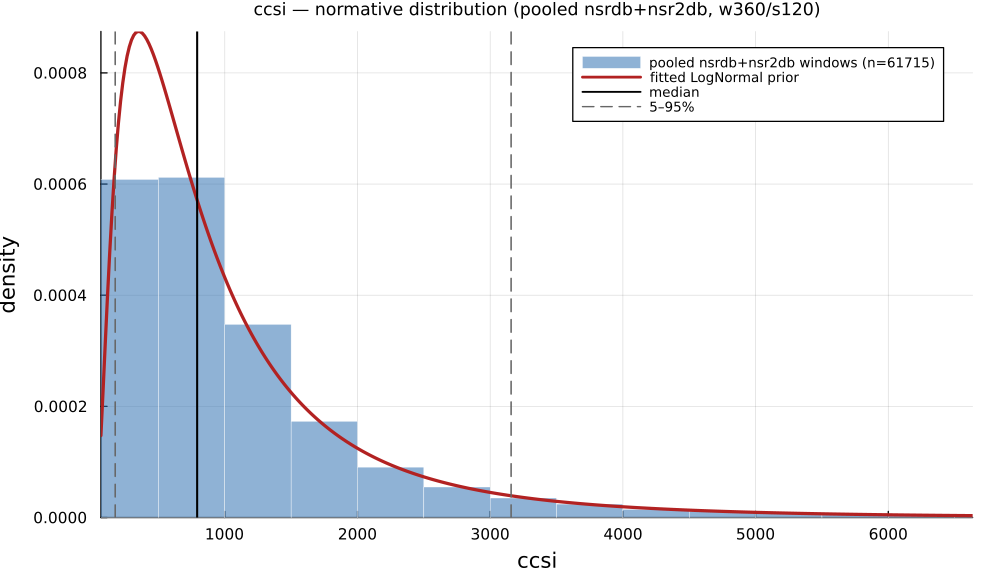

# `ccsi`

> **Corrected Cardiac Sympathetic Index**

| | |
|---|---|
| **Aliases** | `corrected_cardiac_sympathetic_index`, `corrected_csi`, `modified_csi`, `csi_mod` |
| **Domain** | `geometric` |
| **Distribution family** | `LogNormal` |
| **Equation** | `4 * SD2^2 / SD1` |
| **Resource intensity** | ◍◍◌◌◌  low — _Geometric subgraph (Poincaré coords / RR histogram + reductions). Warm (shared representation cached) is 9× cheaper._ (measured, see §Resources) |

## Definition

Corrected cardiac sympathetic index. Formally: `4 * SD2^2 / SD1`.

## What does *normal* look like?

Fitted normative prior: **LogNormal(μ = 6.637, σ = 0.8815)**  —  KS p = 3.8e-05, n = 61715.

Empirical distribution over the **pooled nsrdb+nsr2db** normative windows (360-beat windows, 120-beat stride), overlaid with the fitted `LogNormal` prior density. Vertical lines mark the median and the 5–95% range.

### Normal-range summary (pooled nsrdb+nsr2db)

| statistic | value |
|---|---|
| median | 791.8 |
| IQR (25–75%) | 427.3 – 1376 |
| 5–95% range | 174.1 – 3158 |
| mean ± sd | 1108 ± 1114 |
| n windows | 61715 |

_n varies by feature only through per-window validity over the full pooled nsrdb+nsr2db table (n up to 61 715; e.g. `sampen`/`mse` drop windows where the statistic is undefined). `ulf` is the one exception: a 360-beat (~5 min) window contains no ULF-band power, so it uses a long-window NSRDB-only extraction (see its own page)._

## Use cases

- Modified cardiac sympathetic index (4·SD2²/SD1) emphasising long-term spread.
- Lorenz-plot seizure detection (Jeppesen et al. 2014).
- Exploratory autonomic-surge screening (no dedicated validation study on file beyond the seizure-detection setting above; use cautiously).

## Applications by area

*Evidence is reported at the measure-family level; a specific variant may not be the exact index measured in every cited study.*

The three areas below are the application fields of the consolidated [HRV knowledge base](references.md) (clinical · sports & peak-performance · contemplative practice); the fourth KB field, *methods & foundations*, is this measure's seminal lineage — see [§Citation](#Citation).

### Clinical

**Coverage: individual papers** — a small, scattered literature (no pooled meta-analysis).

CSI/CVI (Toichi 1997) separates sympathetic/parasympathetic contributions from a single short ECG without pharmacological blockade; reported clinical uses include psychiatric autonomic dysfunction (CVI drops with worsening psychosis) and epilepsy (CSI spikes distinguish epileptic from psychogenic non-epileptic seizures, though the companion CVI measure does not discriminate the same comparison).

*Dominant reported direction:* CSI up / CVI down under acute stress or pathology; the two halves of the index do not always agree.

**Key references:** [toichi1997](@cite); [jeppesen2014](@cite); [jeppesen2016](@cite).

### Sports & peak performance

**Coverage: individual papers** — a small, scattered literature (no pooled meta-analysis).

The one on-topic study (elite football) found CVI differs significantly by playing position but not between athletes and non-athlete controls as a whole — a weaker, more qualified version of the classic "athletes have higher vagal tone" story than the RMSSD-based literature tells; otherwise CSI/CVI appear mainly in methodological papers illustrating exercise/postural-change tracking.

*Dominant reported direction:* position-dependent; no clear athlete-vs.-control effect at the whole-group level.

**Key references:** [toichi1997](@cite).

### Contemplative practice

**Coverage: sparse-or-none** — essentially no dedicated application literature found.

No study computes CSI/CVI exactly as Toichi (1997) defined them in a meditation/mindfulness/yoga-breathing population; the same Poincaré-geometry construct appears in meditation studies under other names (SD1/SD2 ratio, ad hoc indices), so the literal CSI/CVI label is essentially absent from this domain even though the underlying geometry is well studied.

*Dominant reported direction:* no data harvested under this name.

**Key references:** [toichi1997](@cite).

See the [effect-distribution meta-analysis](../usecases/effect-distributions.md) page for the harvested per-study effect sizes/p-values behind these domain summaries (`docs/zoo_gen/effect_stats.csv`).

## Resources

Resource-intensity rank **◍◍◌◌◌  low** is **measured** — median wall-clock time + allocations over a 360-beat window on synthetic realistic RR (`docs/zoo_gen/bench_resources.jl`; full grid in `resource_bench.csv`).

| metric (360-beat window) | value |
|---|---|
| cold median wall-time | 0.0358 ms |
| warm median wall-time | 0.004068 ms |
| allocations (cold) | 32.9 KiB |

*Cold* = fresh memoization caches (builds every shared representation from scratch); *warm* = shared representations (`diff`, periodogram, Poincaré coords, DFA fluctuation) already cached, so only this feature is recomputed. The tier is derived from the cold cost; see `Geometric subgraph (Poincaré coords / RR histogram + reductions). Warm (shared representation cached) is 9× cheaper.`

## Citation

Modified / corrected CSI = 4·SD2²/SD1, Jeppesen et al. (2014), Lorenz-plot seizure detection.

**Seminal reference(s):** [jeppesen2014](@cite).

See the [References](references.md) page for the full bibliography.
