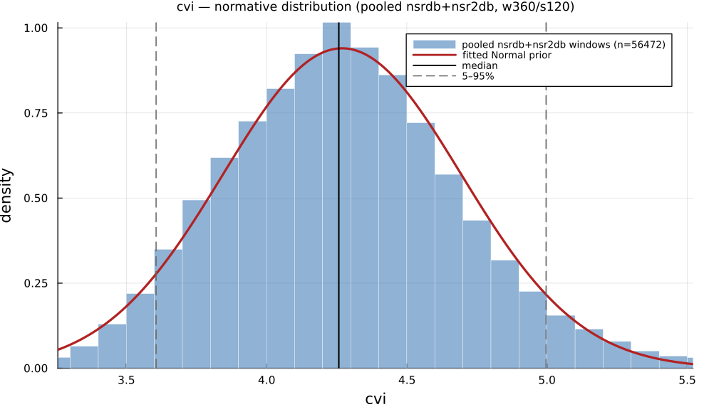

# `cvi`

> **Cardiac Vagal Index**

| | |
|---|---|
| **Aliases** | `cardiac_vagal_index` |
| **Domain** | `geometric` |
| **Distribution family** | `Normal` |
| **Equation** | `log10(SD1 * SD2 * 16)` |
| **Resource intensity** | ◍◍◌◌◌  low — _Geometric subgraph (Poincaré coords / RR histogram + reductions). Warm (shared representation cached) is 7× cheaper._ (measured, see §Resources) |

## Definition

Cardiac vagal index. Formally: `log10(SD1 * SD2 * 16)`.

## What does *normal* look like?

Fitted normative prior: **Normal(μ = 4.269, σ = 0.4244)**  —  KS p = 1.1e-28, n = 56472.

Empirical distribution over the **pooled nsrdb+nsr2db** normative windows (360-beat windows, 120-beat stride), overlaid with the fitted `Normal` prior density. Vertical lines mark the median and the 5–95% range.

### Normal-range summary (pooled nsrdb+nsr2db)

| statistic | value |
|---|---|
| median | 4.258 |
| IQR (25–75%) | 3.978 – 4.534 |
| 5–95% range | 3.606 – 4.997 |
| mean ± sd | 4.269 ± 0.4244 |
| n windows | 56472 |

_n varies by feature: pooled time/frequency/geometric features use the full nsrdb+nsr2db table (up to n = 56 472); the 13 nonlinear/entropy features are O(N²)/template-matching and are fit on a fixed-seed ≈3000-window subsample instead (`test/tools/collect_extended_features.jl`, seed 20260729); `ulf` uses a long-window NSRDB-only extraction (see its own page)._

## Use cases

- Cardiac vagal index from Lorenz-plot geometry (Toichi et al. 1997).
- Parasympathetic-tone screening alongside CSI.
- Autonomic-function assessment.

## Applications by area

*Evidence is reported at the measure-family level; a specific variant may not be the exact index measured in every cited study.*

### Clinical

**Coverage: individual papers** — a small, scattered literature (no pooled meta-analysis).

CSI/CVI (Toichi 1997) separates sympathetic/parasympathetic contributions from a single short ECG without pharmacological blockade; reported clinical uses include psychiatric autonomic dysfunction (CVI drops with worsening psychosis) and epilepsy (CSI spikes distinguish epileptic from psychogenic non-epileptic seizures, though the companion CVI measure does not discriminate the same comparison).

*Dominant reported direction:* CSI up / CVI down under acute stress or pathology; the two halves of the index do not always agree.

**Key references:** [toichi1997](@cite); [jeppesen2014](@cite); [jeppesen2016](@cite).

### Sports & peak performance

**Coverage: individual papers** — a small, scattered literature (no pooled meta-analysis).

The one on-topic study (elite football) found CVI differs significantly by playing position but not between athletes and non-athlete controls as a whole — a weaker, more qualified version of the classic "athletes have higher vagal tone" story than the RMSSD-based literature tells; otherwise CSI/CVI appear mainly in methodological papers illustrating exercise/postural-change tracking.

*Dominant reported direction:* position-dependent; no clear athlete-vs.-control effect at the whole-group level.

**Key references:** [toichi1997](@cite).

### Meditation & contemplation

**Coverage: sparse-or-none** — essentially no dedicated application literature found.

No study computes CSI/CVI exactly as Toichi (1997) defined them in a meditation/mindfulness/yoga-breathing population; the same Poincaré-geometry construct appears in meditation studies under other names (SD1/SD2 ratio, ad hoc indices), so the literal CSI/CVI label is essentially absent from this domain even though the underlying geometry is well studied.

*Dominant reported direction:* no data harvested under this name.

**Key references:** [toichi1997](@cite).

See the [effect-distribution meta-analysis](../usecases/effect-distributions.md) page for the harvested per-study effect sizes/p-values behind these domain summaries (`docs/zoo_gen/effect_stats.csv`).

## Resources

Resource-intensity rank **◍◍◌◌◌  low** is **measured** — median wall-clock time + allocations over a 360-beat window on synthetic realistic RR (`docs/zoo_gen/bench_resources.jl`; full grid in `resource_bench.csv`).

| metric (360-beat window) | value |
|---|---|
| cold median wall-time | 0.03864 ms |
| warm median wall-time | 0.00525 ms |
| allocations (cold) | 32.9 KiB |

*Cold* = fresh memoization caches (builds every shared representation from scratch); *warm* = shared representations (`diff`, periodogram, Poincaré coords, DFA fluctuation) already cached, so only this feature is recomputed. The tier is derived from the cold cost; see `Geometric subgraph (Poincaré coords / RR histogram + reductions). Warm (shared representation cached) is 7× cheaper.`

## Citation

Cardiac vagal index (log₁₀ 16·SD1·SD2), Toichi et al. (1997).

**Seminal reference(s):** [toichi1997](@cite).

See the [References](references.md) page for the full bibliography.
