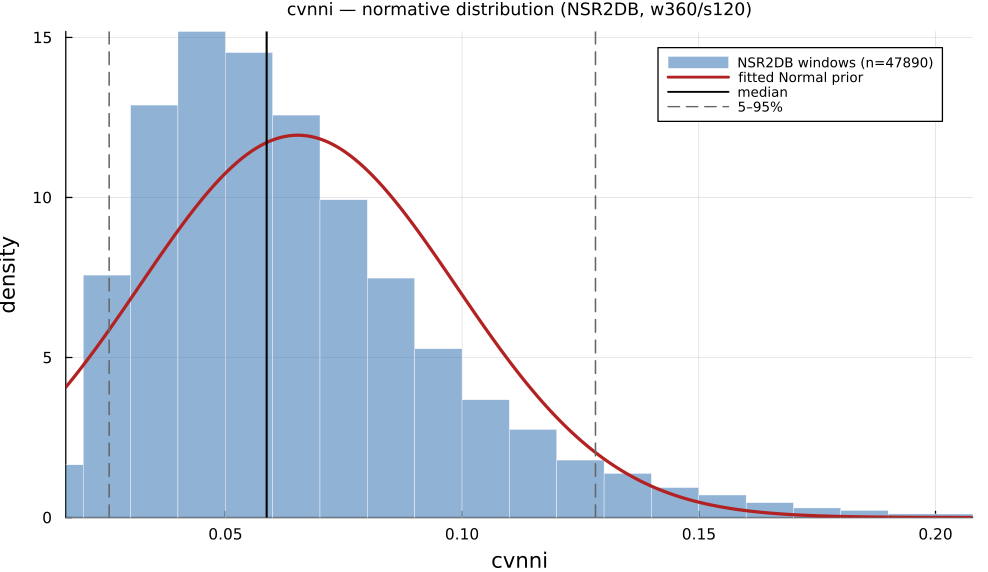

# `cvnni`

> **Coefficient Of Variation Of The Nn Intervals (Sdnn / Mean).**

| | |
|---|---|
| **Aliases** | `cvnni`, `cv_nni`, `coefficient_of_variation` |
| **Domain** | `time` · `statistics` |
| **Distribution family** | `Normal` |
| **Equation** | `` |
| **Resource intensity** | ◍◍◌◌◌  low — _Level 1–2 (base statistics over successive differences)._ (measured, see §Resources) |

## Definition

Calculate the coefficient of variation of the NN intervals (SDNN / mean).

## What does *normal* look like?

Fitted normative prior: **Normal(μ = 0.06531, σ = 0.0334)**  —  KS p < 1e-300, n = 47890.

Empirical distribution over the **NSR2DB** normative windows (360-beat windows, 120-beat stride), overlaid with the fitted `Normal` prior density. Vertical lines mark the median and the 5–95% range.

### Normal-range summary (NSR2DB)

| statistic | value |
|---|---|
| median | 0.05874 |
| IQR (25–75%) | 0.04196 – 0.08075 |
| 5–95% range | 0.02547 – 0.1282 |
| mean ± sd | 0.06531 ± 0.0334 |
| n windows | 47890 |

_n varies by feature: pooled time/frequency/geometric features use the full nsrdb+nsr2db table (up to n = 56 472); the 13 nonlinear/entropy features are O(N²)/template-matching and are fit on a fixed-seed ≈3000-window subsample instead (`test/tools/collect_extended_features.jl`, seed 20260729); `ulf` uses a long-window NSRDB-only extraction (see its own page)._

## Use cases

- Heart-rate-normalised overall variability (SDNN / mean NN).
- Cross-subject comparison of HRV magnitude.
- Exploratory screening independent of baseline heart rate (descriptive ratio, not a validated diagnostic threshold on file).

## Applications by area

*Evidence is reported at the measure-family level; a specific variant may not be the exact index measured in every cited study.*

### Clinical

**Coverage: statistics** — a large/pooled literature (reviews or meta-analyses exist).

SDNN/SDANN are among the most validated HRV mortality predictors: low values predict higher cardiac/all-cause mortality post-MI, in heart failure, and even in the general population (8 cohorts, n = 21,988). CVNNI has its own well-established sub-literature as a diabetic cardiac autonomic neuropathy screening marker. One acute-decompensated-HF study reports the opposite polarity (higher SDNN/SDANN in the poor-prognosis group).

*Dominant reported direction:* down — low SDNN/SDANN/CVNNI → higher mortality (one acute-HF exception reversed).

**Key references:** [hillebrand2013](@cite); [rueda2024](@cite).

### Sports & peak performance

**Coverage: individual papers** — a small, scattered literature (no pooled meta-analysis).

Comparatively under-used next to RMSSD in sports HRV monitoring — the field's dedicated meta-analysis pools RMSSD/HF/SD1, not SDNN. Individual studies find SDNN falls with heavy training/overreaching and recovers during taper, and tends to be higher in higher-level athletes, but effect sizes are small-sample and heterogeneous.

*Dominant reported direction:* down with overreaching, recovers with taper (RMSSD-dominated literature, SDNN secondary).

**Key references:** [bellenger2016](@cite).

### Meditation & contemplation

**Coverage: individual papers** — a small, scattered literature (no pooled meta-analysis).

The weakest of the three domains for this family: two dedicated meta-analyses found the evidence for resting/vagally-mediated HRV — including SDNN — inconclusive or null, with only a handful of trials reporting SDNN at all. Individual acute-state studies diverge sharply in direction (SDNN falls during Heartfulness meditation, rises during Chi/Kundalini-yoga).

*Dominant reported direction:* contested — meta-analytic null vs. technique-dependent individual-study increases/decreases.

**Key references:** [radmark2019](@cite); [brown2021](@cite).

See the [effect-distribution meta-analysis](../usecases/effect-distributions.md) page for the harvested per-study effect sizes/p-values behind these domain summaries (`docs/zoo_gen/effect_stats.csv`).

## Resources

Resource-intensity rank **◍◍◌◌◌  low** is **measured** — median wall-clock time + allocations over a 360-beat window on synthetic realistic RR (`docs/zoo_gen/bench_resources.jl`; full grid in `resource_bench.csv`).

| metric (360-beat window) | value |
|---|---|
| cold median wall-time | 0.009507 ms |
| warm median wall-time | 0.004408 ms |
| allocations (cold) | 2.2 KiB |

*Cold* = fresh memoization caches (builds every shared representation from scratch); *warm* = shared representations (`diff`, periodogram, Poincaré coords, DFA fluctuation) already cached, so only this feature is recomputed. The tier is derived from the cold cost; see `Level 1–2 (base statistics over successive differences).`

## Citation

Coefficient of variation of NN (SDNN/mean), Task Force (1996).

**Seminal reference(s):** [taskforce1996](@cite).

See the [References](references.md) page for the full bibliography.
