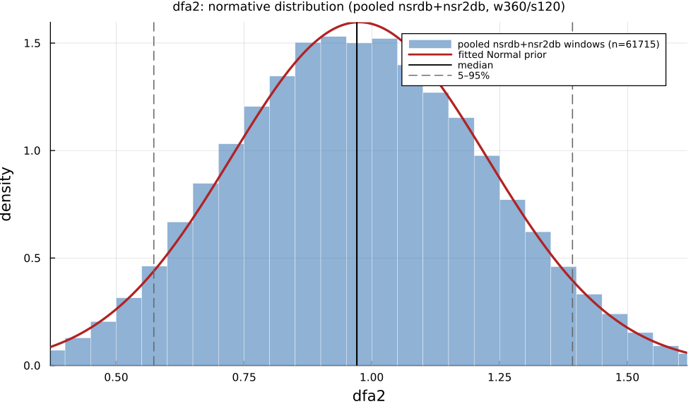

# `dfa2`

> **Dfa Long-Term Scaling Exponent Alpha2**

| | |
|---|---|
| **Aliases** | `dfa2`, `dfa_exponent_2` |
| **Domain** | `nonlinear` |
| **Distribution family** | `Normal` |
| **Equation** | `alpha2 from DFA (scales 4-64)` |
| **Resource intensity** | ◍◍◍◍◌  high, _Nonlinear subgraph (template matching / embedding — O(N²) worst case). Warm (shared representation cached) is 1018× cheaper._ (measured, see §Resources) |

## Definition

DFA long-term scaling exponent alpha2. Formally: `alpha2 from DFA (scales 4-64)`.

## What does *normal* look like?

Fitted normative prior: **Normal(μ = 0.9749, σ = 0.2498)**, KS p = 5e-30, n = 61715.

Empirical distribution over the **pooled nsrdb+nsr2db** normative windows (360-beat windows, 120-beat stride), overlaid with the fitted `Normal` prior density. Vertical lines mark the median and the 5–95% range.

### Normal-range summary (pooled nsrdb+nsr2db)

| statistic | value |
|---|---|
| median | 0.9706 |
| IQR (25–75%) | 0.7997 – 1.147 |
| 5–95% range | 0.5736 – 1.392 |
| mean ± sd | 0.9749 ± 0.2498 |
| n windows | 61715 |

_n varies by feature only through per-window validity over the full pooled nsrdb+nsr2db table (n up to 61 715; e.g. `sampen`/`mse` drop windows where the statistic is undefined). `ulf` is the one exception: a 360-beat (~5 min) window contains no ULF-band power, so it uses a long-window NSRDB-only extraction (see its own page)._

## Use cases

- Long-term fractal scaling exponent α2 of the RR series (Peng et al. 1995).
- Ageing and cardiac-disease fractal-breakdown studies.
- Report with α1 and adequate record length.

## Applications by area

*Evidence is reported at the measure-family level; a specific variant may not be the exact index measured in every cited study.*

### Clinical

**Coverage: individual papers.** A small, scattered literature with no pooled meta-analysis.

The DFA mortality literature is overwhelmingly about the short-term exponent α1 (`dfa1`); where studies additionally measured the long-term exponent α2, evidence is thin and inconsistent. One ESRD cohort measured α2 alongside α1 and found it carried *no significant* mortality effect once α1 was accounted for; one elderly community cohort (LILAC) reported both α1 and α2 associated with mortality without isolating which exponent drove the effect. No dedicated α2 meta-analysis or systematic review exists.

*Dominant reported direction:* weak/mostly null: α2 rarely reaches significance on its own; no independent α2 effect size is established in the harvested literature.

**Key references:** [sen2018](@cite).

### Sports & peak performance

**Coverage: sparse or none.** Essentially no dedicated application literature found.

The DFA-based aerobic/anaerobic exercise-threshold research program is specifically built on the short-term exponent α1 (declining from ~1.5 at rest toward ~0.5 near exhaustion); none of the harvested threshold-detection studies isolate α2 as a distinct sports metric, so no application evidence was harvested for α2 in this domain.

*Dominant reported direction:* no data harvested for this domain.

### Contemplative practice

**Coverage: individual papers.** A small, scattered literature with no pooled meta-analysis.

One small study (deep-meditation practitioners) explicitly measured both α1 and α2 and reported a contrary, significant *increase* in both during deep meditation; the broader meditation-DFA literature synthesized in the review below is otherwise dominated by α1-only findings, so this single α2 data point cannot establish a reliable direction.

*Dominant reported direction:* unresolved: one small study reports an increase; otherwise essentially unstudied.

**Key references:** [deka2023](@cite).

**The strong prognostic DFA evidence in the literature is specific to the short-term exponent α1** (`dfa1`): α2 (long-term) associations are weak, inconsistent, or explicitly non-significant in the harvested literature; treat any "lower DFA exponent → higher mortality" claim you encounter elsewhere as an α1 claim, not an α2 one, unless the source specifically isolates α2.

See the [effect-distribution meta-analysis](../usecases/effect-distributions.md) page for the harvested per-study effect sizes/p-values behind these domain summaries (`docs/zoo_gen/effect_stats.csv`).

## Resources

Resource-intensity rank **◍◍◍◍◌  high** is measured: median wall-clock time and allocations over a 360-beat window on synthetic realistic RR (`docs/zoo_gen/bench_resources.jl`; full grid in `resource_bench.csv`).

| metric (360-beat window) | value |
|---|---|
| cold median wall-time | 3.499 ms |
| warm median wall-time | 0.003437 ms |
| allocations (cold) | 38.0 MiB |

*Cold* = fresh memoization caches (builds every shared representation from scratch); *warm* = shared representations (`diff`, periodogram, Poincaré coords, DFA fluctuation) already cached, so only this feature is recomputed. The tier is derived from the cold cost; see `Nonlinear subgraph (template matching / embedding — O(N²) worst case). Warm (shared representation cached) is 1018× cheaper.`

## Citation

Long-term scaling exponent α2, Peng et al. (1995); DFA algorithm, Peng et al. (1994); window convention Francis et al. (2002); age-related range Iyengar et al. (1996).

**Seminal reference(s):** [peng1995](@cite); [peng1994](@cite); [francis2002](@cite); [iyengar1996](@cite).

See the [References](references.md) page for the full bibliography.
