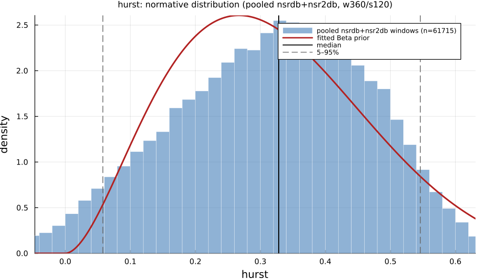

# `hurst`

> **Hurst Exponent**

| | |
|---|---|
| **Aliases** | `hurst_exponent`, `hurst` |
| **Domain** | `nonlinear` |
| **Distribution family** | `Beta` |
| **Equation** | `H from R/S analysis` |
| **Resource intensity** | ◍◍◌◌◌  low, _Nonlinear subgraph (template matching / embedding — O(N²) worst case)._ (measured, see §Resources) |

## Definition

Hurst exponent. Formally: `H from R/S analysis`.

## What does *normal* look like?

Fitted normative prior: **Beta(α = 2.883, β = 6.17)**, KS p = 1.2e-21, n = 61715.

Note: `hurst` is theoretically bounded to (0, 1) (`Beta`, as declared in the `Features.jl` docstring), but the observed 360-beat-window values leave that interval (see the 5–95% range below), so the empirical fit shown here is `Normal`.

Empirical distribution over the **pooled nsrdb+nsr2db** normative windows (360-beat windows, 120-beat stride), overlaid with the fitted `Beta` prior density. Vertical lines mark the median and the 5–95% range.

### Normal-range summary (pooled nsrdb+nsr2db)

| statistic | value |
|---|---|
| median | 0.3282 |
| IQR (25–75%) | 0.2131 – 0.4287 |
| 5–95% range | 0.05781 – 0.546 |
| mean ± sd | 0.3179 ± 0.1483 |
| n windows | 61715 |

_n varies by feature only through per-window validity over the full pooled nsrdb+nsr2db table (n up to 61 715; e.g. `sampen`/`mse` drop windows where the statistic is undefined). `ulf` is the one exception: a 360-beat (~5 min) window contains no ULF-band power, so it uses a long-window NSRDB-only extraction (see its own page)._

## Use cases

- Long-range dependence / persistence of the RR series (Hurst 1951).
- Fractal-scaling and self-similarity research.
- Cross-check against the DFA exponents.

## Applications by area

*Evidence is reported at the measure-family level; a specific variant may not be the exact index measured in every cited study.*

### Clinical

**Coverage: statistics.** A pooled literature; reviews or meta-analyses exist.

Commonly and successfully used via DFA's α1 (a robust proxy for the Hurst exponent on short non-stationary cardiac records): lower α1 predicts higher mortality/sudden-cardiac-death risk across post-MI, heart-failure and elderly cohorts: one of the most replicated nonlinear-HRV findings in cardiology, remaining predictive after adjusting for LVEF and conventional covariates (pooled MD −0.17, 95% CI [−0.21, −0.13]).

*Dominant reported direction:* down: lower Hurst/α1 → higher mortality risk.

**Key references:** [sen2018](@cite).

### Sports & peak performance

**Coverage: individual papers.** A small, scattered literature with no pooled meta-analysis.

Uncommon as "Hurst exponent" per se, but moderately active as the DFA-α1 aerobic/ventilatory-threshold method: α1 declines from > 1 (correlated) toward ~0.75 at threshold and < 0.5 at high intensity, with very high threshold correlations in small samples: an actively contested literature (a 2025 large-sample validation found poor agreement, prompting a published rebuttal).

*Dominant reported direction:* down with exercise intensity (threshold-detection validity disputed).

**Key references:** [gronwald2020](@cite); [cassirame2025](@cite); [hoos2025](@cite).

### Contemplative practice

**Coverage: individual papers.** A small, scattered literature with no pooled meta-analysis.

Rare but identifiable: a 2023 narrative review synthesizes ≥8 small studies (n = 8–70) mostly reporting a *decrease* in the Hurst/DFA scaling exponent during meditation (breakdown of long-range correlation), with one notable study reporting the opposite (increase) during "deep meditation" that the source review does not reconcile.

*Dominant reported direction:* mostly down, one unreconciled increase.

**Key references:** [deka2023](@cite).

See the [effect-distribution meta-analysis](../usecases/effect-distributions.md) page for the harvested per-study effect sizes/p-values behind these domain summaries (`docs/zoo_gen/effect_stats.csv`).

## Resources

Resource-intensity rank **◍◍◌◌◌  low** is measured: median wall-clock time and allocations over a 360-beat window on synthetic realistic RR (`docs/zoo_gen/bench_resources.jl`; full grid in `resource_bench.csv`).

| metric (360-beat window) | value |
|---|---|
| cold median wall-time | 0.01982 ms |
| warm median wall-time | 0.01826 ms |
| allocations (cold) | 2.2 KiB |

*Cold* = fresh memoization caches (builds every shared representation from scratch); *warm* = shared representations (`diff`, periodogram, Poincaré coords, DFA fluctuation) already cached, so only this feature is recomputed. The tier is derived from the cold cost; see `Nonlinear subgraph (template matching / embedding — O(N²) worst case).`

## Citation

Hurst exponent via rescaled-range (R/S) analysis, Hurst (1951).

**Seminal reference(s):** [hurst1951](@cite).

See the [References](references.md) page for the full bibliography.
