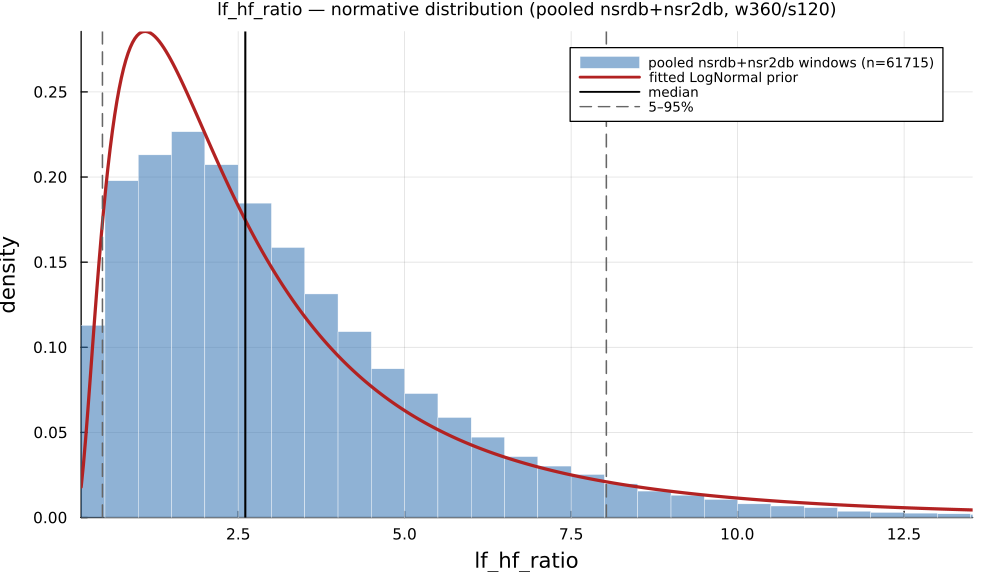

# `lf_hf_ratio`

> **Lf/Hf Power Ratio**

| | |
|---|---|
| **Aliases** | `lf_hf_ratio` |
| **Domain** | `frequency` |
| **Distribution family** | `LogNormal` |
| **Equation** | `LF / HF` |
| **Resource intensity** | ◍◍◍◌◌  moderate — _Frequency subgraph (requires a Welch/Lomb–Scargle periodogram first). Warm (shared representation cached) is 17× cheaper._ (measured, see §Resources) |

## Definition

LF/HF power ratio. Formally: `LF / HF`.

## What does *normal* look like?

Fitted normative prior: **LogNormal(μ = 0.8524, σ = 0.8691)**  —  KS p = 6.6e-09, n = 61715.

Empirical distribution over the **pooled nsrdb+nsr2db** normative windows (360-beat windows, 120-beat stride), overlaid with the fitted `LogNormal` prior density. Vertical lines mark the median and the 5–95% range.

### Normal-range summary (pooled nsrdb+nsr2db)

| statistic | value |
|---|---|
| median | 2.608 |
| IQR (25–75%) | 1.447 – 4.302 |
| 5–95% range | 0.4623 – 8.029 |
| mean ± sd | 3.212 ± 2.491 |
| n windows | 61715 |

_n varies by feature only through per-window validity over the full pooled nsrdb+nsr2db table (n up to 61 715; e.g. `sampen`/`mse` drop windows where the statistic is undefined). `ulf` is the one exception: a 360-beat (~5 min) window contains no ULF-band power, so it uses a long-window NSRDB-only extraction (see its own page)._

## Use cases

- Heuristic "sympathovagal balance" summary (interpret with caution).
- Tracking within-subject shifts between conditions.
- Report with the component LF and HF powers, not alone.

## Applications by area

*Evidence is reported at the measure-family level; a specific variant may not be the exact index measured in every cited study.*

The three areas below are the application fields of the consolidated [HRV knowledge base](references.md) (clinical · sports & peak-performance · contemplative practice); the fourth KB field, *methods & foundations*, is this measure's seminal lineage — see [§Citation](#Citation).

### Clinical

**Coverage: statistics** — a large/pooled literature (reviews or meta-analyses exist).

LF, HF and total power are consistently reduced in disease states (cardiac mortality risk, depression, anxiety, T2DM autonomic neuropathy) across large meta-analyses — but the LF/HF *ratio* itself is repeatedly non-significant in the very same datasets where its components move significantly, undercutting its billing as the most sensitive "sympathovagal balance" composite.

*Dominant reported direction:* down — LF/HF/TP reduced in disease; the LF/HF ratio specifically is often null.

**Key references:** [rueda2024](@cite); [wu2023](@cite); [chalmers2014](@cite).

### Sports & peak performance

**Coverage: statistics** — a large/pooled literature (reviews or meta-analyses exist).

Heavily used for training-load/overreaching monitoring, anchored by a 27-study meta-analysis; the intuitive "LF up / HF down under overload" model is directly contradicted by a body of work reporting paradoxical parasympathetic hyperactivity in overreached athletes, and the popular LF/HF > 4 "overtraining" cutoff is shown to be driven mainly by spontaneous breathing frequency rather than training state.

*Dominant reported direction:* contested — sympathetic-dominance model vs. parasympathetic-hyperactivity counter-evidence, confounded by respiration.

**Key references:** [bellenger2016](@cite).

### Contemplative practice

**Coverage: statistics** — a large/pooled literature (reviews or meta-analyses exist).

Commonly measured but shows null-to-mixed effects: the most direct meta-analysis (4 pooled trials) found no significant LF/HF change, and a well-powered 10-day mindfulness RCT likewise found no HF/LF-HF effect even though RMSSD rose — individual intensive-retreat studies show more mixed, technique- and task-dependent patterns confounded by voluntary breath-rate change.

*Dominant reported direction:* null-to-mixed, confounded by breathing.

**Key references:** [radmark2019](@cite).

!!! note
    **LF/HF as "sympathovagal balance" is a contested construct** — LF power and the LF/HF ratio do not track directly-measured cardiac sympathetic activity, and clinical meta-analyses repeatedly find the ratio non-significant even when its LF and HF components individually move significantly ([goldstein2011](@cite); [billman2013](@cite)).

See the [effect-distribution meta-analysis](../usecases/effect-distributions.md) page for the harvested per-study effect sizes/p-values behind these domain summaries (`docs/zoo_gen/effect_stats.csv`).

## Resources

Resource-intensity rank **◍◍◍◌◌  moderate** is **measured** — median wall-clock time + allocations over a 360-beat window on synthetic realistic RR (`docs/zoo_gen/bench_resources.jl`; full grid in `resource_bench.csv`).

| metric (360-beat window) | value |
|---|---|
| cold median wall-time | 0.06239 ms |
| warm median wall-time | 0.003747 ms |
| allocations (cold) | 32.0 KiB |

*Cold* = fresh memoization caches (builds every shared representation from scratch); *warm* = shared representations (`diff`, periodogram, Poincaré coords, DFA fluctuation) already cached, so only this feature is recomputed. The tier is derived from the cold cost; see `Frequency subgraph (requires a Welch/Lomb–Scargle periodogram first). Warm (shared representation cached) is 17× cheaper.`

## Citation

Pagani et al. (1986) introduced the LF/HF ratio as a marker of sympatho-vagal interaction; standardised by the Task Force (1996) (interpret with care).

**Seminal reference(s):** [pagani1986](@cite); [taskforce1996](@cite).

See the [References](references.md) page for the full bibliography.
