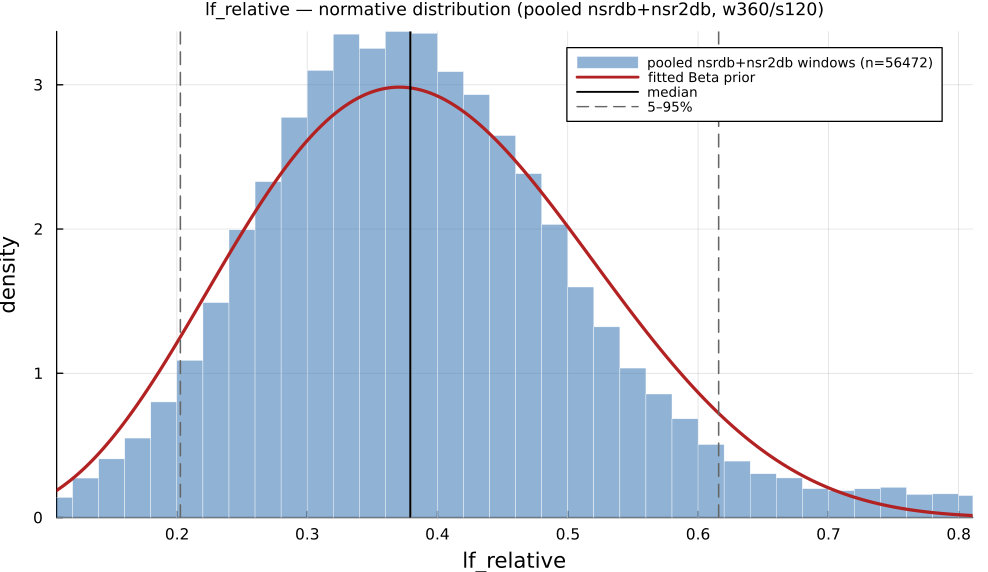

# `lf_relative`

> **Lf Power As Proportion Of Total Power**

| | |
|---|---|
| **Aliases** | `lf_relative_power` |
| **Domain** | `frequency` |
| **Distribution family** | `Beta` |
| **Equation** | `LF / TP` |
| **Resource intensity** | ◍◍◍◌◌  moderate — _Frequency subgraph (requires a Welch/Lomb–Scargle periodogram first). Warm (shared representation cached) is 18× cheaper._ (measured, see §Resources) |

## Definition

LF power as proportion of total power. Formally: `LF / TP`.

## What does *normal* look like?

Fitted normative prior: **Beta(α = 5.298, β = 8.295)**  —  KS p = 2.6e-63, n = 56472.

Empirical distribution over the **pooled nsrdb+nsr2db** normative windows (360-beat windows, 120-beat stride), overlaid with the fitted `Beta` prior density. Vertical lines mark the median and the 5–95% range.

### Normal-range summary (pooled nsrdb+nsr2db)

| statistic | value |
|---|---|
| median | 0.3792 |
| IQR (25–75%) | 0.303 – 0.4627 |
| 5–95% range | 0.2027 – 0.6158 |
| mean ± sd | 0.3898 ± 0.1277 |
| n windows | 56472 |

_n varies by feature: pooled time/frequency/geometric features use the full nsrdb+nsr2db table (up to n = 56 472); the 13 nonlinear/entropy features are O(N²)/template-matching and are fit on a fixed-seed ≈3000-window subsample instead (`test/tools/collect_extended_features.jl`, seed 20260729); `ulf` uses a long-window NSRDB-only extraction (see its own page)._

## Use cases

- Autonomic balance via spectral bands (LF/HF interpretation with care).
- Baroreflex and respiratory-sinus-arrhythmia studies.
- Longer recordings where spectral resolution is adequate.

## Applications by area

*Evidence is reported at the measure-family level; a specific variant may not be the exact index measured in every cited study.*

### Clinical

**Coverage: statistics** — a large/pooled literature (reviews or meta-analyses exist).

LF, HF and total power are consistently reduced in disease states (cardiac mortality risk, depression, anxiety, T2DM autonomic neuropathy) across large meta-analyses — but the LF/HF *ratio* itself is repeatedly non-significant in the very same datasets where its components move significantly, undercutting its billing as the most sensitive "sympathovagal balance" composite.

*Dominant reported direction:* down — LF/HF/TP reduced in disease; the LF/HF ratio specifically is often null.

**Key references:** [rueda2024](@cite); [wu2023](@cite); [chalmers2014](@cite).

### Sports & peak performance

**Coverage: statistics** — a large/pooled literature (reviews or meta-analyses exist).

Heavily used for training-load/overreaching monitoring, anchored by a 27-study meta-analysis; the intuitive "LF up / HF down under overload" model is directly contradicted by a body of work reporting paradoxical parasympathetic hyperactivity in overreached athletes, and the popular LF/HF > 4 "overtraining" cutoff is shown to be driven mainly by spontaneous breathing frequency rather than training state.

*Dominant reported direction:* contested — sympathetic-dominance model vs. parasympathetic-hyperactivity counter-evidence, confounded by respiration.

**Key references:** [bellenger2016](@cite).

### Meditation & contemplation

**Coverage: statistics** — a large/pooled literature (reviews or meta-analyses exist).

Commonly measured but shows null-to-mixed effects: the most direct meta-analysis (4 pooled trials) found no significant LF/HF change, and a well-powered 10-day mindfulness RCT likewise found no HF/LF-HF effect even though RMSSD rose — individual intensive-retreat studies show more mixed, technique- and task-dependent patterns confounded by voluntary breath-rate change.

*Dominant reported direction:* null-to-mixed, confounded by breathing.

**Key references:** [radmark2019](@cite).

See the [effect-distribution meta-analysis](../usecases/effect-distributions.md) page for the harvested per-study effect sizes/p-values behind these domain summaries (`docs/zoo_gen/effect_stats.csv`).

## Resources

Resource-intensity rank **◍◍◍◌◌  moderate** is **measured** — median wall-clock time + allocations over a 360-beat window on synthetic realistic RR (`docs/zoo_gen/bench_resources.jl`; full grid in `resource_bench.csv`).

| metric (360-beat window) | value |
|---|---|
| cold median wall-time | 0.06076 ms |
| warm median wall-time | 0.003316 ms |
| allocations (cold) | 32.1 KiB |

*Cold* = fresh memoization caches (builds every shared representation from scratch); *warm* = shared representations (`diff`, periodogram, Poincaré coords, DFA fluctuation) already cached, so only this feature is recomputed. The tier is derived from the cold cost; see `Frequency subgraph (requires a Welch/Lomb–Scargle periodogram first). Warm (shared representation cached) is 18× cheaper.`

## Citation

LF power in normalised units (fraction of total power), Task Force (1996).

**Seminal reference(s):** [taskforce1996](@cite).

See the [References](references.md) page for the full bibliography.
