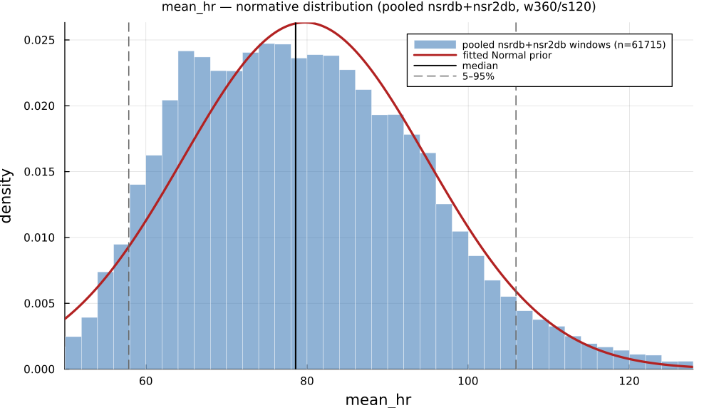

# `mean_hr`

> **Mean Heart Rate**

| | |
|---|---|
| **Aliases** | `mean_hr`, `average_hr` |
| **Domain** | `time` · `statistics` |
| **Distribution family** | `Normal` |
| **Equation** | `60000 / mean(IBI)` |
| **Resource intensity** | ◍◍◌◌◌  low — _Level 1–2 (base statistics over successive differences)._ (measured, see §Resources) |

## Definition

Mean heart rate. Formally: `60000 / mean(IBI)`.

## What does *normal* look like?

Fitted normative prior: **Normal(μ = 79.73, σ = 15.15)**  —  KS p = 1.6e-95, n = 61715.

Empirical distribution over the **pooled nsrdb+nsr2db** normative windows (360-beat windows, 120-beat stride), overlaid with the fitted `Normal` prior density. Vertical lines mark the median and the 5–95% range.

### Normal-range summary (pooled nsrdb+nsr2db)

| statistic | value |
|---|---|
| median | 78.58 |
| IQR (25–75%) | 68.05 – 89.69 |
| 5–95% range | 57.88 – 105.9 |
| mean ± sd | 79.73 ± 15.15 |
| n windows | 61715 |

_n varies by feature only through per-window validity over the full pooled nsrdb+nsr2db table (n up to 61 715; e.g. `sampen`/`mse` drop windows where the statistic is undefined). `ulf` is the one exception: a 360-beat (~5 min) window contains no ULF-band power, so it uses a long-window NSRDB-only extraction (see its own page)._

## Use cases

- Short-term vagal / parasympathetic tone (esp. successive-difference measures).
- Ultra-short and 5-min HRV screening; biofeedback targets.
- Stress, recovery, and training-load monitoring.

## Applications by area

*Evidence is reported at the measure-family level; a specific variant may not be the exact index measured in every cited study.*

The three areas below are the application fields of the consolidated [HRV knowledge base](references.md) (clinical · sports & peak-performance · contemplative practice); the fourth KB field, *methods & foundations*, is this measure's seminal lineage — see [§Citation](#Citation).

### Clinical

**Coverage: statistics** — a large/pooled literature (reviews or meta-analyses exist).

Elevated resting/mean heart rate is one of the most consistently replicated clinical predictors: dose-response meta-analyses pooling dozens of prospective cohorts (> 1.2 million subjects) show a near-linear rise in all-cause and cardiovascular mortality, coronary heart disease, heart failure and even cancer incidence per +10 bpm. Age-predicted HRmax (208 − 0.7·age) is itself a load-bearing exercise-testing constant from a 351-study meta-analytic pooling.

*Dominant reported direction:* up — higher resting HR → higher mortality/CV risk (≈RR 1.08–1.17 per 10 bpm).

**Key references:** [zhang2016](@cite); [aune2017](@cite); [tanaka2001](@cite).

### Sports & peak performance

**Coverage: statistics** — a large/pooled literature (reviews or meta-analyses exist).

Lower resting HR ("training bradycardia") and faster post-exercise heart-rate recovery (HRR) are classic, meta-analyzed markers of positive training adaptation — but the same meta-analysis found faster HRR also accompanies functional overreaching, so the identical directional signal reads as both "good" and "bad" depending on context.

*Dominant reported direction:* down at rest / faster HRR — but HRR speed alone cannot separate adaptation from overreaching.

**Key references:** [bellenger2016](@cite).

### Contemplative practice

**Coverage: statistics** — a large/pooled literature (reviews or meta-analyses exist).

A 45-RCT meta-analysis finds meditation reduces heart rate overall (concentrated in "open monitoring" styles), but this is contested: a more recent physiological study found HR unchanged or significantly *increased* during Chi/Kundalini-yoga meditation, explicitly arguing raw HR is a poor real-time biofeedback signal.

*Dominant reported direction:* contested — meta-analytic decrease vs. style-specific increase/no-change.

**Key references:** [pascoe2017](@cite); [natarajan2023](@cite).

!!! note
    **Meditation's effect on HR level is disputed** — see the [`mean`](mean.md) entry: pooled meta-analytic decrease ([pascoe2017](@cite)) vs. style-specific increase/no-change ([natarajan2023](@cite)).

See the [effect-distribution meta-analysis](../usecases/effect-distributions.md) page for the harvested per-study effect sizes/p-values behind these domain summaries (`docs/zoo_gen/effect_stats.csv`).

## Resources

Resource-intensity rank **◍◍◌◌◌  low** is **measured** — median wall-clock time + allocations over a 360-beat window on synthetic realistic RR (`docs/zoo_gen/bench_resources.jl`; full grid in `resource_bench.csv`).

| metric (360-beat window) | value |
|---|---|
| cold median wall-time | 0.005159 ms |
| warm median wall-time | 0.003256 ms |
| allocations (cold) | 1.5 KiB |

*Cold* = fresh memoization caches (builds every shared representation from scratch); *warm* = shared representations (`diff`, periodogram, Poincaré coords, DFA fluctuation) already cached, so only this feature is recomputed. The tier is derived from the cold cost; see `Level 1–2 (base statistics over successive differences).`

## Citation

BPM re-expression of the Task Force (1996) time-domain panel.

**Seminal reference(s):** [taskforce1996](@cite).

See the [References](references.md) page for the full bibliography.
