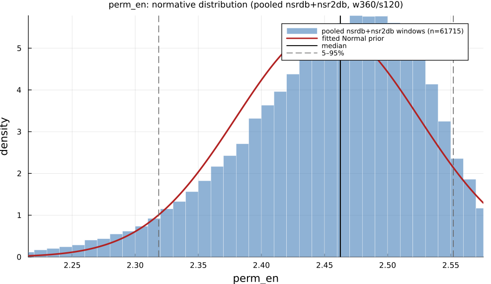

# `perm_en`

> **Permutation Entropy Of The Inter-Beat-Intervals (Ibis).**

| | |
|---|---|
| **Aliases** | `permutation_entropy`, `perm_en` |
| **Domain** | `nonlinear` |
| **Distribution family** | `Normal` |
| **Equation** | `` |
| **Resource intensity** | ◍◍◍◌◌  moderate, _Nonlinear subgraph (template matching / embedding — O(N²) worst case)._ (measured, see §Resources) |

## Definition

Calculate the permutation entropy of the Inter-Beat-Intervals (IBIs).

## What does *normal* look like?

Fitted normative prior: **Normal(μ = 2.452, σ = 0.07262)**, KS p = 7.3e-172, n = 61715.

Empirical distribution over the **pooled nsrdb+nsr2db** normative windows (360-beat windows, 120-beat stride), overlaid with the fitted `Normal` prior density. Vertical lines mark the median and the 5–95% range.

### Normal-range summary (pooled nsrdb+nsr2db)

| statistic | value |
|---|---|
| median | 2.463 |
| IQR (25–75%) | 2.409 – 2.506 |
| 5–95% range | 2.319 – 2.552 |
| mean ± sd | 2.452 ± 0.07262 |
| n windows | 61715 |

_n varies by feature only through per-window validity over the full pooled nsrdb+nsr2db table (n up to 61 715; e.g. `sampen`/`mse` drop windows where the statistic is undefined). `ulf` is the one exception: a 360-beat (~5 min) window contains no ULF-band power, so it uses a long-window NSRDB-only extraction (see its own page)._

## Use cases

- Ordinal-pattern complexity; fast and robust to monotone transforms.
- Noisy-signal complexity screening.
- Detecting dynamical change / regime shifts.

## Applications by area

*Evidence is reported at the measure-family level; a specific variant may not be the exact index measured in every cited study.*

### Clinical

**Coverage: statistics.** A pooled literature; reviews or meta-analyses exist.

Genuinely common here: a 2026 PRISMA review found 55 studies (2011–2025) applying fuzzy/Shannon/spectral/SVD/permutation/multiscale entropy, concentrated in diabetes, cardiovascular disease and neurological conditions, with classification accuracies up to 92.5%. The dominant direction is lower entropy/complexity in disease: with one notable reversal (higher multiscale entropy predicted incident stroke in atrial fibrillation).

*Dominant reported direction:* down: lower entropy/complexity in disease (one AF-stroke reversal).

**Key references:** [yang2026](@cite).

### Sports & peak performance

**Coverage: individual papers.** A small, scattered literature with no pooled meta-analysis.

Uncommon: no dedicated meta-analyses exist, and a 2025 systematic review of 19 soccer-overtraining studies found none used any nonlinear/entropy index at all. The handful of small papers that do exist (n = 9–27, sometimes animal models) give mixed directions.

*Dominant reported direction:* mixed / essentially unstudied.

**Key references:** [yang2026](@cite).

### Contemplative practice

**Coverage: individual papers.** A small, scattered literature with no pooled meta-analysis.

One dedicated review (26 studies) covers Shannon/ApEn/SampEn/permutation/Renyi/multiscale entropy in meditation/yoga: most studies report reduced complexity during meditation, but this is not unanimous (some report increases, especially multiscale entropy at long scales), and effect sizes are frequently small/non-significant.

*Dominant reported direction:* mostly down, with scale- and measure-dependent exceptions.

**Key references:** [deka2023](@cite).

See the [effect-distribution meta-analysis](../usecases/effect-distributions.md) page for the harvested per-study effect sizes/p-values behind these domain summaries (`docs/zoo_gen/effect_stats.csv`).

## Resources

Resource-intensity rank **◍◍◍◌◌  moderate** is measured: median wall-clock time and allocations over a 360-beat window on synthetic realistic RR (`docs/zoo_gen/bench_resources.jl`; full grid in `resource_bench.csv`).

| metric (360-beat window) | value |
|---|---|
| cold median wall-time | 0.1118 ms |
| warm median wall-time | 0.104 ms |
| allocations (cold) | 232.9 KiB |

*Cold* = fresh memoization caches (builds every shared representation from scratch); *warm* = shared representations (`diff`, periodogram, Poincaré coords, DFA fluctuation) already cached, so only this feature is recomputed. The tier is derived from the cold cost; see `Nonlinear subgraph (template matching / embedding — O(N²) worst case).`

## Citation

Permutation entropy, Bandt & Pompe (2002), an ordinal-pattern complexity measure.

**Seminal reference(s):** [bandt2002](@cite).

See the [References](references.md) page for the full bibliography.
