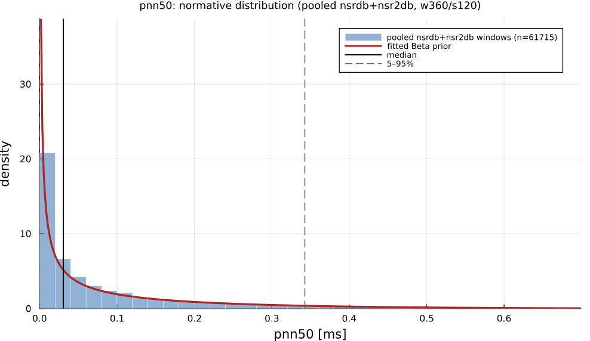

# `pnn50`

> **Proportion Of Successive Differences > 50 Ms**

| | |
|---|---|
| **Aliases** | `pnn50` |
| **Domain** | `time`, `statistics` |
| **Distribution family** | `Beta` |
| **Equation** | `sum(|diff(IBI)| > 50) / N` |
| **Resource intensity** | ◍◍◌◌◌  low, _Level 1–2 (base statistics over successive differences)._ (measured, see §Resources) |

## Definition

Proportion of successive differences > 50 ms. Formally: `sum(|diff(IBI)| > 50) / N`.

## What does *normal* look like?

Fitted normative prior: **Beta(α = 0.3211, β = 3.563)**, KS p = 2.1e-98, n = 61715.

Empirical distribution over the **pooled nsrdb+nsr2db** normative windows (360-beat windows, 120-beat stride), overlaid with the fitted `Beta` prior density. Vertical lines mark the median and the 5–95% range.

### Normal-range summary (pooled nsrdb+nsr2db)

| statistic | value |
|---|---|
| median | 0.03064 |
| IQR (25–75%) | 0.008357 – 0.1031 |
| 5–95% range | 0 – 0.3426 |
| mean ± sd | 0.08267 ± 0.1246 |
| n windows | 61715 |

_n varies by feature only through per-window validity over the full pooled nsrdb+nsr2db table (n up to 61 715; e.g. `sampen`/`mse` drop windows where the statistic is undefined). `ulf` is the one exception: a 360-beat (~5 min) window contains no ULF-band power, so it uses a long-window NSRDB-only extraction (see its own page)._

## Use cases

- Parasympathetic activity via the fraction of large beat-to-beat changes.
- Robust, interpretable vagal marker in ambulatory recordings.
- Screening for reduced HRV.

## Applications by area

*Evidence is reported at the measure-family level; a specific variant may not be the exact index measured in every cited study.*

### Clinical

**Coverage: statistics.** A pooled literature; reviews or meta-analyses exist.

RMSSD/pNN50 are among the most heavily studied HRV measures in psychiatry: two independent meta-analyses converge on significantly reduced RMSSD/pNN50 in major depression vs. healthy controls (g ≈ −0.46 to −0.51, thousands of patients pooled), extending to broader cardiovascular-risk and mental-disorder populations.

*Dominant reported direction:* down: reduced in depression/anxiety (g ≈ −0.3 to −0.5).

**Key references:** [koch2019](@cite); [wu2023](@cite).

### Sports & peak performance

**Coverage: statistics.** A pooled literature; reviews or meta-analyses exist.

RMSSD is the dominant, most-meta-analyzed short-term vagal index in sports science for training-load, recovery and overreaching monitoring, but its direction under overload is genuinely context-dependent: it can rise *or* fall depending on overload type/timing, an ambiguity documented across multiple competing meta-analyses rather than settled.

*Dominant reported direction:* context-dependent: rises with some overreaching patterns, falls with others (pre-competition taper).

**Key references:** [bellenger2016](@cite).

### Contemplative practice

**Coverage: individual papers.** A small, scattered literature with no pooled meta-analysis.

The one dedicated meta-analysis pooled only 3 studies and found a null RMSSD effect, explicitly citing too few large RCTs, yet several individually-reported trials claim significant RMSSD/pNN50 increases with practice, the largest reported-vs-pooled gap of the three application domains.

*Dominant reported direction:* contested: meta-analytic null vs. positive individual trials.

**Key references:** [radmark2019](@cite).

See the [effect-distribution meta-analysis](../usecases/effect-distributions.md) page for the harvested per-study effect sizes/p-values behind these domain summaries (`docs/zoo_gen/effect_stats.csv`).

## Resources

Resource-intensity rank **◍◍◌◌◌  low** is measured: median wall-clock time and allocations over a 360-beat window on synthetic realistic RR (`docs/zoo_gen/bench_resources.jl`; full grid in `resource_bench.csv`).

| metric (360-beat window) | value |
|---|---|
| cold median wall-time | 0.006412 ms |
| warm median wall-time | 0.003827 ms |
| allocations (cold) | 4.3 KiB |

*Cold* = fresh memoization caches (builds every shared representation from scratch); *warm* = shared representations (`diff`, periodogram, Poincaré coords, DFA fluctuation) already cached, so only this feature is recomputed. The tier is derived from the cold cost; see `Level 1–2 (base statistics over successive differences).`

## Citation

Ewing et al. (1984) introduced the NN50 count; pNN50 was formalised by the Task Force (1996).

**Seminal reference(s):** [ewing1984](@cite); [taskforce1996](@cite).

See the [References](references.md) page for the full bibliography.
