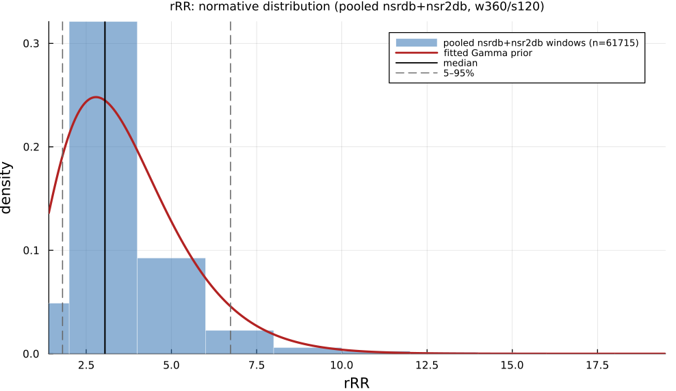

# `rRR`

> **Median Relative Rr Interval Distance**

| | |
|---|---|
| **Aliases** | `rRR` |
| **Domain** | `time`, `statistics` |
| **Distribution family** | `Gamma` |
| **Equation** | `median(euclidean_dist(relRR; mean(relRR)))*100` |
| **Resource intensity** | ◍◍◌◌◌  low, _Level 1–2 (base statistics over successive differences)._ (measured, see §Resources) |

## Definition

Median relative RR interval distance. Formally: `median(euclidean_dist(relRR; mean(relRR)))*100`.

## What does *normal* look like?

Fitted normative prior: **Gamma(α = 4.165, θ = 0.8806)**, KS p = 3.5e-172, n = 61715.

Empirical distribution over the **pooled nsrdb+nsr2db** normative windows (360-beat windows, 120-beat stride), overlaid with the fitted `Gamma` prior density. Vertical lines mark the median and the 5–95% range.

### Normal-range summary (pooled nsrdb+nsr2db)

| statistic | value |
|---|---|
| median | 3.05 |
| IQR (25–75%) | 2.424 – 4.05 |
| 5–95% range | 1.806 – 6.734 |
| mean ± sd | 3.667 ± 3.108 |
| n windows | 61715 |

_n varies by feature only through per-window validity over the full pooled nsrdb+nsr2db table (n up to 61 715; e.g. `sampen`/`mse` drop windows where the statistic is undefined). `ulf` is the one exception: a 360-beat (~5 min) window contains no ULF-band power, so it uses a long-window NSRDB-only extraction (see its own page)._

## Use cases

- Artifact-robust HRV summary from relative RR intervals (Vollmer 2015).
- Field / wearable recordings with occasional ectopy or noise.
- Complements SDNN/RMSSD when data quality is uncertain.

## Applications by area

*Evidence is reported at the measure-family level; a specific variant may not be the exact index measured in every cited study.*

No dedicated applications literature was harvested for `rRR`; treat its application evidence as sparse until a dedicated search is done. Its aliases and closest relatives may have their own applications; see the [HRV Variable Zoo](index.md) overview.

See the [effect-distribution meta-analysis](../usecases/effect-distributions.md) page for the harvested per-study effect sizes/p-values behind these domain summaries (`docs/zoo_gen/effect_stats.csv`).

## Resources

Resource-intensity rank **◍◍◌◌◌  low** is measured: median wall-clock time and allocations over a 360-beat window on synthetic realistic RR (`docs/zoo_gen/bench_resources.jl`; full grid in `resource_bench.csv`).

| metric (360-beat window) | value |
|---|---|
| cold median wall-time | 0.009818 ms |
| warm median wall-time | 0.009888 ms |
| allocations (cold) | 21.3 KiB |

*Cold* = fresh memoization caches (builds every shared representation from scratch); *warm* = shared representations (`diff`, periodogram, Poincaré coords, DFA fluctuation) already cached, so only this feature is recomputed. The tier is derived from the cold cost; see `Level 1–2 (base statistics over successive differences).`

## Citation

Vollmer (2015): a robust, simple relative-RR measure of HRV.

**Seminal reference(s):** [vollmer2015](@cite).

See the [References](references.md) page for the full bibliography.
