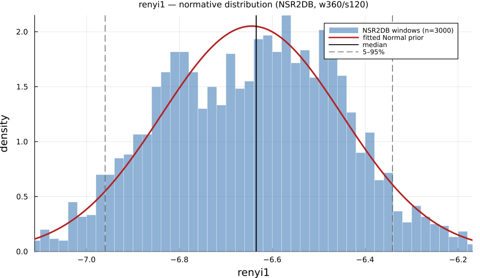

# `renyi1`

> **Renyi Entropy Of Order 1**

| | |
|---|---|
| **Aliases** | _none_ |
| **Domain** |  |
| **Distribution family** | `Normal` |
| **Equation** | `H_1(IBI)  (Renyi entropy order 1)` |
| **Resource intensity** | ◍◍◌◌◌  low — _Nonlinear subgraph (template matching / embedding — O(N²) worst case)._ (measured, see §Resources) |

## Definition

Renyi entropy of order 1. Formally: `H_1(IBI)  (Renyi entropy order 1)`.

## What does *normal* look like?

Fitted normative prior: **Normal(μ = -6.644, σ = 0.1945)**  —  KS p = 0.0015, n = 3000.

Empirical distribution over the **NSR2DB** normative windows (360-beat windows, 120-beat stride), overlaid with the fitted `Normal` prior density. Vertical lines mark the median and the 5–95% range.

### Normal-range summary (NSR2DB)

| statistic | value |
|---|---|
| median | -6.635 |
| IQR (25–75%) | -6.795 – -6.5 |
| 5–95% range | -6.96 – -6.341 |
| mean ± sd | -6.644 ± 0.1945 |
| n windows | 3000 |

_n varies by feature: pooled time/frequency/geometric features use the full nsrdb+nsr2db table (up to n = 56 472); the 13 nonlinear/entropy features are O(N²)/template-matching and are fit on a fixed-seed ≈3000-window subsample instead (`test/tools/collect_extended_features.jl`, seed 20260729); `ulf` uses a long-window NSRDB-only extraction (see its own page)._

## Use cases

- Shannon-equivalent limit of the Rényi entropy spectrum.
- Reference point against renyi0 / renyi2.
- Distribution-spread complexity.

## Applications by area

*Evidence is reported at the measure-family level; a specific variant may not be the exact index measured in every cited study.*

### Clinical

**Coverage: statistics** — a large/pooled literature (reviews or meta-analyses exist).

Genuinely common here: a 2026 PRISMA review found 55 studies (2011–2025) applying fuzzy/Shannon/spectral/SVD/permutation/multiscale entropy, concentrated in diabetes, cardiovascular disease and neurological conditions, with classification accuracies up to 92.5%. The dominant direction is lower entropy/complexity in disease — with one notable reversal (higher multiscale entropy predicted incident stroke in atrial fibrillation).

*Dominant reported direction:* down — lower entropy/complexity in disease (one AF-stroke reversal).

**Key references:** [yang2026](@cite).

### Sports & peak performance

**Coverage: individual papers** — a small, scattered literature (no pooled meta-analysis).

Uncommon: no dedicated meta-analyses exist, and a 2025 systematic review of 19 soccer-overtraining studies found none used any nonlinear/entropy index at all. The handful of small papers that do exist (n = 9–27, sometimes animal models) give mixed directions.

*Dominant reported direction:* mixed / essentially unstudied.

**Key references:** [yang2026](@cite).

### Meditation & contemplation

**Coverage: individual papers** — a small, scattered literature (no pooled meta-analysis).

One dedicated review (26 studies) covers Shannon/ApEn/SampEn/permutation/Renyi/multiscale entropy in meditation/yoga: most studies report reduced complexity during meditation, but this is not unanimous (some report increases, especially multiscale entropy at long scales), and effect sizes are frequently small/non-significant.

*Dominant reported direction:* mostly down, with scale- and measure-dependent exceptions.

**Key references:** [deka2023](@cite).

See the [effect-distribution meta-analysis](../usecases/effect-distributions.md) page for the harvested per-study effect sizes/p-values behind these domain summaries (`docs/zoo_gen/effect_stats.csv`).

## Resources

Resource-intensity rank **◍◍◌◌◌  low** is **measured** — median wall-clock time + allocations over a 360-beat window on synthetic realistic RR (`docs/zoo_gen/bench_resources.jl`; full grid in `resource_bench.csv`).

| metric (360-beat window) | value |
|---|---|
| cold median wall-time | 0.008286 ms |
| warm median wall-time | 0.003186 ms |
| allocations (cold) | 1.5 KiB |

*Cold* = fresh memoization caches (builds every shared representation from scratch); *warm* = shared representations (`diff`, periodogram, Poincaré coords, DFA fluctuation) already cached, so only this feature is recomputed. The tier is derived from the cold cost; see `Nonlinear subgraph (template matching / embedding — O(N²) worst case).`

## Citation

Rényi generalised entropy of order α=1 (→ Shannon entropy), Rényi (1961).

**Seminal reference(s):** [renyi1961](@cite).

See the [References](references.md) page for the full bibliography.
