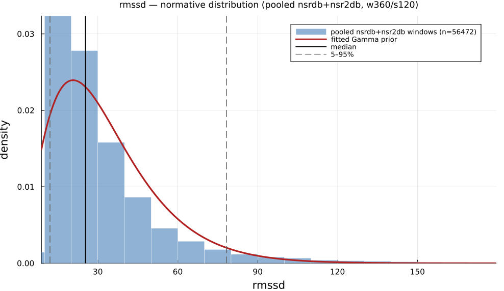

# `rmssd`

> **Root Mean Square Of Successive Differences**

| | |
|---|---|
| **Aliases** | `rmssd` |
| **Domain** | `time` · `statistics` |
| **Distribution family** | `Gamma` |
| **Equation** | `sqrt(mean(diff(IBI).^2))` |
| **Resource intensity** | ◍◍◌◌◌  low — _Level 1–2 (base statistics over successive differences)._ (measured, see §Resources) |

## Definition

Root mean square of successive differences. Formally: `sqrt(mean(diff(IBI).^2))`.

## What does *normal* look like?

Fitted normative prior: **Gamma(α = 2.7, θ = 12.17)**  —  KS p = 7.5e-66, n = 56472.

Empirical distribution over the **pooled nsrdb+nsr2db** normative windows (360-beat windows, 120-beat stride), overlaid with the fitted `Gamma` prior density. Vertical lines mark the median and the 5–95% range.

### Normal-range summary (pooled nsrdb+nsr2db)

| statistic | value |
|---|---|
| median | 25.36 |
| IQR (25–75%) | 17.54 – 38.03 |
| 5–95% range | 12.04 – 78.28 |
| mean ± sd | 32.87 ± 27.43 |
| n windows | 56472 |

_n varies by feature: pooled time/frequency/geometric features use the full nsrdb+nsr2db table (up to n = 56 472); the 13 nonlinear/entropy features are O(N²)/template-matching and are fit on a fixed-seed ≈3000-window subsample instead (`test/tools/collect_extended_features.jl`, seed 20260729); `ulf` uses a long-window NSRDB-only extraction (see its own page)._

## Use cases

- Beat-to-beat parasympathetic (vagal) tone; the most-used short-term HRV index.
- Ultra-short (≥10 s–1 min) and paced-breathing biofeedback targets.
- Daily readiness, recovery, and training-load monitoring.

## Applications by area

*Evidence is reported at the measure-family level; a specific variant may not be the exact index measured in every cited study.*

### Clinical

**Coverage: statistics** — a large/pooled literature (reviews or meta-analyses exist).

RMSSD/pNN50 are among the most heavily studied HRV measures in psychiatry: two independent meta-analyses converge on significantly reduced RMSSD/pNN50 in major depression vs. healthy controls (g ≈ −0.46 to −0.51, thousands of patients pooled), extending to broader cardiovascular-risk and mental-disorder populations.

*Dominant reported direction:* down — reduced in depression/anxiety (g ≈ −0.3 to −0.5).

**Key references:** [koch2019](@cite); [wu2023](@cite).

### Sports & peak performance

**Coverage: statistics** — a large/pooled literature (reviews or meta-analyses exist).

RMSSD is the dominant, most-meta-analyzed short-term vagal index in sports science for training-load, recovery and overreaching monitoring — but its direction under overload is genuinely context-dependent: it can rise *or* fall depending on overload type/timing, an ambiguity documented across multiple competing meta-analyses rather than settled.

*Dominant reported direction:* context-dependent — rises with some overreaching patterns, falls with others (pre-competition taper).

**Key references:** [bellenger2016](@cite).

### Meditation & contemplation

**Coverage: individual papers** — a small, scattered literature (no pooled meta-analysis).

The one dedicated meta-analysis pooled only 3 studies and found a null RMSSD effect, explicitly citing too few large RCTs — yet several individually-reported trials claim significant RMSSD/pNN50 increases with practice, the largest reported-vs-pooled gap of the three application domains.

*Dominant reported direction:* contested — meta-analytic null vs. positive individual trials.

**Key references:** [radmark2019](@cite).

!!! note
    **RMSSD ≡ SD1·√2** — see the [`sd1`](sd1.md) entry: papers that report RMSSD and SD1 as separate, corroborating findings are re-describing one statistic ([ciccone2017](@cite)).

!!! note
    **Meditation's effect on RMSSD/HR is disputed** — direction of change during meditation is not universal across the literature: a meta-analysis and several individual RCTs disagree on both the sign and the significance of the RMSSD response (see the Meditation subsection above).

See the [effect-distribution meta-analysis](../usecases/effect-distributions.md) page for the harvested per-study effect sizes/p-values behind these domain summaries (`docs/zoo_gen/effect_stats.csv`).

## Resources

Resource-intensity rank **◍◍◌◌◌  low** is **measured** — median wall-clock time + allocations over a 360-beat window on synthetic realistic RR (`docs/zoo_gen/bench_resources.jl`; full grid in `resource_bench.csv`).

| metric (360-beat window) | value |
|---|---|
| cold median wall-time | 0.01166 ms |
| warm median wall-time | 0.006532 ms |
| allocations (cold) | 8.2 KiB |

*Cold* = fresh memoization caches (builds every shared representation from scratch); *warm* = shared representations (`diff`, periodogram, Poincaré coords, DFA fluctuation) already cached, so only this feature is recomputed. The tier is derived from the cold cost; see `Level 1–2 (base statistics over successive differences).`

## Citation

Task Force (1996) consensus short-term vagal index. Successive-difference HRV measures predate the Task Force standard: Ewing et al. (1984) used them clinically, and the underlying statistic traces to von Neumann's (1941) mean-square successive difference (not independently on file here).

**Seminal reference(s):** [taskforce1996](@cite); [ewing1984](@cite).

See the [References](references.md) page for the full bibliography.
