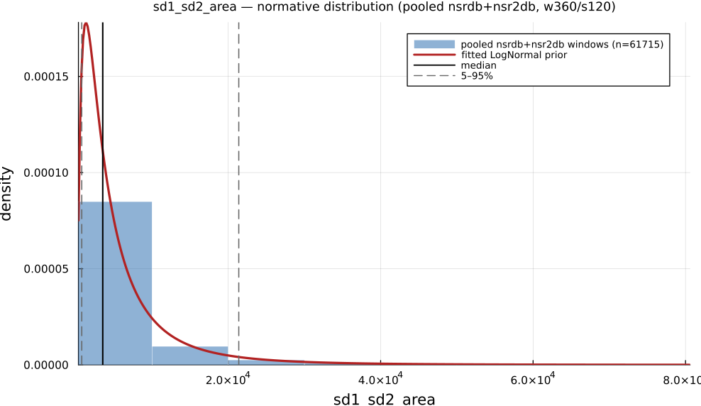

# `sd1_sd2_area`

> **Poincare Plot Ellipse Area**

| | |
|---|---|
| **Aliases** | `poincare_area` |
| **Domain** | `geometric` |
| **Distribution family** | `LogNormal` |
| **Equation** | `pi * SD1 * SD2` |
| **Resource intensity** | ◍◍◌◌◌  low — _Geometric subgraph (Poincaré coords / RR histogram + reductions). Warm (shared representation cached) is 10× cheaper._ (measured, see §Resources) |

## Definition

Poincare plot ellipse area. Formally: `pi * SD1 * SD2`.

## What does *normal* look like?

Fitted normative prior: **LogNormal(μ = 8.214, σ = 1.011)**  —  KS p = 7.4e-16, n = 61715.

Empirical distribution over the **pooled nsrdb+nsr2db** normative windows (360-beat windows, 120-beat stride), overlaid with the fitted `LogNormal` prior density. Vertical lines mark the median and the 5–95% range.

### Normal-range summary (pooled nsrdb+nsr2db)

| statistic | value |
|---|---|
| median | 3540 |
| IQR (25–75%) | 1837 – 6824 |
| 5–95% range | 785.7 – 2.139e+04 |
| mean ± sd | 6727 ± 1.305e+04 |
| n windows | 61715 |

_n varies by feature only through per-window validity over the full pooled nsrdb+nsr2db table (n up to 61 715; e.g. `sampen`/`mse` drop windows where the statistic is undefined). `ulf` is the one exception: a 360-beat (~5 min) window contains no ULF-band power, so it uses a long-window NSRDB-only extraction (see its own page)._

## Use cases

- Total Poincaré-ellipse dispersion (π·SD1·SD2).
- Compact geometric summary of overall variability.
- Robust-to-artifact field-recording summary.

## Applications by area

*Evidence is reported at the measure-family level; a specific variant may not be the exact index measured in every cited study.*

The three areas below are the application fields of the consolidated [HRV knowledge base](references.md) (clinical · sports & peak-performance · contemplative practice); the fourth KB field, *methods & foundations*, is this measure's seminal lineage — see [§Citation](#Citation).

### Clinical

**Coverage: statistics** — a large/pooled literature (reviews or meta-analyses exist).

A well-established clinical output across cardiology, endocrinology and psychiatry: lower SD1/SD2 (reduced beat-to-beat and long-term variability) consistently marks worse disease state, though most reported sample sizes are small (n = 18–95). SD1 is mathematically identical to RMSSD (SD1 = RMSSD/√2), so papers reporting both as independently "significant" double-count the same statistic, and the SD2/SD1 ratio's billing as a "sympathovagal balance" surrogate is directly contested.

*Dominant reported direction:* down — lower SD1/SD2 → worse disease state.

**Key references:** [ciccone2017](@cite); [rahman2018](@cite); [stuckey2014](@cite).

### Sports & peak performance

**Coverage: individual papers** — a small, scattered literature (no pooled meta-analysis).

Largely restates RMSSD-based vagal-tone monitoring in geometric form (SD1 = RMSSD/√2), plus an SD2/SD1 "stress score" aimed at overreaching detection; SD1 rises with aerobic training and falls with acute intensity/overtraining, though overtraining shows a non-monotonic pattern (higher than sedentary, far below trained) and no meta-analysis isolates a Poincaré-specific effect size distinct from RMSSD.

*Dominant reported direction:* up with training, down acutely/with overtraining (same underlying signal as RMSSD).

**Key references:** [bellenger2016](@cite); [ciccone2017](@cite).

### Contemplative practice

**Coverage: individual papers** — a small, scattered literature (no pooled meta-analysis).

A handful of small, likely underpowered studies (n = 8–18) report SD1/SD2-ratio changes across meditation traditions, but the direction of SD2 and total Poincaré-plot area disagrees between the two studies that report it — exploratory, not established.

*Dominant reported direction:* inconsistent across the two available small studies.

**Key references:** [ciccone2017](@cite).

See the [effect-distribution meta-analysis](../usecases/effect-distributions.md) page for the harvested per-study effect sizes/p-values behind these domain summaries (`docs/zoo_gen/effect_stats.csv`).

## Resources

Resource-intensity rank **◍◍◌◌◌  low** is **measured** — median wall-clock time + allocations over a 360-beat window on synthetic realistic RR (`docs/zoo_gen/bench_resources.jl`; full grid in `resource_bench.csv`).

| metric (360-beat window) | value |
|---|---|
| cold median wall-time | 0.03211 ms |
| warm median wall-time | 0.003296 ms |
| allocations (cold) | 32.9 KiB |

*Cold* = fresh memoization caches (builds every shared representation from scratch); *warm* = shared representations (`diff`, periodogram, Poincaré coords, DFA fluctuation) already cached, so only this feature is recomputed. The tier is derived from the cold cost; see `Geometric subgraph (Poincaré coords / RR histogram + reductions). Warm (shared representation cached) is 10× cheaper.`

## Citation

Poincaré ellipse area π·SD1·SD2, Brennan et al. (2001); Task Force (1996) geometric methods.

**Seminal reference(s):** [brennan2001](@cite); [taskforce1996](@cite).

See the [References](references.md) page for the full bibliography.
