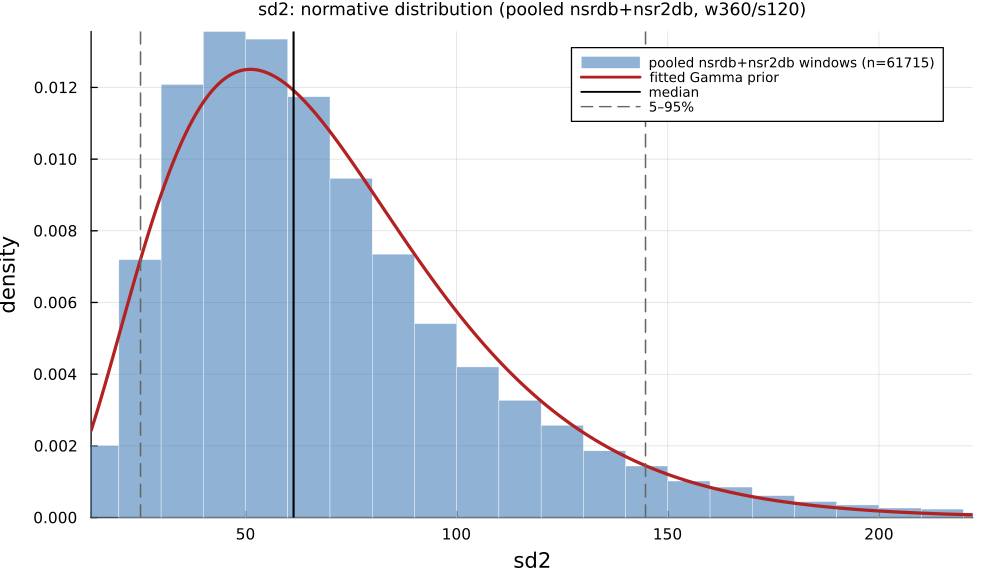

# `sd2`

> **Poincare Plot Long-Term Variability**

| | |
|---|---|
| **Aliases** | `sd2`, `sd2_length` |
| **Domain** | `geometric` |
| **Distribution family** | `Gamma` |
| **Equation** | `std((IBI[1:end-1] + IBI[2:end]) / sqrt(2))` |
| **Resource intensity** | ◍◍◌◌◌  low, _Geometric subgraph (Poincaré coords / RR histogram + reductions). Warm (shared representation cached) is 5× cheaper._ (measured, see §Resources) |

## Definition

Poincare plot long-term variability. Formally: `std((IBI[1:end-1] + IBI[2:end]) / sqrt(2))`.

## What does *normal* look like?

Fitted normative prior: **Gamma(α = 3.731, θ = 18.73)**, KS p = 1.8e-24, n = 61715.

Empirical distribution over the **pooled nsrdb+nsr2db** normative windows (360-beat windows, 120-beat stride), overlaid with the fitted `Gamma` prior density. Vertical lines mark the median and the 5–95% range.

### Normal-range summary (pooled nsrdb+nsr2db)

| statistic | value |
|---|---|
| median | 61.37 |
| IQR (25–75%) | 42.63 – 87.1 |
| 5–95% range | 25.13 – 144.7 |
| mean ± sd | 69.87 ± 38.56 |
| n windows | 61715 |

_n varies by feature only through per-window validity over the full pooled nsrdb+nsr2db table (n up to 61 715; e.g. `sampen`/`mse` drop windows where the statistic is undefined). `ulf` is the one exception: a 360-beat (~5 min) window contains no ULF-band power, so it uses a long-window NSRDB-only extraction (see its own page)._

## Use cases

- Long-term Poincaré-plot length; overall/continuous variability.
- Paired with SD1 for the SD2/SD1 shape ratio.
- Geometric complement to SDNN.

## Applications by area

*Evidence is reported at the measure-family level; a specific variant may not be the exact index measured in every cited study.*

### Clinical

**Coverage: statistics.** A pooled literature; reviews or meta-analyses exist.

A well-established clinical output across cardiology, endocrinology and psychiatry: lower SD1/SD2 (reduced beat-to-beat and long-term variability) consistently marks worse disease state, though most reported sample sizes are small (n = 18–95). SD1 is mathematically identical to RMSSD (SD1 = RMSSD/√2), so papers reporting both as independently "significant" double-count the same statistic, and the SD2/SD1 ratio's billing as a "sympathovagal balance" surrogate is directly contested.

*Dominant reported direction:* down: lower SD1/SD2 → worse disease state.

**Key references:** [ciccone2017](@cite); [rahman2018](@cite); [stuckey2014](@cite).

### Sports & peak performance

**Coverage: individual papers.** A small, scattered literature with no pooled meta-analysis.

Largely restates RMSSD-based vagal-tone monitoring in geometric form (SD1 = RMSSD/√2), plus an SD2/SD1 "stress score" aimed at overreaching detection; SD1 rises with aerobic training and falls with acute intensity/overtraining, though overtraining shows a non-monotonic pattern (higher than sedentary, far below trained) and no meta-analysis isolates a Poincaré-specific effect size distinct from RMSSD.

*Dominant reported direction:* up with training, down acutely/with overtraining (same underlying signal as RMSSD).

**Key references:** [bellenger2016](@cite); [ciccone2017](@cite).

### Contemplative practice

**Coverage: individual papers.** A small, scattered literature with no pooled meta-analysis.

A handful of small, likely underpowered studies (n = 8–18) report SD1/SD2-ratio changes across meditation traditions, but the direction of SD2 and total Poincaré-plot area disagrees between the two studies that report it: exploratory, not established.

*Dominant reported direction:* inconsistent across the two available small studies.

**Key references:** [ciccone2017](@cite).

See the [effect-distribution meta-analysis](../usecases/effect-distributions.md) page for the harvested per-study effect sizes/p-values behind these domain summaries (`docs/zoo_gen/effect_stats.csv`).

## Resources

Resource-intensity rank **◍◍◌◌◌  low** is measured: median wall-clock time and allocations over a 360-beat window on synthetic realistic RR (`docs/zoo_gen/bench_resources.jl`; full grid in `resource_bench.csv`).

| metric (360-beat window) | value |
|---|---|
| cold median wall-time | 0.02656 ms |
| warm median wall-time | 0.005871 ms |
| allocations (cold) | 25.4 KiB |

*Cold* = fresh memoization caches (builds every shared representation from scratch); *warm* = shared representations (`diff`, periodogram, Poincaré coords, DFA fluctuation) already cached, so only this feature is recomputed. The tier is derived from the cold cost; see `Geometric subgraph (Poincaré coords / RR histogram + reductions). Warm (shared representation cached) is 5× cheaper.`

## Citation

Tulppo et al. (1996) introduced ellipse-fitted SD2; Brennan et al. (2001) derived the closed form linking it to SDNN/SDSD (primacy contested).

**Seminal reference(s):** [tulppo1996](@cite); [brennan2001](@cite).

See the [References](references.md) page for the full bibliography.
