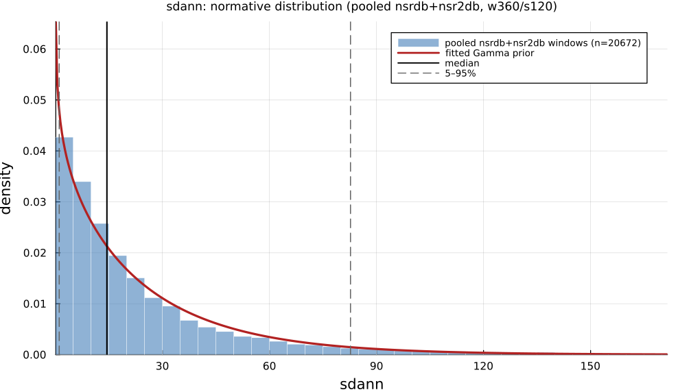

# `sdann`

> **Standard Deviation Of 5-Min Average Nn Intervals**

| | |
|---|---|
| **Aliases** | `sdann` |
| **Domain** | `time`, `statistics` |
| **Distribution family** | `Gamma` |
| **Equation** | `std(5-min means of IBI)` |
| **Resource intensity** | ◍◍◌◌◌  low, _Level 1–2 (base statistics over successive differences)._ (measured, see §Resources) |

## Definition

Standard deviation of 5-min average NN intervals. Formally: `std(5-min means of IBI)`.

## What does *normal* look like?

Fitted normative prior: **Gamma(α = 0.8725, θ = 27.85)**, KS p = 6.1e-28, n = 20672.

**SDANN is degenerate on 360-beat windows.** SDANN is the SD of multiple non-overlapping 5-minute segment means; a single 360-beat window (about 5 to 6 min) usually spans only one segment, so most windows yield `NaN` and are filtered out of the summary below (see the reduced n). Treat the plot and normal-range table as indicative only; a real SDANN needs at least 25 to 30 min, ideally the full 24-h recording.

Empirical distribution over the **pooled nsrdb+nsr2db** normative windows (360-beat windows, 120-beat stride), overlaid with the fitted `Gamma` prior density. Vertical lines mark the median and the 5–95% range.

### Normal-range summary (pooled nsrdb+nsr2db)

| statistic | value |
|---|---|
| median | 14.45 |
| IQR (25–75%) | 5.978 – 30.92 |
| 5–95% range | 1.084 – 82.71 |
| mean ± sd | 24.3 ± 29.32 |
| n windows | 20672 |

_n varies by feature only through per-window validity over the full pooled nsrdb+nsr2db table (n up to 61 715; e.g. `sampen`/`mse` drop windows where the statistic is undefined). `ulf` is the one exception: a 360-beat (~5 min) window contains no ULF-band power, so it uses a long-window NSRDB-only extraction (see its own page)._

## Use cases

- Long-term (circadian, ≥5-min) variability component over 24-h recordings.
- Complements SDNN by isolating slow, between-segment drift.
- Prognostic Holter-based risk stratification.

## Applications by area

*Evidence is reported at the measure-family level; a specific variant may not be the exact index measured in every cited study.*

### Clinical

**Coverage: statistics.** A pooled literature; reviews or meta-analyses exist.

SDNN/SDANN are among the most validated HRV mortality predictors: low values predict higher cardiac/all-cause mortality post-MI, in heart failure, and even in the general population (8 cohorts, n = 21,988). CVNNI has its own well-established sub-literature as a diabetic cardiac autonomic neuropathy screening marker. One acute-decompensated-HF study reports the opposite polarity (higher SDNN/SDANN in the poor-prognosis group).

*Dominant reported direction:* down: low SDNN/SDANN/CVNNI → higher mortality (one acute-HF exception reversed).

**Key references:** [hillebrand2013](@cite); [rueda2024](@cite).

### Sports & peak performance

**Coverage: individual papers.** A small, scattered literature with no pooled meta-analysis.

Comparatively under-used next to RMSSD in sports HRV monitoring: the field's dedicated meta-analysis pools RMSSD/HF/SD1, not SDNN. Individual studies find SDNN falls with heavy training/overreaching and recovers during taper, and tends to be higher in higher-level athletes, but effect sizes are small-sample and heterogeneous.

*Dominant reported direction:* down with overreaching, recovers with taper (RMSSD-dominated literature, SDNN secondary).

**Key references:** [bellenger2016](@cite).

### Contemplative practice

**Coverage: individual papers.** A small, scattered literature with no pooled meta-analysis.

The weakest of the three domains for this family: two dedicated meta-analyses found the evidence for resting and vagally-mediated HRV (including SDNN) inconclusive or null, with only a handful of trials reporting SDNN at all. Individual acute-state studies diverge sharply in direction (SDNN falls during Heartfulness meditation, rises during Chi/Kundalini-yoga).

*Dominant reported direction:* contested: meta-analytic null vs. technique-dependent individual-study increases/decreases.

**Key references:** [radmark2019](@cite); [brown2021](@cite).

See the [effect-distribution meta-analysis](../usecases/effect-distributions.md) page for the harvested per-study effect sizes/p-values behind these domain summaries (`docs/zoo_gen/effect_stats.csv`).

## Resources

Resource-intensity rank **◍◍◌◌◌  low** is measured: median wall-clock time and allocations over a 360-beat window on synthetic realistic RR (`docs/zoo_gen/bench_resources.jl`; full grid in `resource_bench.csv`).

| metric (360-beat window) | value |
|---|---|
| cold median wall-time | 0.006152 ms |
| warm median wall-time | 0.006232 ms |
| allocations (cold) | 12.7 KiB |

*Cold* = fresh memoization caches (builds every shared representation from scratch); *warm* = shared representations (`diff`, periodogram, Poincaré coords, DFA fluctuation) already cached, so only this feature is recomputed. The tier is derived from the cold cost; see `Level 1–2 (base statistics over successive differences).`

## Citation

SDANN (SD of 5-min mean NN), Kleiger et al. (1987); standardised by the Task Force (1996). Primacy contested: Wolf et al. (1978) reported the prognostic RR-variability/post-MI-mortality link that SDANN-family measures build on, predating Kleiger by ~9 years.

**Seminal reference(s):** [kleiger1987](@cite); [wolf1978](@cite); [taskforce1996](@cite).

See the [References](references.md) page for the full bibliography.
