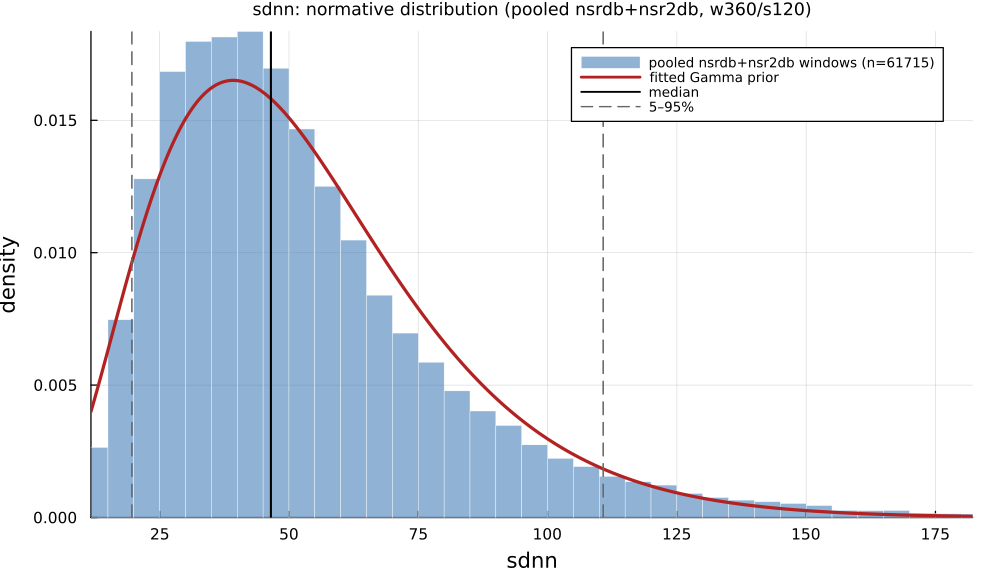

# `sdnn`

> **Standard Deviation Of Nn Intervals**

| | |
|---|---|
| **Aliases** | `std` |
| **Domain** | `time`, `statistics` |
| **Distribution family** | `Gamma` |
| **Equation** | `std(IBI)` |
| **Resource intensity** | ◍◌◌◌◌  very low, _Level 1–2 (base statistics over successive differences)._ (measured, see §Resources) |

## Definition

Standard deviation of NN intervals. Formally: `std(IBI)`.

## What does *normal* look like?

Fitted normative prior: **Gamma(α = 3.795, θ = 14.03)**, KS p = 3.6e-29, n = 61715.

Empirical distribution over the **pooled nsrdb+nsr2db** normative windows (360-beat windows, 120-beat stride), overlaid with the fitted `Gamma` prior density. Vertical lines mark the median and the 5–95% range.

### Normal-range summary (pooled nsrdb+nsr2db)

| statistic | value |
|---|---|
| median | 46.51 |
| IQR (25–75%) | 32.78 – 65.36 |
| 5–95% range | 19.63 – 110.8 |
| mean ± sd | 53.25 ± 30.13 |
| n windows | 61715 |

_n varies by feature only through per-window validity over the full pooled nsrdb+nsr2db table (n up to 61 715; e.g. `sampen`/`mse` drop windows where the statistic is undefined). `ulf` is the one exception: a 360-beat (~5 min) window contains no ULF-band power, so it uses a long-window NSRDB-only extraction (see its own page)._

## Use cases

- Overall HRV magnitude; prognostic index after myocardial infarction (Kleiger et al. 1987).
- Standard summary of a 24-h or 5-min recording.
- Global autonomic-variability screening.

## Applications by area

*Evidence is reported at the measure-family level; a specific variant may not be the exact index measured in every cited study.*

### Clinical

**Coverage: statistics.** A pooled literature; reviews or meta-analyses exist.

SDNN/SDANN are among the most validated HRV mortality predictors: low values predict higher cardiac/all-cause mortality post-MI, in heart failure, and even in the general population (8 cohorts, n = 21,988). CVNNI has its own well-established sub-literature as a diabetic cardiac autonomic neuropathy screening marker. One acute-decompensated-HF study reports the opposite polarity (higher SDNN/SDANN in the poor-prognosis group).

*Dominant reported direction:* down: low SDNN/SDANN/CVNNI → higher mortality (one acute-HF exception reversed).

**Key references:** [hillebrand2013](@cite); [rueda2024](@cite).

### Sports & peak performance

**Coverage: individual papers.** A small, scattered literature with no pooled meta-analysis.

Comparatively under-used next to RMSSD in sports HRV monitoring: the field's dedicated meta-analysis pools RMSSD/HF/SD1, not SDNN. Individual studies find SDNN falls with heavy training/overreaching and recovers during taper, and tends to be higher in higher-level athletes, but effect sizes are small-sample and heterogeneous.

*Dominant reported direction:* down with overreaching, recovers with taper (RMSSD-dominated literature, SDNN secondary).

**Key references:** [bellenger2016](@cite).

### Contemplative practice

**Coverage: individual papers.** A small, scattered literature with no pooled meta-analysis.

The weakest of the three domains for this family: two dedicated meta-analyses found the evidence for resting and vagally-mediated HRV (including SDNN) inconclusive or null, with only a handful of trials reporting SDNN at all. Individual acute-state studies diverge sharply in direction (SDNN falls during Heartfulness meditation, rises during Chi/Kundalini-yoga).

*Dominant reported direction:* contested: meta-analytic null vs. technique-dependent individual-study increases/decreases.

**Key references:** [radmark2019](@cite); [brown2021](@cite).

**Meditation's effect on SDNN is disputed**: one study found SDRR *decreased* during Heartfulness meditation, while another found it *increased* during Chi/Kundalini-yoga meditation; both are small, single-technique studies ([natarajan2023](@cite); [radmark2019](@cite) for the pooled mindfulness-HRV review these sit alongside).

See the [effect-distribution meta-analysis](../usecases/effect-distributions.md) page for the harvested per-study effect sizes/p-values behind these domain summaries (`docs/zoo_gen/effect_stats.csv`).

## Resources

Resource-intensity rank **◍◌◌◌◌  very low** is measured: median wall-clock time and allocations over a 360-beat window on synthetic realistic RR (`docs/zoo_gen/bench_resources.jl`; full grid in `resource_bench.csv`).

| metric (360-beat window) | value |
|---|---|
| cold median wall-time | 0.002885 ms |
| warm median wall-time | 0.002765 ms |
| allocations (cold) | 736 B |

*Cold* = fresh memoization caches (builds every shared representation from scratch); *warm* = shared representations (`diff`, periodogram, Poincaré coords, DFA fluctuation) already cached, so only this feature is recomputed. The tier is derived from the cold cost; see `Level 1–2 (base statistics over successive differences).`

## Citation

Kleiger et al. (1987) established SDNN as the prognostic 24-h HRV index and popularised it; standardised by the Task Force (1996). Primacy contested: Wolf et al. (1978) had already linked a cruder RR-interval SD/variance measure to lower post-MI hospital mortality nearly a decade earlier.

**Seminal reference(s):** [kleiger1987](@cite); [wolf1978](@cite); [taskforce1996](@cite).

See the [References](references.md) page for the full bibliography.
