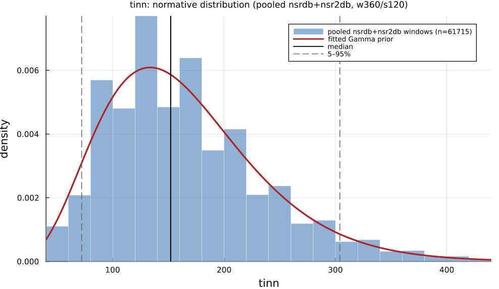

# `tinn`

> **Triangular Interpolation Of Nn Interval Histogram**

| | |
|---|---|
| **Aliases** | `triangular_interpolation_of_nn_intervals` |
| **Domain** | `geometric` |
| **Distribution family** | `Gamma` |
| **Equation** | `M - N  (triangle base width)` |
| **Resource intensity** | ◍◍◍◍◍  very high, _Geometric subgraph (Poincaré coords / RR histogram + reductions)._ (measured, see §Resources) |

## Definition

Triangular interpolation of NN interval histogram. Formally: `M - N  (triangle base width)`.

## What does *normal* look like?

Fitted normative prior: **Gamma(α = 5.321, θ = 30.91)**, KS p = 1.8e-18, n = 61715.

Empirical distribution over the **pooled nsrdb+nsr2db** normative windows (360-beat windows, 120-beat stride), overlaid with the fitted `Gamma` prior density. Vertical lines mark the median and the 5–95% range.

### Normal-range summary (pooled nsrdb+nsr2db)

| statistic | value |
|---|---|
| median | 152 |
| IQR (25–75%) | 112 – 200 |
| 5–95% range | 72 – 304 |
| mean ± sd | 164.5 ± 73.8 |
| n windows | 61715 |

_n varies by feature only through per-window validity over the full pooled nsrdb+nsr2db table (n up to 61 715; e.g. `sampen`/`mse` drop windows where the statistic is undefined). `ulf` is the one exception: a 360-beat (~5 min) window contains no ULF-band power, so it uses a long-window NSRDB-only extraction (see its own page)._

## Use cases

- Baseline width of the triangular RR-histogram interpolation.
- Geometric variability summary robust to outliers.
- Companion to the triangular index.

## Applications by area

*Evidence is reported at the measure-family level; a specific variant may not be the exact index measured in every cited study.*

### Clinical

**Coverage: statistics.** A pooled literature; reviews or meta-analyses exist.

HTI (and TINN) are original 1996 Task Force geometric measures that remain recurring prognostic markers: reduced HTI/TINN is associated with higher post-MI and atrial-fibrillation mortality and reduced diabetic autonomic integrity: except one hemodialysis-AF cohort reporting a U-shaped, not monotonic, relationship.

*Dominant reported direction:* down: lower HTI/TINN → worse outcome (one U-shaped exception).

**Key references:** [taskforce1996](@cite); [stuckey2014](@cite).

### Sports & peak performance

**Coverage: individual papers.** A small, scattered literature with no pooled meta-analysis.

Not the sports-science metric of choice: a 138-athlete profiling study and dedicated exercise-HRV meta-analyses bypass HTI/TINN entirely in favor of SDNN/RMSSD/LF-HF. Where it is reported, HTI rises with higher aerobic/endurance training status.

*Dominant reported direction:* up with endurance training status (rarely reported).

**Key references:** [stuckey2014](@cite).

### Contemplative practice

**Coverage: sparse or none.** Essentially no dedicated application literature found.

Six targeted searches of the most relevant meditation/mindfulness HRV papers found none reporting HTI or TINN: these studies uniformly use SDNN/RMSSD/LF-HF instead, plausibly because typical meditation-session recordings (5–20 min) are too short for a stable NN-interval histogram (the Task Force recommends ≥20 min, ideally 24 h).

*Dominant reported direction:* no data harvested for this domain.

**Key references:** [taskforce1996](@cite).

See the [effect-distribution meta-analysis](../usecases/effect-distributions.md) page for the harvested per-study effect sizes/p-values behind these domain summaries (`docs/zoo_gen/effect_stats.csv`).

## Resources

Resource-intensity rank **◍◍◍◍◍  very high** is measured: median wall-clock time and allocations over a 360-beat window on synthetic realistic RR (`docs/zoo_gen/bench_resources.jl`; full grid in `resource_bench.csv`).

| metric (360-beat window) | value |
|---|---|
| cold median wall-time | 56.3 ms |
| warm median wall-time | 55.28 ms |
| allocations (cold) | 51.3 MiB |

*Cold* = fresh memoization caches (builds every shared representation from scratch); *warm* = shared representations (`diff`, periodogram, Poincaré coords, DFA fluctuation) already cached, so only this feature is recomputed. The tier is derived from the cold cost; see `Geometric subgraph (Poincaré coords / RR histogram + reductions).`

## Citation

Triangular Interpolation of the NN histogram (TINN), Malik et al. (1989) / Task Force (1996).

**Seminal reference(s):** [malik1989](@cite); [taskforce1996](@cite).

See the [References](references.md) page for the full bibliography.
