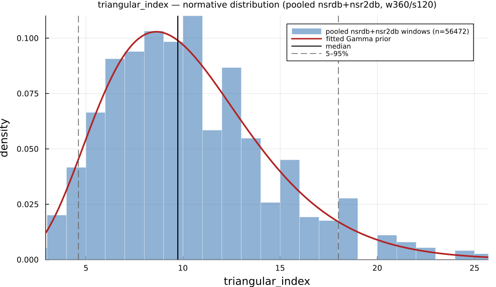

# `triangular_index`

> **Hrv Triangular Index**

| | |
|---|---|
| **Aliases** | `triangular_index` |
| **Domain** | `geometric` |
| **Distribution family** | `Gamma` |
| **Equation** | `N / max(histogram_weights)` |
| **Resource intensity** | ◍◍◌◌◌  low — _Geometric subgraph (Poincaré coords / RR histogram + reductions). Warm (shared representation cached) is 3× cheaper._ (measured, see §Resources) |

## Definition

HRV triangular index. Formally: `N / max(histogram_weights)`.

## What does *normal* look like?

Fitted normative prior: **Gamma(α = 6.108, θ = 1.688)**  —  KS p = 1.7e-27, n = 56472.

Empirical distribution over the **pooled nsrdb+nsr2db** normative windows (360-beat windows, 120-beat stride), overlaid with the fitted `Gamma` prior density. Vertical lines mark the median and the 5–95% range.

### Normal-range summary (pooled nsrdb+nsr2db)

| statistic | value |
|---|---|
| median | 9.73 |
| IQR (25–75%) | 7.2 – 12.86 |
| 5–95% range | 4.615 – 18 |
| mean ± sd | 10.31 ± 4.244 |
| n windows | 56472 |

_n varies by feature: pooled time/frequency/geometric features use the full nsrdb+nsr2db table (up to n = 56 472); the 13 nonlinear/entropy features are O(N²)/template-matching and are fit on a fixed-seed ≈3000-window subsample instead (`test/tools/collect_extended_features.jl`, seed 20260729); `ulf` uses a long-window NSRDB-only extraction (see its own page)._

## Use cases

- Geometric, artifact-robust overall-HRV magnitude from the RR histogram.
- 24-h Holter analysis where noise defeats SDNN.
- Post-MI risk stratification (Malik et al. 1989).

## Applications by area

*Evidence is reported at the measure-family level; a specific variant may not be the exact index measured in every cited study.*

### Clinical

**Coverage: statistics** — a large/pooled literature (reviews or meta-analyses exist).

HTI (and TINN) are original 1996 Task Force geometric measures that remain recurring prognostic markers: reduced HTI/TINN is associated with higher post-MI and atrial-fibrillation mortality and reduced diabetic autonomic integrity — except one hemodialysis-AF cohort reporting a U-shaped, not monotonic, relationship.

*Dominant reported direction:* down — lower HTI/TINN → worse outcome (one U-shaped exception).

**Key references:** [taskforce1996](@cite); [stuckey2014](@cite).

### Sports & peak performance

**Coverage: individual papers** — a small, scattered literature (no pooled meta-analysis).

Not the sports-science metric of choice — a 138-athlete profiling study and dedicated exercise-HRV meta-analyses bypass HTI/TINN entirely in favor of SDNN/RMSSD/LF-HF. Where it is reported, HTI rises with higher aerobic/endurance training status.

*Dominant reported direction:* up with endurance training status (rarely reported).

**Key references:** [stuckey2014](@cite).

### Meditation & contemplation

**Coverage: sparse-or-none** — essentially no dedicated application literature found.

Six targeted searches of the most relevant meditation/mindfulness HRV papers found none reporting HTI or TINN — these studies uniformly use SDNN/RMSSD/LF-HF instead, plausibly because typical meditation-session recordings (5–20 min) are too short for a stable NN-interval histogram (the Task Force recommends ≥20 min, ideally 24 h).

*Dominant reported direction:* no data harvested for this domain.

**Key references:** [taskforce1996](@cite).

See the [effect-distribution meta-analysis](../usecases/effect-distributions.md) page for the harvested per-study effect sizes/p-values behind these domain summaries (`docs/zoo_gen/effect_stats.csv`).

## Resources

Resource-intensity rank **◍◍◌◌◌  low** is **measured** — median wall-clock time + allocations over a 360-beat window on synthetic realistic RR (`docs/zoo_gen/bench_resources.jl`; full grid in `resource_bench.csv`).

| metric (360-beat window) | value |
|---|---|
| cold median wall-time | 0.01088 ms |
| warm median wall-time | 0.003256 ms |
| allocations (cold) | 4.0 KiB |

*Cold* = fresh memoization caches (builds every shared representation from scratch); *warm* = shared representations (`diff`, periodogram, Poincaré coords, DFA fluctuation) already cached, so only this feature is recomputed. The tier is derived from the cold cost; see `Geometric subgraph (Poincaré coords / RR histogram + reductions). Warm (shared representation cached) is 3× cheaper.`

## Citation

HRV triangular index, Malik et al. (1989); standardised by the Task Force (1996).

**Seminal reference(s):** [malik1989](@cite); [taskforce1996](@cite).

See the [References](references.md) page for the full bibliography.
