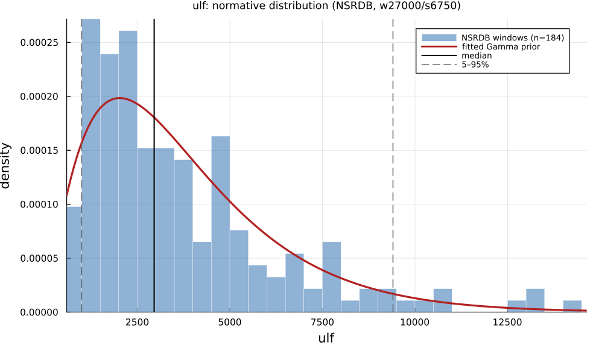

# `ulf`

> **Ultra-Low Frequency Power (0-0.003 Hz)**

| | |
|---|---|
| **Aliases** | `ultra_low_frequency` |
| **Domain** | `frequency` |
| **Distribution family** | `Gamma` |
| **Equation** | `integral(PSD; 0; 0.003) Hz` |
| **Resource intensity** | ◍◍◍◌◌  moderate — _Frequency subgraph (requires a Welch/Lomb–Scargle periodogram first). Warm (shared representation cached) is 3× cheaper._ (measured, see §Resources) |

## Definition

Ultra-low frequency power (0-0.003 Hz). Formally: `integral(PSD; 0; 0.003) Hz`.

## What does *normal* look like?

Fitted normative prior: **Gamma(α = 2.166, θ = 1736)**  —  KS p = 0.28, n = 184.

Empirical distribution over the **NSRDB** normative windows (27000-beat windows, 6750-beat stride), overlaid with the fitted `Gamma` prior density. Vertical lines mark the median and the 5–95% range.

### Normal-range summary (NSRDB)

| statistic | value |
|---|---|
| median | 2956 |
| IQR (25–75%) | 1739 – 4824 |
| 5–95% range | 997.8 – 9405 |
| mean ± sd | 3761 ± 2878 |
| n windows | 184 |

_n varies by feature only through per-window validity over the full pooled nsrdb+nsr2db table (n up to 61 715; e.g. `sampen`/`mse` drop windows where the statistic is undefined). `ulf` is the one exception: a 360-beat (~5 min) window contains no ULF-band power, so it uses a long-window NSRDB-only extraction (see its own page)._

## Use cases

- Autonomic balance via spectral bands (LF/HF interpretation with care).
- Baroreflex and respiratory-sinus-arrhythmia studies.
- Longer recordings where spectral resolution is adequate.

## Applications by area

*Evidence is reported at the measure-family level; a specific variant may not be the exact index measured in every cited study.*

The three areas below are the application fields of the consolidated [HRV knowledge base](references.md) (clinical · sports & peak-performance · contemplative practice); the fourth KB field, *methods & foundations*, is this measure's seminal lineage — see [§Citation](#Citation).

### Clinical

**Coverage: statistics** — a large/pooled literature (reviews or meta-analyses exist).

ULF/VLF power is extensively studied in mortality risk stratification: lower ULF/VLF consistently predicts higher all-cause/cardiac/arrhythmic mortality post-MI, in CHF, ACS and elderly cohorts. A 2024 meta-analysis, however, found time-domain measures (SDNN, HTI) the strongest post-MI predictors rather than VLF/ULF specifically, and the band's own physiological interpretation (thermoregulation vs. renin–angiotensin vs. artifact) remains unsettled.

*Dominant reported direction:* down — lower ULF/VLF → higher mortality (contested against time-domain predictors).

**Key references:** [shaffer2017](@cite); [rueda2024](@cite); [yuda2021](@cite).

### Sports & peak performance

**Coverage: individual papers** — a small, scattered literature (no pooled meta-analysis).

Uncommon as a headline sports metric. Acute dose-response is consistent and strong (ULF/VLF falls monotonically with rising exercise intensity; ambulatory ULF rises sharply with movement, largely a motion-artifact/thermoregulatory effect), but chronic-training/overtraining findings are weak, inconsistent, and even sex-reversed within a single small study.

*Dominant reported direction:* down acutely with intensity; chronic/training direction unsettled.

**Key references:** [shaffer2017](@cite).

### Contemplative practice

**Coverage: individual papers** — a small, scattered literature (no pooled meta-analysis).

A minor, seldom-isolated component of meditation HRV research: one classic study reports dramatic, exaggerated VLF-spanning oscillations tied to extremely slow breathing during Chi/Kundalini meditation, while a more careful spectral study found no change in normalized VLF power but a significant drop in the residual (non-harmonic) component — illustrating strong method-dependence (raw vs. normalized vs. residual power).

*Dominant reported direction:* method-dependent (raw vs. normalized vs. residual).

**Key references:** [shaffer2017](@cite).

See the [effect-distribution meta-analysis](../usecases/effect-distributions.md) page for the harvested per-study effect sizes/p-values behind these domain summaries (`docs/zoo_gen/effect_stats.csv`).

## Resources

Resource-intensity rank **◍◍◍◌◌  moderate** is **measured** — median wall-clock time + allocations over a 360-beat window on synthetic realistic RR (`docs/zoo_gen/bench_resources.jl`; full grid in `resource_bench.csv`).

| metric (360-beat window) | value |
|---|---|
| cold median wall-time | 0.1031 ms |
| warm median wall-time | 0.03 ms |
| allocations (cold) | 48.6 KiB |

*Cold* = fresh memoization caches (builds every shared representation from scratch); *warm* = shared representations (`diff`, periodogram, Poincaré coords, DFA fluctuation) already cached, so only this feature is recomputed. The tier is derived from the cold cost; see `Frequency subgraph (requires a Welch/Lomb–Scargle periodogram first). Warm (shared representation cached) is 3× cheaper.`

## Citation

Ultra-low-frequency 1/f power-law scaling, Bigger et al. (1996); band per Task Force (1996); Lomb (1976) least-squares periodogram estimator.

**Seminal reference(s):** [bigger1996](@cite); [taskforce1996](@cite); [lomb1976](@cite).

See the [References](references.md) page for the full bibliography.
