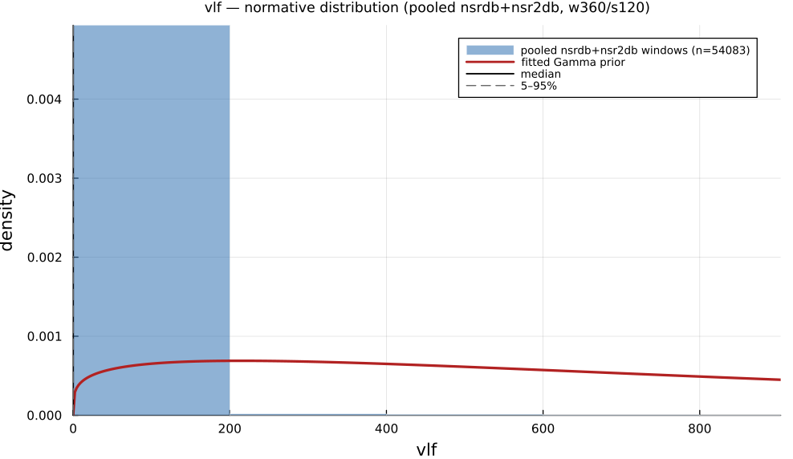

# `vlf`

> **Very Low Frequency Power (0.003-0.04 Hz)**

| | |
|---|---|
| **Aliases** | `very_low_frequency` |
| **Domain** | `frequency` |
| **Distribution family** | `Gamma` |
| **Equation** | `integral(PSD; 0.003; 0.04) Hz` |
| **Resource intensity** | ◍◍◍◌◌  moderate — _Frequency subgraph (requires a Welch/Lomb–Scargle periodogram first). Warm (shared representation cached) is 14× cheaper._ (measured, see §Resources) |

## Definition

Very low frequency power (0.003-0.04 Hz). Formally: `integral(PSD; 0.003; 0.04) Hz`.

## What does *normal* look like?

Fitted normative prior: **Gamma(α = 1.24, θ = 891.8)**  —  KS p < 1e-300, n = 54083.

!!! warning "Degenerate on short (360-beat) windows — indicative only"
    **VLF (0.003–0.04 Hz) is degenerate on 360-beat windows.** A 360-beat window (~5–6 min) barely reaches the band's own lower edge, so Welch's frequency resolution cannot resolve power inside it for most windows — the empirical median/IQR collapse to 0 below. Treat the plot and normal-range table as **indicative only**; a real VLF estimate needs much longer windows (≥5 min, ideally tens of minutes to hours) or a full-length recording.

Empirical distribution over the **pooled nsrdb+nsr2db** normative windows (360-beat windows, 120-beat stride), overlaid with the fitted `Gamma` prior density. Vertical lines mark the median and the 5–95% range.

### Normal-range summary (pooled nsrdb+nsr2db)

| statistic | value |
|---|---|
| median | 0 |
| IQR (25–75%) | 0 – 0 |
| 5–95% range | 0 – 0 |
| mean ± sd | 15.23 ± 189 |
| n windows | 54083 |

_n varies by feature: pooled time/frequency/geometric features use the full nsrdb+nsr2db table (up to n = 56 472); the 13 nonlinear/entropy features are O(N²)/template-matching and are fit on a fixed-seed ≈3000-window subsample instead (`test/tools/collect_extended_features.jl`, seed 20260729); `ulf` uses a long-window NSRDB-only extraction (see its own page)._

## Use cases

- Slow (0.003–0.04 Hz) rhythms linked to thermoregulation, renin–angiotensin, and physical activity.
- Longer recordings (≥5 min, ideally hours) where the band resolves.
- Prognostic marker in cardiac risk studies.

## Applications by area

*Evidence is reported at the measure-family level; a specific variant may not be the exact index measured in every cited study.*

### Clinical

**Coverage: statistics** — a large/pooled literature (reviews or meta-analyses exist).

ULF/VLF power is extensively studied in mortality risk stratification: lower ULF/VLF consistently predicts higher all-cause/cardiac/arrhythmic mortality post-MI, in CHF, ACS and elderly cohorts. A 2024 meta-analysis, however, found time-domain measures (SDNN, HTI) the strongest post-MI predictors rather than VLF/ULF specifically, and the band's own physiological interpretation (thermoregulation vs. renin–angiotensin vs. artifact) remains unsettled.

*Dominant reported direction:* down — lower ULF/VLF → higher mortality (contested against time-domain predictors).

**Key references:** [shaffer2017](@cite); [rueda2024](@cite); [yuda2021](@cite).

### Sports & peak performance

**Coverage: individual papers** — a small, scattered literature (no pooled meta-analysis).

Uncommon as a headline sports metric. Acute dose-response is consistent and strong (ULF/VLF falls monotonically with rising exercise intensity; ambulatory ULF rises sharply with movement, largely a motion-artifact/thermoregulatory effect), but chronic-training/overtraining findings are weak, inconsistent, and even sex-reversed within a single small study.

*Dominant reported direction:* down acutely with intensity; chronic/training direction unsettled.

**Key references:** [shaffer2017](@cite).

### Meditation & contemplation

**Coverage: individual papers** — a small, scattered literature (no pooled meta-analysis).

A minor, seldom-isolated component of meditation HRV research: one classic study reports dramatic, exaggerated VLF-spanning oscillations tied to extremely slow breathing during Chi/Kundalini meditation, while a more careful spectral study found no change in normalized VLF power but a significant drop in the residual (non-harmonic) component — illustrating strong method-dependence (raw vs. normalized vs. residual power).

*Dominant reported direction:* method-dependent (raw vs. normalized vs. residual).

**Key references:** [shaffer2017](@cite).

See the [effect-distribution meta-analysis](../usecases/effect-distributions.md) page for the harvested per-study effect sizes/p-values behind these domain summaries (`docs/zoo_gen/effect_stats.csv`).

## Resources

Resource-intensity rank **◍◍◍◌◌  moderate** is **measured** — median wall-clock time + allocations over a 360-beat window on synthetic realistic RR (`docs/zoo_gen/bench_resources.jl`; full grid in `resource_bench.csv`).

| metric (360-beat window) | value |
|---|---|
| cold median wall-time | 0.05374 ms |
| warm median wall-time | 0.003827 ms |
| allocations (cold) | 29.8 KiB |

*Cold* = fresh memoization caches (builds every shared representation from scratch); *warm* = shared representations (`diff`, periodogram, Poincaré coords, DFA fluctuation) already cached, so only this feature is recomputed. The tier is derived from the cold cost; see `Frequency subgraph (requires a Welch/Lomb–Scargle periodogram first). Warm (shared representation cached) is 14× cheaper.`

## Citation

Akselrod et al. (1981) seminal HRV power-spectrum paper; band per Task Force (1996); Scargle (1982) unevenly-sampled spectral estimator.

**Seminal reference(s):** [akselrod1981](@cite); [taskforce1996](@cite); [scargle1982](@cite).

See the [References](references.md) page for the full bibliography.
